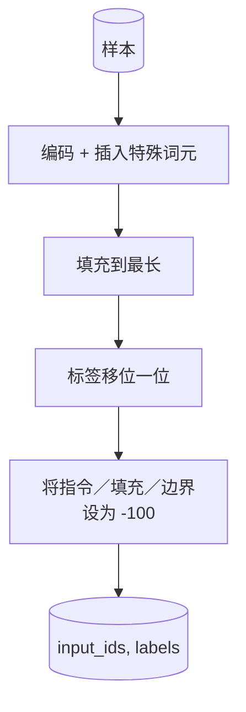

# 综合实践第 39 课：通过监督微调进行指令调优（Capstone Lesson 39: Instruction Tuning by Supervised Fine-Tuning）

> 预训练基础模型能续写序列，却不会遵循指令。监督微调（Supervised fine-tuning，SFT）是解决此问题的最小改动：向模型提供成对的指令与期望回复，训练主体预测回复词元。关键是只让损失计算回复，不计算指令。本课构建 Alpaca 风格 SFT 循环，使用自定义批次整理函数，以 `ignore_index=-100` 掩蔽指令词元，在 200 个指令－回复对上训练，并在留出划分上用完全匹配评估。

**Type:** Build
**Languages:** Python (torch, numpy)
**Prerequisites:** 阶段 19 第 30–37 课（NLP LLM 路线：分词器、嵌入表、注意力块、Transformer 主体、预训练循环、检查点保存、生成、困惑度）
**Time:** ~90 分钟

## 学习目标（Learning Objectives）

- 用显式边界词元将成对指令－回复数据格式化为单一因果序列。
- 构建批次整理函数（Collate function），掩蔽指令词元，使交叉熵只计算回复词元。
- 按 SFT 目标训练微型 Transformer 主体，观察评估指标变化。
- 实现遵守回复起始边界的贪心生成（Greedy generation）和温度采样生成。
- 对生成补全计算留出集上的完全匹配（Exact-match）。

## 问题（The Problem）

以预测下一词元训练的基础模型不知道什么是指令。给它字符串 `"What is the capital of France?"`，它会继续这个问题，或另起一句。模型掌握了语言，却没有格式契约（Format contract）。

SFT 契约是一个字符串模板。每个训练样本都变为包含三个区域的单一序列：

```text
<INST> 法国的首都是什么？ <RESP> 法国的首都是巴黎。
```

边界词元是训练时预留的特殊词元。模型学会 `<RESP>` 之后的全部内容是回复，而回复就是被评分的部分。基础模型的下一词元目标仍然适用，只是训练语料中每个样本都具有这种形式。

但有个问题：如果将整个序列送入普通交叉熵损失，模型也会被训练去预测指令词元。指令本来就是已知的，你希望这些位置的梯度为零。解决办法就是掩码（Mask）。

## 概念（The Concept）


`ignore_index` 是 `torch.nn.functional.cross_entropy` 的功能。任何等于 `ignore_index` 的目标位置都贡献零损失和零梯度。PyTorch 的惯例值为 `-100`。批次整理函数为每个样本构建两个张量：`input_ids`（完整序列）和 `labels`（`input_ids` 的副本，将指令位置覆盖为 `-100`）。

前向传播时模型看到完整序列，注意力可以关注指令。损失只计算回复词元。这正是所需行为：以指令为条件，预测回复。

## 数据（The Data）

`main.py` 确定性生成 200 个指令－回复对，覆盖六类任务：

- 单次事实问答（某国首都）
- 算术
- 列表提取
- 一句话摘要
- 代码（打印、排序）
- 定义

每类任务都有模板化指令和确定性回复，这是刻意简化的。完全匹配很脆弱，因此本课使用正确答案是某个特定字符串的夹具（Fixture）。真实 SFT 数据集需要模糊指标，但原则相同。

划分为 160 条训练、40 条测试。测试集覆盖全部六类任务，因而可报告逐类别完全匹配。

## 分词与填充（Tokenisation and Padding）

分词器（Tokenizer）基于字节，预留三个特殊词元：

- `INST_ID = 256`：标记指令区域起点。
- `RESP_ID = 257`：标记指令与回复的边界。
- `PAD_ID = 258`：用于变长批次的填充。

序列形式为 `[INST] inst_bytes [RESP] resp_bytes [PAD]*`。批次整理函数：

1. 对每个样本分词。
2. 将批次中的每个样本填充到批内最长序列长度。
3. 构建 `labels`，即移位一位的 `input_ids`（因果语言模型目标），并进行以下处理：
   - 将指令区域替换为 `-100`。
   - 将填充区域替换为 `-100`。
   - 将 `RESP_ID` 边界位置本身替换为 `-100`（不训练模型预测边界词元，而是预测其后内容）。



移位是标准因果技巧：`input_ids` 的位置 `i` 预测位置 `i+1`，所以 `labels[i] = input_ids[i+1]`（输入丢弃最后位置，目标丢弃首位置）。掩码在移位后应用，以覆盖正确位置。

## 训练（Training）


循环是标准 PyTorch SFT 循环：Adam、学习率约 3e-4 至 1e-3，在本夹具上训练十至二十轮，不使用调度器。模型足够小（隐藏维度 96、2 个块、最大长度 64），可在 CPU 上两分钟内训练至收敛。

每五轮在留出集上执行一次小型评估并打印完全匹配。观察完全匹配从第一轮 0.0 升至第十五轮约 0.85，就是本课的收获：能看到模型同时学会格式和答案。

## 生成（Generation）

评估时模型收到指令前缀 `[INST] inst_bytes [RESP]`，生成词元直至满足以下任一条件：

- 序列达到 `max_len`，或
- 模型触发特殊停止启发式（Stop heuristic）：连续两个句末字节（`.`、`!`、`?`）。

本课提供贪心解码及可选温度采样器。完全匹配采用贪心，因为温度会让指标随机化。真实系统经常先采样，再模糊评分；这条管线在第 41 课介绍。

## 完全匹配评估（Exact-Match Evaluation）

完全匹配是最严格的文本指标。对预测回复字符串做规范化（转小写、去除首尾空白、合并双空格），再与按相同方式规范化的参考回复比较。每个样本得分为 1 或 0，汇总值为平均数。

真实 SFT 管线会以词元级 F1（第 41 课）和裁判模型（Judge model）补充完全匹配。完全匹配仍然有用，因为它没有歧义：若结果为 0.7，就表示恰好 70% 的测试指令产生了与标准回复逐字符一致的输出。

```figure
cc-sft-loss-mask
```

## 你将构建什么（What you will build）

实现包含一个 `main.py` 和测试。

1. `InstructionTokenizer`：带预留特殊词元的字节级编码器，编码指令前缀或完整数据对。
2. `make_dataset`：用固定种子生成覆盖六类任务的 200 对数据。
3. `SFTDataset`：为每个样本返回已准备掩码的 `(input_ids, labels)`。
4. `sft_collate`：动态填充、构建批次张量，将指令与填充位置设为 `-100`。
5. `TinyGPT`：Transformer 主体加绑定或不绑定权重的语言模型头。
6. `train_sft`：SFT 循环，带逐轮评估钩子。
7. `generate`：从前缀进行因果解码，支持贪心或采样，并带停止启发式。
8. `exact_match`：规范化字符串比较，返回 `[0, 1]` 范围的浮点数。
9. `run_demo`：构建数据、训练二十轮、评估、打印逐类别明细，成功时以零退出。

## 为什么掩码重要（Why the mask matters）

没有掩码，损失会把指令词元视为目标，模型因而学习预测指令。这个不同目标会从两方面降低模型表现。第一，模型容量被浪费在重建用户总会提供的输入上。第二，多数批次的指令词元多于回复词元，因此回复损失在梯度总和中占比更小；优化器在你真正关心部分上的有效学习率低于预期。掩码不是润色，它定义了目标。

## 拓展目标（Stretch goals）

- 添加学习率预热（Warmup）及后续余弦衰减（Cosine decay）。SFT 对学习率比预训练更敏感。
- 添加逐词元损失日志并绘制训练损失曲线。注意早期轮次由模板词元（`<RESP>`、常见前缀）主导，后期则由实际答案词元主导。
- 将评估扩展至 BLEU-1 或 chrF。完全匹配会低估以不同措辞表达相同答案的模型。
- 添加多轮格式的聊天模板（Chat template），在包含追问的夹具上训练。

实现为你提供格式契约、掩码和循环。从基础模型到遵循指令的模型，目标的变化只需一个批次整理函数。
