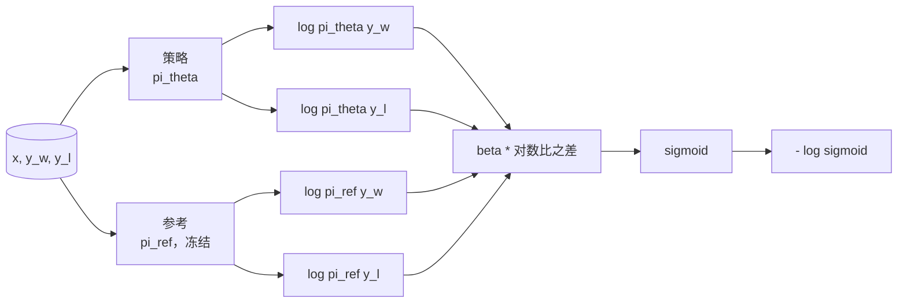
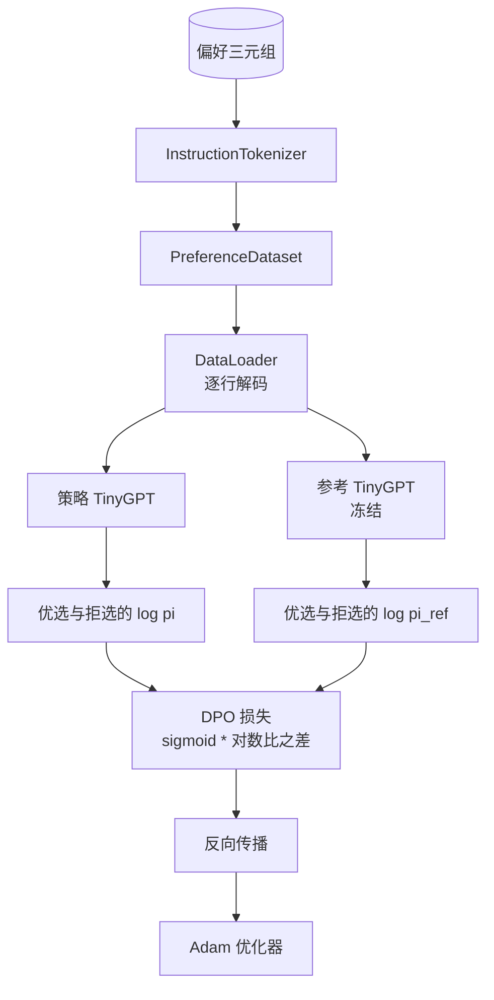

# 综合实践第 40 课：从零实现直接偏好优化（Capstone Lesson 40: Direct Preference Optimization from Scratch）

> 奖励模型（Reward model）与 PPO 构成经典的人类反馈强化学习（RLHF）技术栈。直接偏好优化（Direct Preference Optimization，DPO）将其合为单个监督损失，直接依据偏好对拟合策略。本课从奖励差恒等式推导 DPO 损失，交付可工作的参考模型与策略模型，计算逐词元对数概率，并用包含优选与拒选补全的偏好夹具训练微型 Transformer。测试固定损失数学与梯度方向，让你确认实现与论文一致。

**Type:** Build
**Languages:** Python (torch, numpy)
**Prerequisites:** 阶段 19 第 30–37 课（NLP LLM 路线：分词器、嵌入表、注意力块、Transformer 主体、预训练循环、检查点保存、生成、困惑度）
**Time:** ~90 分钟

## 学习目标（Learning Objectives）

- 将 DPO 损失推导为缩放对数比之差上的 sigmoid，并关联到隐式奖励（Implicit reward）。
- 构建参考模型（Reference model）与策略模型（Policy model）对，冻结参考、训练策略。
- 在两种模型下计算序列级对数概率（Log-probability），掩蔽提示词词元。
- 用 `(prompt, chosen, rejected)` 三元组训练策略，观察优选补全相对拒选补全的对数概率上升。
- 以损失数学、梯度符号和参考不变性的测试固定行为。

## 问题（The Problem）

你有一个 SFT 模型，它遵循指令，但输出参差不齐：有些补全清楚，有些冗长或错误。你还有小型偏好对数据集：同一提示词下，人类将一个补全标为优选，另一个标为拒选。

经典 RLHF 方案是两阶段管线：先用偏好训练奖励模型，再用近端策略优化（PPO）针对奖励优化策略。它有效但昂贵：PPO 期间内存中需要两个模型，需要 KL 控制使策略靠近参考，奖励模型脆弱时还会出现奖励钻空子（Reward hacking）。

DPO 用单个监督损失替代两个阶段，奖励模型从不显式存在。策略直接在偏好对上训练，以朝向 SFT 参考的显式 KL 惩罚约束。在 Bradley-Terry 偏好模型下，最优解相同，代码却少得多。

## 概念（The Concept）

从 Bradley-Terry 模型出发。给定提示词 `x` 和两个补全 `y_w`（优选）、`y_l`（拒选），人类偏好 `y_w` 的概率为：

```text
P(y_w > y_l | x) = sigmoid( r(x, y_w) - r(x, y_l) )
```

其中 `r` 是某个潜在奖励函数。RLHF 先根据偏好拟合 `r`，再训练策略 `pi`，在 KL 锚定约束下最大化 `r`：

```text
max_pi   E_{x, y~pi} [ r(x, y) ] - beta * KL(pi || pi_ref)
```

DPO 推导注意到，该目标下的最优策略 `pi*` 存在以 `r` 表示的闭式形式（Closed form）：

```text
pi*(y | x) = (1/Z(x)) * pi_ref(y | x) * exp( r(x, y) / beta )
```

整理以求 `r`：

```text
r(x, y) = beta * ( log pi*(y | x) - log pi_ref(y | x) ) + beta * log Z(x)
```

`log Z(x)` 项对 `y_w` 和 `y_l` 相同（它依赖 `x`，而非 `y`），因此计算偏好差时抵消：

```text
r(x, y_w) - r(x, y_l) = beta * ( log pi_theta(y_w|x) - log pi_ref(y_w|x)
                                - log pi_theta(y_l|x) + log pi_ref(y_l|x) )
```

代入 Bradley-Terry 的 sigmoid，对偏好对取负对数似然（Negative log likelihood）：

```text
L_DPO(theta) = - E_{(x, y_w, y_l)} [
  log sigmoid( beta * ( log pi_theta(y_w|x) - log pi_ref(y_w|x)
                       - log pi_theta(y_l|x) + log pi_ref(y_l|x) ) )
]
```

这就是损失。每个样本从四个对数概率算出一个标量，再对它应用 sigmoid。没有独立奖励模型，没有 PPO，损失中也没有 KL 项；KL 约束已经融入闭式推导。



## 梯度符号（The Sign of the Gradient）

任何训练前都可做一个有用的健全性检查：对 `log pi_theta(y_w | x)` 求梯度：

```text
d L_DPO / d log pi_theta(y_w | x) = - beta * (1 - sigmoid(z))
```

其中 `z` 是 sigmoid 的输入。对所有 `z`，该值为负，意味着增大策略对优选补全的对数概率会降低损失。对称地，对 `log pi_theta(y_l | x)` 的梯度为正：增大拒选对数概率会增大损失。训练推高优选、压低拒选。参考被冻结，不会变化。

## 数据（The Data）

本课提供十二个偏好三元组，每个为 `(prompt, chosen, rejected)`。优选补全简短准确，拒选补全冗长、偏题或错误。数据对覆盖第 39 课相同的任务类别（首都、算术、列表），让从 SFT 基础模型出发的策略具有合理起点。

夹具刻意保持很小。生产中 DPO 使用数万对数据；这里的重点是损失数学与循环在微型数据集上端到端运行，且优选与拒选的对数概率差距可见地增大。

## 参考不变性（Reference Invariance）

DPO 实现必须谨慎处理参考模型。参考是原地冻结的 SFT 模型，必须满足三个性质：

- 参考参数从不接收梯度。
- 参考对数概率在各轮间从不变化。
- 策略从与参考相同的权重开始。（最优 `theta` 是参考加上学到的更新；将策略初始化为参考副本，是定义明确的起点。）

实现通过以下方式保证：

- 前向传播时，将参考包在 `torch.no_grad()` 中。
- 对所有参考参数设置 `requires_grad=False`。
- 构建参考后，通过 `policy.load_state_dict(reference.state_dict())` 构造策略。

```figure
cap-dpo-preference
```

## 架构（Architecture）



模型与第 39 课的 TinyGPT 相同：仅解码器、因果、字节分词器。参考与策略共享架构；训练时策略权重偏离参考，而参考保持固定。

## 你将构建什么（What you will build）

实现包含一个 `main.py` 和测试。

1. `InstructionTokenizer`：带 `INST` 与 `RESP` 特殊词元的字节分词器，与第 39 课形式相同。
2. `TinyGPT`：仅解码器 Transformer，与第 39 课配置相同，即使跳过第 39 课，本课仍独立完整。
3. `make_preferences`：返回十二个 `(prompt, chosen, rejected)` 三元组。
4. `sequence_log_prob`：给定模型、提示词前缀和补全，返回补全部分下一词元对数概率之和，不计提示词位置。
5. `dpo_loss`：接收四个对数概率和 `beta`，返回逐样本损失张量，以及用于日志的隐式奖励差。
6. `train_dpo`：逐轮循环，在策略和参考下计算优选与拒选对数概率，应用损失，执行 Adam 更新。
7. `evaluate_margins`：在任意时点返回策略下优选减拒选的平均对数概率间隔（Margin）。
8. `run_demo`：通过少量预热预训练构建参考和策略，复制权重，训练三十步，打印逐步损失与间隔，成功时以零退出。

## 为什么 DPO 有效（Why DPO works）

在 Bradley-Terry 偏好模型下，除奖励参数化差异外，DPO 与 RLHF 在数学上等价。隐式奖励 `r(x, y) = beta * (log pi(y|x) - log pi_ref(y|x))` 可以由偏好辨识，但允许相差一个关于 `x` 的函数，该函数会在求差时抵消。闭式策略允许跳过显式奖励模型。KL 约束由结构保证：`pi` 相对 `pi_ref` 的任何偏离都会增大对数比，sigmoid 随之饱和，在策略偏离过远时减弱梯度。参考就是保障。

## 拓展目标（Stretch goals）

- 为对数概率和添加长度归一化（Length normalisation）：除以补全长度。长度偏差（Length bias）是已知 DPO 失败模式，模型会偏好更短补全，因为其对数概率在绝对意义上更大。
- 添加 IPO 损失变体：以 `(z - 1)^2` 替换 sigmoid 加 log，比较夹具上的收敛。
- 添加标签平滑（Label smoothing）参数，在硬性的优选－拒选标签与均匀值 0.5 之间插值。
- 用更小、更便宜的模型替代参考，采用知识蒸馏（Knowledge distillation）思路。

实现提供损失、参考不变性和训练循环。数学是本课核心，代码使数学具体可见。
