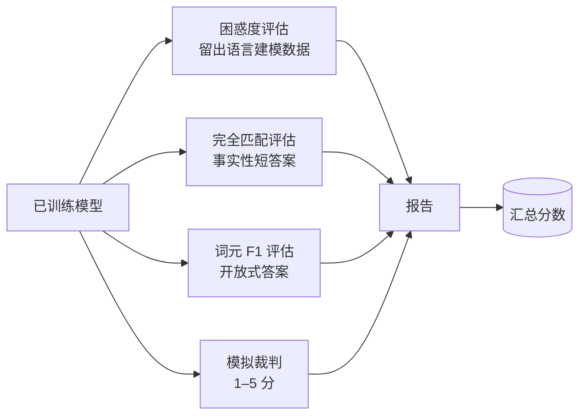
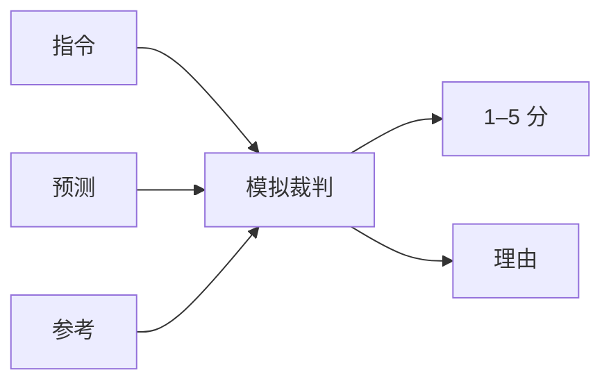
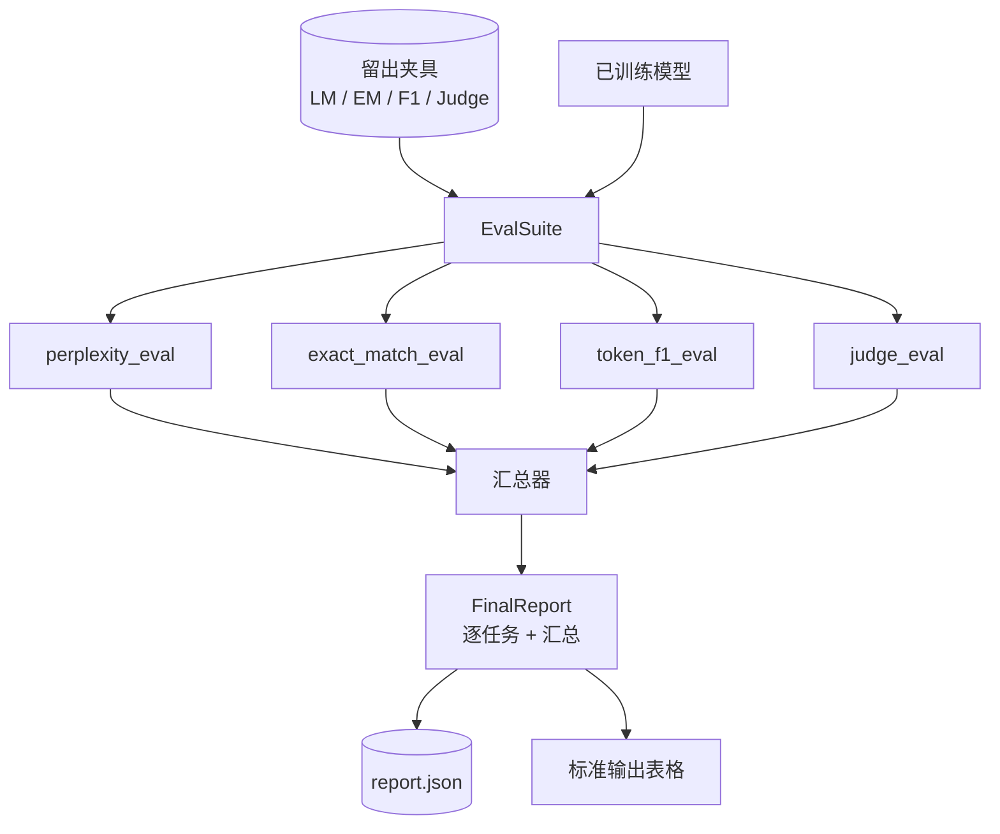

# 综合实践第 41 课：完整评估管线（Capstone Lesson 41: Full Evaluation Pipeline）

> 训练可以通过损失曲线监控，评估却需要专门设计。本课构建统一评估管线，接收任意训练好的语言模型，运行四种异构评估，汇总为逐任务报告，并提供本地模拟的大语言模型裁判，使循环无需网络即可运行。四项评估覆盖每个待交付模型需要的维度：语言建模（困惑度）、短答案正确性（完全匹配）、开放答案相似性（词元 F1）和定性评分（裁判）。

**Type:** Build
**Languages:** Python (torch, numpy)
**Prerequisites:** 阶段 19 第 30–37 课（NLP LLM 路线：分词器、嵌入表、注意力块、Transformer 主体、预训练循环、检查点保存、生成、困惑度）
**Time:** ~90 分钟

## 学习目标（Learning Objectives）

- 在微型 Transformer 上正确统计被掩蔽词元，计算留出集困惑度（Perplexity）。
- 对事实性短提示词运行完全匹配（Exact-match）评估。
- 规范化预测与参考字符串，计算词元级 F1（Token-level F1）。
- 构建本地模拟的大语言模型裁判（LLM-as-judge），按 1–5 分评价模型输出。
- 将四项评估汇总为单份加权报告，并提供逐任务明细。

## 问题（The Problem）

单一指标无法描述语言模型。困惑度反映模型对语言分布的拟合程度，却不说明它能否答题。完全匹配检查是否输出标准字符串，却惩罚正确的改述。词元 F1 容许改述，却会被内容错误但词汇重叠的答案欺骗。大语言模型裁判能捕捉定性维度，但成本高且具有随机性。

实际需要的管线包含全部四项。每项评估覆盖其他项遗漏的维度，运行在为该指标设计的不同留出数据子集上。最终报告并列显示逐任务数值和总分，让评审一眼看出模型的权衡。

本课用一个文件端到端构建这条管线。

## 概念（The Concept）



每项评估都是 `(model, dataset) -> EvalResult` 函数。结果携带指标值、供检查的逐样本详情，以及用于汇总的名称。管线通过配置组合它们，指定运行哪些评估、如何加权。

## 正确统计困惑度（Perplexity, properly counted）

困惑度是 `exp(mean negative log-likelihood per token)`。实现有两个陷阱：

- 均值必须按实际词元位置计算，而非按批次大小乘序列长度。分母必须排除填充词元，否则困惑度看起来会优于实际。
- 模型预测下一词元，因此位置 `i` 的逻辑值预测位置 `i+1` 的词元。这里的偏一错误（Off-by-one）是静默的：损失仍可用于训练，指标却失去意义。

评估逐批累加非填充位置的 `-log p(token)` 并统计词元数，最后才相除。这在数值上比平均逐批困惑度更安全（后者低估短序列的权重），也符合教材定义。

## 带规范化的完全匹配（Exact-match, with normalisation）

评估运行框架（Harness）比较前会同时规范化预测和参考：

- 转小写。
- 去除首尾空白。
- 将内部连续空白合并为一个空格。
- 若两边仅标点不同，去掉末尾终止标点（`.`、`!`、`?`）。

规范化让完全匹配具有实用价值。模型回答 `"Paris"` 是正确的，`"Paris."` 也正确，`"  paris  "` 同样正确。指标仍要求规范化后的答案字符串一致。

## 正确计算词元 F1（Token F1, the right way）

词元 F1 是基于词元袋（Bag-of-tokens）计算的精确率与召回率的调和平均数，步骤如下：

1. 规范化预测与参考，规则与完全匹配相同。
2. 将两者各自拆成词元列表（按空白分词）。
3. 统计多重集交集（Multiset intersection）。
4. 精确率 = `intersection_count / len(pred_tokens)`。召回率 = `intersection_count / len(ref_tokens)`。F1 为调和平均数。

预测和参考都为空时，F1 为 1（空匹配）；仅一方为空时，F1 为 0。该模式符合 SQuAD 评估参考，可在不同改述间产生稳定数值。

## 本地模拟大语言模型裁判（Local Mock LLM-as-Judge）

真实裁判是通过 API 访问的前沿模型。本课裁判必须离线运行，因此模拟裁判是确定性评分器：接收指令、模型预测与参考，返回 `{1, 2, 3, 4, 5}` 中的分数和一行理由。评分规则明确：

- 规范化预测等于规范化参考时为 5。
- 预测与参考的词元 F1 至少为 0.8 时为 4。
- 词元 F1 在 `[0.5, 0.8)` 时为 3。
- 词元 F1 在 `[0.2, 0.5)` 时为 2。
- 其他情况为 1。

这不是真实裁判，但接口正确。之后只改一个函数即可换成真实模型，管线无需关心。



## 汇总（Aggregation）

总分是规范化评估分数的加权平均。每项评估报告自己的 `[0, 1]` 范围分数：

- 困惑度：按 `1 / (1 + log(perplexity))` 归一化。困惑度 1 映射为 1，无穷映射为 0。
- 完全匹配：已在 `[0, 1]` 范围内。
- 词元 F1：已在 `[0, 1]` 范围内。
- 裁判：除以 5。

权重可配置，默认组合为困惑度 0.2、完全匹配 0.3、词元 F1 0.3、裁判 0.2。权重选择是产品决策，本课提供调节项供你实验。

```figure
cg-eval-quadrant
```

## 架构（Architecture）



`EvalSuite` 是轻量编排器。每项评估是独立函数，接收 `(model, tokenizer, dataset, config)`，返回 `EvalResult`。`Aggregator` 收集结果并生成最终报告。演示打印表格，再写入 JSON 副本，供下游持续集成（CI）读取。

## 你将构建什么（What you will build）

实现包含一个 `main.py` 和测试。

1. `TinyGPT`：第 38–40 课使用的同一仅解码器架构，包含于此以保证课程独立。
2. `InstructionTokenizer`：带 INST / RESP / PAD 特殊词元的字节分词器。
3. 四个夹具：语言建模语料、完全匹配集、F1 集和裁判集，各二十个确定性样本。
4. `perplexity_eval`：返回含困惑度与逐词元损失直方图的 `EvalResult`。
5. `exact_match_eval`：返回平均完全匹配和逐样本记录。
6. `token_f1_eval`：返回平均词元 F1 和逐样本记录。
7. `mock_judge` 与 `judge_eval`：逐样本分数和理由，以及全集平均分数。
8. `Aggregator.normalise`：逐评估归一化规则。
9. `Aggregator.aggregate`：加权平均与组装后的报告。
10. `run_demo`：短暂训练微型模型，执行四项评估，打印报告表格、写入 JSON，成功时以零退出。

## 阅读报告（Reading the report）

报告分三层：顶部是总分，其下是四项评估数值，再下是诊断用逐样本明细。失败的 CI 运行通常需要总分，而追查回归问题的评审需要逐样本明细，查看模型答错了哪些输入。

JSON 导出使用稳定键，使 CI 看板可跨版本绘制趋势线。格式化表格则供训练后查看终端的人阅读。

## 拓展目标（Stretch goals）

- 添加校准（Calibration）评估：模型 softmax 概率与准确率是否匹配？按置信度分桶，报告各桶实测准确率。
- 添加鲁棒性（Robustness）评估：为每个样本标注扰动（错字、改述、干扰项），报告各类扰动下指标下降量。
- 将模拟裁判替换为通过 HTTP 调用的真实模型，函数签名不变。
- 添加逐任务权重学习：不使用固定权重，而是拟合权重，使模型排序符合目标偏好顺序。

实现提供四项评估、汇总器和报告。真实评估管线会叠加更多维度，但模式不变：每项评估一个函数，一个汇总器，一份报告。
