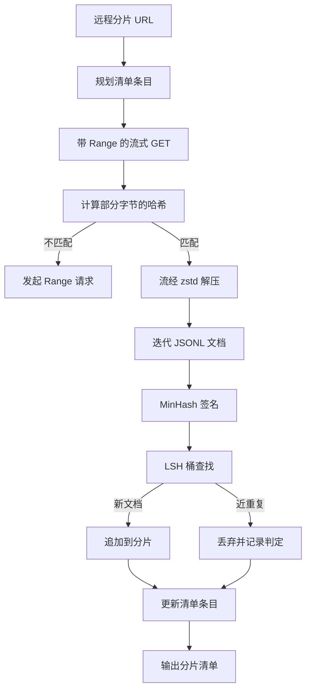

# 大型语料库下载器（Large Corpus Downloader）

> 语言模型训练远在首次前向传播前就开始了。语料必须落盘、解压、去重并可寻址，而且断点恢复方案必须在网络下载到 4% 就中断之前备好。本课构建流式下载器，拉取压缩分片，用 Zstandard 边下载边解压，通过 MinHash 与局部敏感哈希识别近重复，并写出后续管线可以信任的分片清单。

**Type:** Build
**Languages:** Python
**Prerequisites:** 阶段 19 第 30–37 课
**Time:** ~90 分钟

## 学习目标（Learning Objectives）

- 用 `urllib` 流式读取远程分片，并用 `zstandard` 解压，无需在内存缓冲整个文件。
- 针对经过验证的字节偏移发起 HTTP `Range` 请求，恢复部分下载。
- 为每份文档构建 MinHash 签名，使用局部敏感哈希（Locality-sensitive hashing，LSH）分桶，让近重复发生碰撞。
- 输出包含内容哈希、字节大小、文档数量和去重判定的分片清单（Shard manifest）。

## 问题（The Problem）

第一次在 200 GB 语料上训练时，网络下载到 41% 中断，脚本因 `urllib` 异常退出。第二次在 78% 中断。等到 99%，你已重写循环三次。从一开始就必须设计两种故障的处理：部分下载恢复与重复文档移除。两者都有成熟方案，却经常被忽略，因为管线起初只是逐渐膨胀的一行 `requests.get` 调用。

恢复是 HTTP 问题。服务器必须遵守 `Range`，客户端必须基于磁盘记录跟踪已验证偏移，并让该偏移在进程死亡后仍存在。偏移与文件哪怕只差一个字节，恢复下载都会写入错误内容，造成直到分词时才暴露的语料损坏。

去重（Deduplication）是签名问题。精确哈希去重漏掉近重复：同一 Wikipedia 文章带三种不同模板页脚，同一代码文件带不同许可证头，同一博客文章的每个链接都带跟踪参数。MinHash 加 LSH 以次线性成本发现这些情况，每份文档付出一个签名、每个签名一次桶查找的成本。

## 概念（The Concept）



### 使用 urllib 流式传输（Streaming with `urllib`）

标准库 `urllib.request.urlopen` 返回类文件对象。将它包在 `zstandard.ZstdDecompressor().stream_reader` 中，字节便从网络经过解压器流向文档迭代器，压缩与解压分片都不必整体物化到内存。内存成本只有行缓冲区、当前文档的 MinHash 签名以及 LSH 索引。

### 使用 Range 恢复（Resume with `Range`）

下载器为每个分片写两个文件：分片本身和 `.partial.json` 检查点。检查点记录 `verified_bytes`、`expected_size`、`sha256_prefix`（对前 `verified_bytes` 个字节计算）及来源 URL。启动时读取检查点，对磁盘字节重新计算 `sha256_prefix`，仅哈希匹配才恢复。若哈希错误，就丢弃部分文件并从零字节重新下载。因为已验证字节会被检查而不是凭空假设，所以不会发生静默损坏。

### MinHash 加 LSH（MinHash plus LSH）

MinHash 用固定空间估计两个集合的 Jaccard 相似度（Jaccard similarity）。对文档而言，集合是文本的片段（Shingle，即重叠 n 元组）。签名由 `k` 个最小哈希值组成，每个独立哈希函数一个。两份文档的 Jaccard 相似度为 `s` 时，签名任意一个分量相等的概率就是 `s`。

LSH 再将 `k` 个分量分成 `b` 个带（Band），每带 `r` 行，其中 `k = b * r`。两文档至少在一个带中碰撞的概率为 `1 - (1 - s^r)^b`，在通过 `(b, r)` 调节的 `s` 值附近形成陡峭阈值。典型语料去重阈值为 `s = 0.8`，LSH 研究文献使用 `k = 128`、`b = 32`、`r = 4` 达到此阈值。

### 作为契约的分片清单（Shard manifest as a contract）

下载器唯一持久输出是清单。它逐分片保存 URL、解压字节数、文档数、去重后唯一文档数，以及最终分片文件的 sha256。下游分词读取清单，而非目录列表。如果分片缺失或 sha256 错误，清单让下一阶段拒绝启动。清单是“数据已下载”与“数据已下载且可验证”的分界。

```figure
cap-corpus-downloader
```

## 动手实现（Build It）

`code/main.py` 实现：

- `ShardPlanner`：读取分片 URL 列表，生成规划中的清单条目。
- `StreamingDownloader`：打开可选带 `Range` 的 `urllib` 流，写入临时文件，每个数据块更新 `.partial.json` 检查点，恢复时验证 sha256 前缀。
- `ZstdDocIterator`：用 `zstandard.ZstdDecompressor` 包装类文件流，每行产出一份文档。
- `MinHasher`：使用固定的一组哈希种子，为字符串生成 `k` 分量签名。
- `LSHIndex`：按带给签名分桶并报告碰撞。
- `Dedup`：组合哈希器与索引，将文档标为 `keep` 或 `near_duplicate`，并附匹配分片 ID。
- `ManifestWriter`：收集逐分片统计，写入 `manifest.json`。

文件底部演示在磁盘构建小型合成语料，用 `zstandard` 压缩，通过 `file://` URL 下载，去重并打印清单。

运行：

```bash
python3 code/main.py
```

脚本以零退出并打印清单汇总。

## 生产模式（Production Patterns）

四种模式将本课扩展到真实语料。

**先检查点，后写入（Checkpoint before write）。** 向分片追加字节前，必须对 `.partial.json` 执行 `fsync`。否则断电会使顺序颠倒：分片字节已落盘，检查点没有记录，下一次恢复认为已验证字节更少，重复追加后缀使文件损坏。先检查点，再写入，这与预写日志（Write-ahead log）遵循同一纪律。

**分片 LSH 索引（Sharded LSH index）。** 200 GB 规模下，覆盖整个语料的单一 LSH 索引放不进内存。按第一个带哈希分区，将分区存到磁盘，只查询新签名将落入的分区。代价是每文档多一次磁盘读取，收益是 LSH 索引不再形成硬性内存上限。

**使用墓碑，而非删除（Tombstone, not delete）。** 丢弃的重复项在清单中记录为 `near_duplicate`，并附与其碰撞的文档所在分片 ID。删除会丢失重复项与保留项的关联。墓碑（Tombstone）保留审计线索，让下游流程能够重新考虑阈值。

**清单中逐分片 sha256，再加清单 sha256（Per-shard sha256 in the manifest, plus a manifest sha256）。** 清单本身也要有内容哈希。下游信任分片条目前先验证清单哈希。否则清单会成为静默攻击面：攻击者修改一个文件就能破坏整个管线。

## 实际应用（Use It）

生产模式：

- **每次 CI 运行都可恢复（Resume on every CI run）。** CI 运行器是临时的，下载器必须假设每次磁盘全新，并从缓存或远程恢复。`--cache-dir` 是一等标志。
- **先去重，再分词（Dedup before tokenization）。** 分词昂贵，同一文档处理两次会增加一倍成本，却没有损失曲线收益。去重应位于分词上游，而非下游。
- **清单作为合并门禁（Manifest as merge gate）。** 训练从固定提交读取清单 sha256。新数据集版本需要新的清单提交。代码与数据的联系依靠 git，而非口头约定。

## 交付成果（Ship It）

真实项目中的 `outputs/skill-corpus-downloader.md` 应说明：哪些 URL 供下载器使用、检查点目录如何布局、去重使用的片段宽度和 `(k, b, r)` 三元组，以及清单在版本控制中的位置。本课交付引擎。

## 练习（Exercises）

1. 添加 `--shingle-width` 标志，测量宽度 3、5、9 下去重判定的变化，为默认值选择提供理由。
2. 通过嗅探魔数字节，在 zstd 之外添加 gzip 支持。下载器不应要求调用者指定编解码器（Codec）。
3. 添加 `--resume-only` 模式，没有检查点就拒绝新下载。在 CI 中可防止一次运行意外重新拉取 200 GB。
4. 将 LSH 索引移到 shelf 或 sqlite 文件，比较与内存版本的吞吐量。
5. 启动时添加清单 sha256 检查。若磁盘清单与 `manifest.lock` 中哈希不符，下载器应默认拒绝运行（Fail closed）。

## 关键术语（Key Terms）

| 术语 | 常见说法 | 实际含义 |
|------|-----------------|------------------------|
| 分片（Shard） | “一个文件” | 自包含语料切片，有自己的 sha256，是恢复与去重的单位 |
| MinHash 签名（MinHash signature） | “指纹（Fingerprint）” | 集合的 `k` 分量摘要，每分量为一个独立哈希在集合上的最小值 |
| LSH 带（LSH band） | “桶（Bucket）” | 一组 `r` 个签名分量，作为碰撞检测的单个桶键 |
| 已验证字节（Verified bytes） | “恢复偏移（Resume offset）” | 磁盘上 sha256 前缀与检查点匹配的字节，是唯一安全恢复偏移 |
| 清单（Manifest） | “索引（The index）” | 下载器产出内容的单一持久记录，包含内容哈希 |

## 延伸阅读（Further Reading）

- [RFC 7233](https://datatracker.ietf.org/doc/html/rfc7233)：HTTP Range 请求，即恢复协议
- [Zstandard 格式规范（Zstandard format specification）](https://datatracker.ietf.org/doc/html/rfc8478)：使流式解压安全的帧格式
- [最小哈希（MinHash）](https://en.wikipedia.org/wiki/MinHash)：本课使用的签名族
- [局部敏感哈希（Locality-sensitive hashing）](https://en.wikipedia.org/wiki/Locality-sensitive_hashing)：去重阈值背后的分带方案
- 阶段 19 第 43 课：下载器供给的 HDF5 分词语料
- 阶段 19 第 44 课：在语料上训练的余弦调度
- 阶段 19 第 45 课：使用该调度的自动混合精度（AMP）循环
