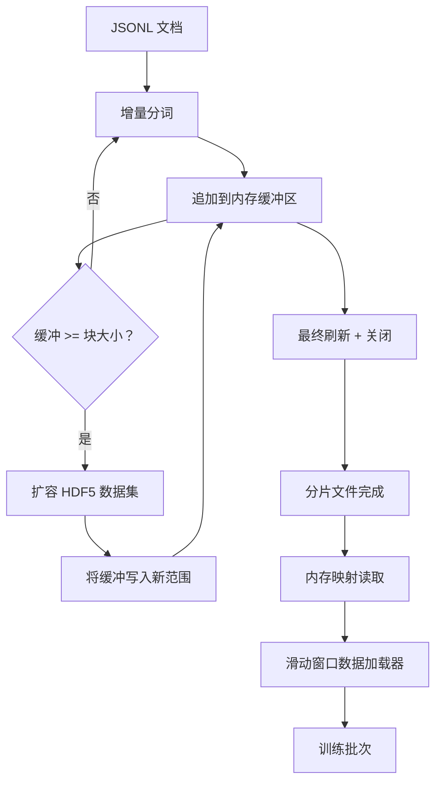

# HDF5 分词语料库（HDF5 Tokenized Corpus）

> 下载后的语料必须采用训练器能以线速流式读取的布局落盘。磁盘上的 JSONL 无法承受 16 个数据加载工作进程，带可扩容、分块整数数据集的 HDF5 则可以。本课实现流式分词并写入可扩容 HDF5 数据集、跨文件分片写入、训练时内存映射读取，以及按正确打包规则生成定长序列的滑动窗口数据加载器。

**Type:** Build
**Languages:** Python
**Prerequisites:** 阶段 19 第 30–37 课
**Time:** ~90 分钟

## 学习目标（Learning Objectives）

- 用确定性分块，将文档流式写入可扩容 HDF5 整数数据集。
- 将写入分摊到多个 HDF5 文件，使失败影响有界且可并行。
- 通过页缓存支持的 HDF5 分块布局回读词元，使数据加载器只在组批时复制到批次缓冲区。
- 实现滑动窗口（Sliding window）数据加载器，以明确的打包（Packing）规则输出定长训练序列。

## 问题（The Problem）

现代语言模型训练由几十个工作进程以每秒数十万个样本的速度读取词元。磁盘 JSONL 一遇到冷缓存缺页就撑不住：JSON 解析慢，文档边界不可寻址，定位到“样本 4,217,884”需要扫描文件。即使压缩良好的 Parquet 也不适合，因为训练器不要列，而要支持 O(1) 随机访问的扁平词元流。

HDF5 适合，因为它提供分块、可扩容、纯整数数据集，读取时的数据块对页缓存（Page cache）友好。训练器请求 `tokens[3,200,000 : 3,200,8192]` 切片，HDF5 将所需超切片（Hyperslab）从页缓存复制到新分配的 NumPy 数组。每个工作进程只需一个打开的文件句柄和一个块大小的页缓存占用，相比解码 JSONL 的成本微不足道。

构建难点在于让写入端可靠。可扩容数据集容易误用：逐文档写会让 HDF5 碎片化到不可用；一次扩容写全部文档，进程死亡又会丢失整个分片。正确纪律是先缓冲再扩展，缓冲大小与块大小匹配，并以分片写入将工作分散到多个文件，使一次崩溃最多丢失一个分片。

## 概念（The Concept）



### 正确使用可扩容 HDF5（Resizable HDF5 done right）

词元数据集以 `maxshape=(None,)` 和固定 `chunks=(chunk_size,)` 创建。写入时，将词元缓冲到长度为 `chunk_size` 的 NumPy 数组。缓冲填满后，数据集恰好扩展 `chunk_size`，将缓冲写到新增范围。分片结束时，把剩余缓冲写入最后一个不完整范围。除最后一次外，每次写入都连续且与块对齐；读取器按分片 HDF5 属性记录的 `token_count` 截断最后部分。

### 分片写入（Sharded write）

单个 HDF5 文件是单点故障。管线并行写分片：阶段 19 第 42 课的每个输入分片对应一个 HDF5 输出分片。`shards.json` 索引逐分片记录文件路径、词元数、文档数以及词元的 sha256。训练器读取 `shards.json`，计算全局偏移并验证语料。

### 内存映射读取（Memory-mapped read）

训练时，每个工作进程以 `swmr=True` 模式打开分配给自己的 HDF5 文件，请求 `tokens[start:stop]`。块变热后，HDF5 分块布局使读取由页缓存支撑。工作进程从不整体物化文件：切片复制到数据加载器批次缓冲区，组批时再复制到锁页内存（Pinned memory）训练张量。热路径每次跨块只有一次系统调用，其余都是内存访问。

### 滑动窗口数据加载器（Sliding-window dataloader）

只有数据加载器知道训练序列长度。它在全局词元流中随机选起点，读取 `window_size + 1` 个词元，返回 `(input, target) = (tokens[:-1], tokens[1:])`。不强制按文档边界切分：窗口可跨越两份文档，中间插入显式 `boundary_token_id`，让模型学会使用分隔符。这是标准打包规则，也是初学者常忘记的规则，最终会得到 8% 训练边界词元、92% 自然文本的语料。

```figure
cc-hdf5-corpus
```

## 动手实现（Build It）

`code/main.py` 实现：

- `Tokenizer`：足够演示使用的字节级确定性分词器，接口为 `encode(text) -> list[int]` 和 `vocab_size`。
- `HDF5ShardWriter`：打开可扩容整数数据集，将词元缓冲至块大小，按固定步幅扩容并写入，关闭时将 `token_count` 和 `sha256` 记录为 HDF5 属性。
- `ShardedTokenizationPipeline`：迭代输入文档，路由到写入器，输出 `shards.json` 索引。
- `MmapTokenStore`：打开分片文件以进行内存映射读取，计算全局偏移，提供统一 `get_slice(start, stop)` API。
- `SlidingWindowDataloader`：从全局流随机选窗口，产出 `(input_ids, target_ids)` NumPy 数组。

文件底部演示构建微型内存语料，分词写入两个分片，通过内存映射打开，运行数据加载器 10 个批次，打印逐批形状和校验和（Checksum）。

运行：

```bash
python3 code/main.py
```

脚本以零退出并打印批次校验和。

## 生产模式（Production Patterns）

四种模式将本课扩展到真实训练。

**块大小匹配典型读取（Chunk size equals the typical read）。** 训练器每样本读取 `window_size + 1` 个词元。将 HDF5 块设为 `window_size` 的倍数，使读取与页缓存对齐。块大小不匹配会让每样本触及两个块，吞吐量减半。

**词元数存在属性中，而非数据集中（Token count in attributes, not in the dataset）。** 块大小无法整除文档边界，数据集尾部切片可能只填了一部分。将真实 `token_count` 存为数据集的 HDF5 属性，让读取器按此值截断。否则读取器越过真实末尾读到零填充词元，模型就会学习预测零。

**分片 sha256 与并行验证（Sharded sha256 with parallel verification）。** 每分片有其词元字节的独立 sha256。训练器可在训练前并行验证全部分片。错误哈希会使运行尽早失败，而非十六小时后的第三轮才失败。

**两端都使用 `swmr=True`，写入器设置 `libver="latest"`。** 单写多读（Single-Writer-Multiple-Reader）模式要求写入器以 `libver="latest"` 打开，提前创建全部数据集，再设置 `file.swmr_mode = True`。此后每次扩容后必须调用 `dataset.flush()`，让以 `swmr=True` 打开的读取工作进程看到一致数据。遗漏 `libver="latest"` 或在结构变化后启用 SWMR，是“文件被锁定”故障的常见原因。

## 实际应用（Use It）

生产模式：

- **每源分片一个 HDF5（One HDF5 per source shard）。** 下载器（第 42 课）每 URL 输出一个分片；分词（本课）每源分片输出一个 HDF5。1:1 映射使断点恢复和部分失败恢复简单。
- **边界词元 ID（Boundary token id）。** 边界词元属于分词器词汇表，是数据加载器唯一注入的词元。若模型应忽略它，训练损失就掩蔽它；否则模型学习将其用作序列分隔符。
- **以 `shards.json` 为事实来源（Source of truth）。** 添加分片意味着写 HDF5、计算 sha256、追加条目。训练器启动时读取一次该文件，绝不依赖目录列表。

## 交付成果（Ship It）

真实项目中的 `outputs/skill-hdf5-tokenized-corpus.md` 应说明：哪个分词器供给管线、什么块大小匹配训练器窗口、`shards.json` 在版本控制中的位置，以及工作进程如何分摊文件。本课交付引擎。

## 练习（Exercises）

1. 给 HDF5 写入器添加 `--compression gzip` 标志，测量演示语料的吞吐量代价，为默认值选择提供理由。
2. 给滑动窗口数据加载器添加确定性种子，验证相同种子的两次运行产生完全相同批次。
3. 添加 `--validate` 模式，读取每个分片，重新计算词元 sha256，与 `shards.json` 比较。CI 应在训练前运行它。
4. 比较块大小为窗口大小的一倍、一半、两倍时的数据加载器吞吐量，报告页缓存影响。
5. 添加 `--max-document-tokens` 标志，写入时截断超长文档，说明相对在读取时决定截断的权衡。

## 关键术语（Key Terms）

| 术语 | 常见说法 | 实际含义 |
|------|-----------------|------------------------|
| 可扩容数据集（Resizable dataset） | “仅追加（Append-only）” | 具有 `maxshape=(None,)` 的 HDF5 数据集，通过 `resize` 调用按块大小增长 |
| 分块布局（Chunked layout） | “HDF5 如何存储” | 固定大小的磁盘页，内核可内存映射，数据加载器可连续读取 |
| `swmr` 模式（Mode） | “边写边读（Read-while-write）” | 单写多读模式，使数据加载工作进程安全共享文件 |
| 分片索引（Shard index） | “shards.json” | 所有词元分片的持久索引，包含偏移与内容哈希 |
| 滑动窗口（Sliding window） | “训练样本（Training sample）” | 全局词元流的定长切片，训练器将其与移位一位的目标配对 |

## 延伸阅读（Further Reading）

- [HDF5 分块文档（HDF5 chunking documentation）](https://support.hdfgroup.org/documentation/hdf5/latest/hdf5_chunking.html)：本课采用的分块、可扩容数据集布局
- [h5py 用户指南（h5py user guide）](https://docs.h5py.org/en/stable/)：HDF5 的 Python 绑定
- [NumPy 内存映射（NumPy memory mapping）](https://numpy.org/doc/stable/reference/generated/numpy.memmap.html)：HDF5 通过 h5py 暴露的读取端基本操作
- 阶段 19 第 42 课：提供本课分词输入的下载器
- 阶段 19 第 44 课：使用本数据加载器的余弦调度
- 阶段 19 第 45 课：包装训练步骤的 AMP 循环
