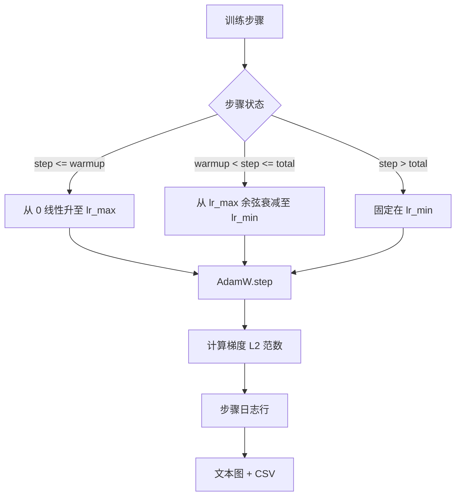

# 带线性预热的余弦学习率（Cosine LR with Linear Warmup）

> 学习率调度是仅次于损失函数的重要决策。AdamW 搭配余弦衰减与线性预热，是现代语言模型训练的默认方案：在最初一千次脆弱更新中使用较小有效步长，升至配置峰值，再平滑降回接近零。本课构建该调度，按训练步数绘制曲线，在学习率旁记录梯度范数，并证明调度遵守预热、峰值与衰减边界。

**Type:** Build
**Languages:** Python
**Prerequisites:** 阶段 19 第 30–37 课
**Time:** ~90 分钟

## 学习目标（Learning Objectives）

- 实现接入线性预热（Linear warmup）加余弦学习率调度的 AdamW 优化器。
- 计算任意步骤的精确调度值，避免各次运行间的浮点漂移。
- 将梯度 L2 范数与学习率并列记录，使训练健康状况可观测。
- 将调度渲染为可目视阅读的文本图，并输出任何工具都可读取的 CSV。

## 问题（The Problem）

最初一千次训练更新波动最大。权重仍接近初始化，优化器运行中的二阶矩（Second moment）估计尚未稳定，梯度范数大且噪声多。若此时学习率已达峰值，模型要么直接发散，要么陷入无法逃脱的损失平台。两种成熟修复是梯度裁剪（阶段 19 第 45 课）和从小值开始逐渐上升的学习率调度。

带预热的余弦调度有三个区域。从零步到 `warmup_steps`，学习率由零线性升至配置峰值 `lr_max`。从 `warmup_steps` 到 `total_steps`，沿余弦曲线上半部分从 `lr_max` 衰减至 `lr_min`。`total_steps` 之后固定在 `lr_min`，使配置错误、运行超步的训练器不会静默脱离调度。

构建难点是调度容易出现偏一错误（Off-by-one）。训练六小时后，在模型开始过拟合时，学习率会因此高或低 1%；若没有彻底测试边界，这种错误就不可见。

## 概念（The Concept）



### 预热公式（Warmup formula）

当 `step` 位于 `[0, warmup_steps]` 且 `warmup_steps > 0` 时，学习率为 `lr_max * step / warmup_steps`。退化情况 `warmup_steps = 0` 视为“无预热”：零步直接从 `lr_max` 开始，立即进入余弦衰减。有些测试框架传入 `warmup_steps = 0`，检查调度仍能产生可用曲线。

### 余弦公式（Cosine formula）

当 `step` 位于 `(warmup_steps, total_steps]` 时，学习率为 `lr_min + 0.5 * (lr_max - lr_min) * (1 + cos(pi * progress))`，其中 `progress = (step - warmup_steps) / max(1, total_steps - warmup_steps)`。在 `step = warmup_steps`，`cos(0) = 1`，得到 `lr_max`，精确匹配预热终点。在 `step = total_steps`，`cos(pi) = -1`，得到 `lr_min`，精确匹配衰减终点。

两个端点的连续性不是偶然。这正是将调度实现为关于 `step` 的单一函数，而非拼接三个函数的原因。拼接式调度在第一次改变 `lr_max` 时就会丢掉一个边界。

### 总步数之后的下限（Floor after total steps）

当 `step > total_steps`，学习率保持 `lr_min`。契约明确：调度不报错、不外推，而是固定在下限，让训练器记录警告。需要延长训练时，应修改调度的 `total_steps`，而非循环。

### 同时记录梯度范数与学习率（Gradient norm logging alongside the rate）

调度只反映一半训练健康状况，梯度范数是另一半。训练循环逐步记录二者。发散训练的梯度范数会先于损失突增；调好的预热让范数随学习率线性上升；峰值过激则表现为预热后范数仍居高不下。磁盘数据格式为 `step, lr, grad_l2_norm, loss`，CSV 是唯一持久记录。

```figure
cap-cosine-warmup
```

## 动手实现（Build It）

`code/main.py` 实现：

- `CosineWithWarmup`：按配置调度提供无状态函数 `lr(step) -> float`。
- `TrainState`：将模型、`AdamW` 优化器和调度包装为一个步骤函数。
- `TrainState.step`：执行一次前向和反向传播，记录梯度 L2 范数，将 `lr(step)` 应用于优化器。
- `plot_schedule_ascii`：将调度渲染成目视可读的文本图。
- `write_schedule_csv`：每步输出一行学习率。

底部演示构建微型 `nn.Linear` 模型，在固定输入批次上训练 20 步，打印逐步学习率、梯度范数和损失，并将调度渲染为文本图以做视觉健全性检查。

运行：

```bash
python3 code/main.py
```

脚本以零退出，打印逐步训练日志和调度图。

## 生产模式（Production Patterns）

四种模式使调度成为生产级交付物。

**调度放在配置中，而非代码里（Schedule lives in a config, not in code）。** 训练器从提交到 git 的 YAML 或 JSON 配置读取 `warmup_steps`、`total_steps`、`lr_max`、`lr_min`。配置按内容寻址，使调度可复现；配置属于 PR 差异，使调度可审计。

**步骤计数单调且与轮次解耦（Step counter is monotonic and decoupled from epochs）。** 数据集分片或加载器重启时，有些框架混淆步骤和轮次。调度从训练器检查点读取 `global_step`，而非本地计数器。步骤计数是持久坐标轴，因此恢复运行会从正确调度位置继续。

**运行目录中保存调度图（Schedule plot in the run directory）。** 每次训练将 `outputs/lr_schedule.png`（本课为文本图）写入运行目录。评审浏览目录就能检查调度，无需重跑任何内容，从而在 PR 阶段发现调度配置错误。

**日志行模式固定（Log row schema is fixed）。** `step, lr, grad_l2_norm, loss`，顺序不变。下游笔记本或看板依赖该模式；重命名列却不升版本，会使所有现有看板失效。

## 实际应用（Use It）

生产模式：

- **先扫描峰值，再扫描其他项（Sweep peak before sweeping anything else）。** `lr_max` 最敏感。先用小模型扫描；最优 `lr_max` 随模型大小变化较弱，因此小模型扫描提供有力先验。
- **预热按总步数比例，而非绝对数量配置（Warmup is a fraction of total steps, not an absolute count）。** 两亿步训练若预热 2000 步，几乎立刻到峰值；两万步训练用相同数量则预热 10%。按比例（通常 1–3%）配置，调度才能随训练时长缩放。
- **刻意让 `lr_min` 非零（Non-zero on purpose）。** 下限为 `lr_max` 的 10% 能让优化器在长尾阶段继续学习。`lr_min = 0` 的调度会生成图上好看、模型却实际尚未完成训练的曲线。

## 交付成果（Ship It）

真实项目中的 `outputs/skill-cosine-warmup.md` 应说明：哪个配置保存调度、从哪个训练器步骤读取全局计数，以及哪次 `lr_max` 扫描得出了部署值。本课交付引擎。

## 练习（Exercises）

1. 添加平方根倒数（Inverse-square-root）调度变体，在 200 步玩具训练中比较。哪条曲线最终损失更低？
2. 添加 `--restart` 标志，在 `total_steps / 2` 加入第二次预热。说明热重启（Warm restart）改善还是损害玩具训练。
3. 添加调度连续性单元测试：对 `[0, total_steps]` 每一步，差 `|lr(step+1) - lr(step)|` 以 `lr_max / warmup_steps` 为界。
4. 将调度接入 `torch.optim.lr_scheduler.LambdaLR`，使其可与框架代码组合。本课用普通步骤函数，包装器改变了什么？
5. 添加 `--plot-png` 标志，用 `matplotlib` 写真实图形。说明本课文本图或 PNG 哪个更适合作为 CI 默认输出。

## 关键术语（Key Terms）

| 术语 | 常见说法 | 实际含义 |
|------|-----------------|------------------------|
| 预热（Warmup） | “慢启动（Slow start）” | 前 `warmup_steps` 次更新中，从零线性升至 `lr_max` |
| 余弦衰减（Cosine decay） | “平滑下降（Smooth drop）” | 剩余步骤沿余弦曲线上半部分从 `lr_max` 降至 `lr_min` |
| 下限（Floor） | “训练之后” | 超过 `total_steps` 后固定的 `lr_min` 值 |
| 梯度范数（Gradient norm） | “梯度的 L2” | 拼接梯度向量的欧几里得范数，逐步记录 |
| 全局步骤（Global step） | “调度坐标轴（Schedule axis）” | 重启后保留、驱动调度的单调步骤计数器 |

## 延伸阅读（Further Reading）

- [Loshchilov 与 Hutter，SGDR：带热重启的随机梯度下降（Stochastic Gradient Descent with Warm Restarts，arXiv 1608.03983）](https://arxiv.org/abs/1608.03983)：余弦调度参考论文
- [Loshchilov 与 Hutter，解耦权重衰减正则化（Decoupled Weight Decay Regularization，arXiv 1711.05101）](https://arxiv.org/abs/1711.05101)：AdamW 参考论文
- [PyTorch torch.optim.lr_scheduler](https://docs.pytorch.org/docs/stable/optim.html#how-to-adjust-learning-rate)：步骤函数如何与框架调度器组合
- 阶段 19 第 42 课：提供本调度所用语料的下载器
- 阶段 19 第 43 课：与调度共同演进的数据加载器
- 阶段 19 第 45 课：梯度裁剪与 AMP，循环的下一层
