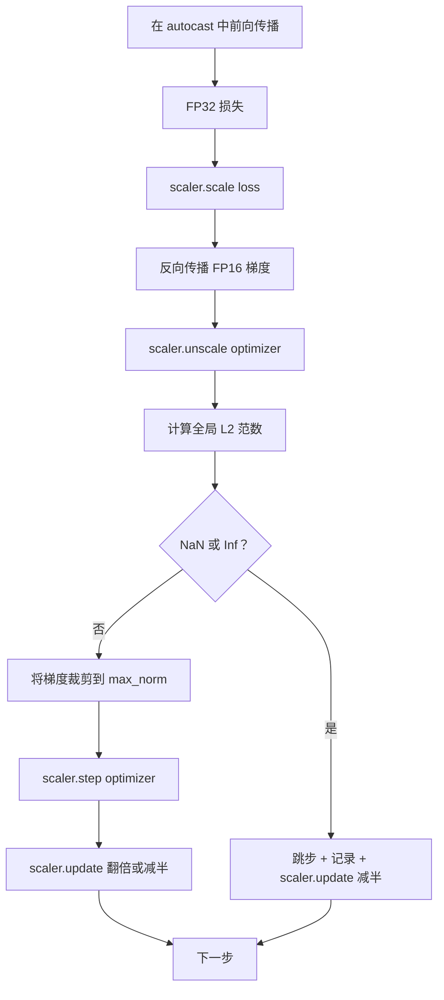

# 梯度裁剪与混合精度（Gradient Clipping and Mixed Precision）

> 上一课的优化器和调度假定梯度正常，但通常并非如此。单个坏批次可能让梯度范数暴增三个数量级，混合精度训练又因损失侧的 FP16 溢出加重问题。本课构建生产训练不可缺少的两项保护：按配置的全局 L2 范数裁剪梯度，以及带 autocast 和 GradScaler 的混合精度循环，检测 NaN 与 Inf、正确跳过步骤，并记录缩放因子供追查。

**Type:** Build
**Languages:** Python
**Prerequisites:** 阶段 19 第 30–37 课
**Time:** ~90 分钟

## 学习目标（Learning Objectives）

- 计算所有参数梯度的全局 L2 范数，超过配置阈值时原地裁剪。
- 用 autocast 加 GradScaler 包装训练步骤，使 FP16 前向与反向传播能应对溢出。
- 检测损失或梯度中的 NaN 和 Inf，跳过优化器步骤并记录。
- 每步报告 GradScaler 缩放因子，让连续大量跳步立即可见。

## 问题（The Problem）

昨天运行正常的训练，在第 8,217 步损失曲线突然直线上升。原因是一个批次的梯度范数达到 4,200，为此前峰值二十倍。没有裁剪，优化器这一步会清除模型此前一小时学到的内容。若按全局 L2 范数 1.0 裁剪，同一批次只贡献单位范数更新，损失保持趋势，训练得以继续。

混合精度训练（Mixed-precision training）通过 FP16 计算前向和大部分反向传播，将吞吐量提高 2–3 倍，代价是 FP16 指数范围窄。典型梯度在 FP16 中溢出得到 Inf，传播到后续层成为 NaN，下一次优化器更新将所有权重设为 NaN。PyTorch GradScaler 的解决办法是：反向传播前将损失乘以较大缩放因子，优化器更新前再将梯度除以相同因子。反缩放时若任意梯度为 Inf 或 NaN，缩放器跳过步骤、将因子减半；此前 N 步正常时，则将因子翻倍。训练过程中，因子逐渐找到 FP16 范围允许的最高值。

构建难点是正确连接两者。反缩放前裁剪，阈值作用于已缩放梯度；反缩放后裁剪，则 GradScaler 操作顺序很重要。正确顺序为：`scaler.scale(loss).backward()`、`scaler.unscale_(optimizer)`、`clip_grad_norm_`、`scaler.step(optimizer)`、`scaler.update()`。其他顺序都会让循环静默出错。

## 概念（The Concept）



### 全局 L2 范数（Global L2 norm）

全局 L2 范数是拼接后梯度向量的欧几里得范数，而非逐参数范数。PyTorch 通过 `torch.nn.utils.clip_grad_norm_(parameters, max_norm)` 实现。函数返回裁剪前范数，因此本课可以同时记录原始与裁剪后的值，诊断“每步都在裁剪”的情况时必不可少。

### autocast 与 GradScaler（autocast and GradScaler）

`torch.amp.autocast(device_type)` 是上下文管理器，选择性地以 FP16 执行符合条件的操作（多数矩阵乘法类操作）。`torch.amp.GradScaler(device_type)` 在反向传播前缩放损失，优化器更新前反缩放梯度。两者配套设计，只用其一是测试应发现的配置错误。

本课使用 CPU autocast，因为 CI 可以运行；将 `device_type="cpu"` 改为 `device_type="cuda"`，同一模式就可原样移到 CUDA。CPU 上 GradScaler 是桩（Stub）：CPU autocast 默认已采用 BF16，无需损失缩放；但本课保留调用点，使接线与 GPU 循环相同。

### 检测 NaN 与 Inf（NaN and Inf detection）

检测分两处。首先反向传播前用 `torch.isfinite` 检查损失本身；Inf 或 NaN 损失无法产生有用梯度，应跳过、不进入优化器。其次在 `scaler.unscale_(optimizer)` 后，用 `has_non_finite_grad(...)` 扫描未缩放梯度，遇到任意 Inf 或 NaN 就跳步。两项检查共同覆盖前向和反向传播故障。

### 缩放因子诊断（Scaling factor diagnostics）

缩放因子是 GradScaler 内部状态。每步读取 `scaler.get_scale()`，与学习率、梯度范数并列记录。健康训练中，因子按二的幂增长，直到在 `2^17` 或 `2^18` 附近饱和。异常训练中，因子高低振荡，说明梯度时而在范围内、时而越界。不记录就看不到这个诊断信号。

```figure
grad-clip-monitor
```

## 动手实现（Build It）

`code/main.py` 实现：

- `clip_global_l2_norm`：包装 `torch.nn.utils.clip_grad_norm_`，同时返回裁剪前后范数。
- `has_non_finite_grad`：扫描梯度中 NaN 和 Inf 的辅助函数。
- `AmpTrainState`：包装模型、`AdamW` 优化器、GradScaler 和 autocast 设备，提供 `step(inputs, targets)`，执行完整裁剪、缩放和遇 NaN 跳步的管线。
- `StepLog` 与 `SkipLog`：结构化逐步记录。
- 演示：训练小型 `nn.Linear` 模型 20 步，第 5 步向梯度注入 Inf，覆盖跳步路径并打印日志。

运行：

```bash
python3 code/main.py
```

脚本以零退出，逐步日志每行标为 `STEP` 或 `SKIP`，至少有一行为 `SKIP`。

## 生产模式（Production Patterns）

四种模式使循环成为生产训练步骤。

**跳步计数用作告警，而非仅日志行（Skip counter as an alert, not a log line）。** 每次训练少量跳步正常，每轮数百次则必须告警：模型处在 FP16 无法容纳的状态，循环正静默失败。本课跟踪 1000 步滚动跳步率，生产中超过 5% 时应呼叫值班人员。

**裁剪阈值放在配置中（Clip threshold lives in the config）。** `max_norm = 1.0` 是现代语言模型训练默认值。先在小模型扫描：更大阈值让模型从真正困难的批次恢复；更小阈值限制最坏情况，但损失曲线噪声更多。阈值应与第 44 课调度放在同一 YAML 或 JSON 配置中。

**范数与调度记录到同一 CSV（Norm log goes to a CSV with the schedule）。** CSV 列为 `step, lr, grad_l2_pre_clip, grad_l2_post_clip, loss, skipped, skip_reason, scaler_scale`。评审打开文件，一行就能看到调度、梯度变化、缩放因子及跳步结果和原因。将列分散到不同文件，容易造成分析错位。

**即使跳步，每步也执行 `scaler.update()`（Runs every step, even on skip）。** 正常步骤中，缩放器读取并递增无 Inf 计数，可能将因子翻倍。跳步时因子减半、计数归零。跳步路径忘记调用 `update()`，就是“缩放因子从未变化”的原因。

## 实际应用（Use It）

生产模式：

- **autocast 设备匹配优化器设备（Autocast device matches optimizer device）。** GPU 训练用 `torch.amp.autocast(device_type="cuda")`，CPU 用 `torch.amp.autocast(device_type="cpu")`。混用设备会产生静默类型错误，表现为损失曲线看似正常，模型却没学到内容。
- **反向传播前检查损失（Loss check before backward）。** `torch.isfinite(loss).all()` 只需一次张量归约，成本可忽略，遇 NaN 损失却可省下整个训练步骤。始终执行。
- **在 `zero_grad` 中使用 `set_to_none=True`（Set gradients to None）。** 将梯度设为 `None` 而非零，让优化器跳过未受影响参数组的计算。这免费提升吞吐量，并略微缩小出错面。

## 交付成果（Ship It）

真实项目中的 `outputs/skill-clip-amp.md` 应说明训练步骤使用的裁剪阈值与 autocast 设备、逐步 CSV 在版本控制中的位置，以及生产跳步率告警阈值。本课交付引擎。

## 练习（Exercises）

1. 将合成 Inf 注入替换为真实损失突增（将一个批次目标乘以 1e8），验证跳步路径触发。
2. 添加 `--bf16` 模式，将 autocast 从 FP16 改为 BF16。BF16 指数范围更宽，很少需要损失缩放；验证相同演示跳步率降至零。
3. 添加单元测试，确认未发生裁剪时，梯度裁剪包装器正确返回裁剪前后范数。
4. 添加滚动窗口跳步率计算和 CLI 标志，若连续 100 步超过配置阈值，就让运行失败。
5. 接入规范 CSV 写入（`step, lr, grad_l2_pre_clip, grad_l2_post_clip, loss, skipped, skip_reason, scaler_scale`），每行刷新，确认 Ctrl-C 后文件仍完好。

## 关键术语（Key Terms）

| 术语 | 常见说法 | 实际含义 |
|------|-----------------|------------------------|
| 全局 L2 范数（Global L2 norm） | “裁剪目标（Clip target）” | 所有可训练参数的拼接梯度向量的欧几里得范数 |
| 自动转换（autocast） | “混合精度（Mixed precision）” | 在 `with` 块中选择性以 FP16 或 BF16 执行符合条件的操作 |
| 梯度缩放器（GradScaler） | “损失缩放器（Loss scaler）” | 反向传播前乘损失、优化器步骤前反缩放梯度的辅助组件 |
| 跳步（Skip） | “坏步骤（Bad step）” | 因梯度或损失非有限而拒绝优化器更新，缩放器将因子减半 |
| 缩放因子（Scaling factor） | “缩放器状态（Scaler state）” | GradScaler 当前乘数；连续正常后翻倍，每次跳步减半 |

## 延伸阅读（Further Reading）

- [Micikevicius 等，混合精度训练（Mixed Precision Training，arXiv 1710.03740）](https://arxiv.org/abs/1710.03740)：最初的损失缩放提案
- [Pascanu、Mikolov、Bengio，论循环神经网络的训练困难（On the difficulty of training recurrent neural networks，arXiv 1211.5063）](https://arxiv.org/abs/1211.5063)：梯度裁剪参考论文
- [PyTorch torch.amp.GradScaler](https://docs.pytorch.org/docs/stable/amp.html)：本课包装的缩放器 API
- [PyTorch torch.nn.utils.clip_grad_norm_](https://docs.pytorch.org/docs/stable/generated/torch.nn.utils.clip_grad_norm_.html)：本课使用的裁剪基本操作
- 阶段 19 第 42 课：为循环供给语料的下载器
- 阶段 19 第 43 课：循环使用的数据加载器
- 阶段 19 第 44 课：与循环组合的调度
