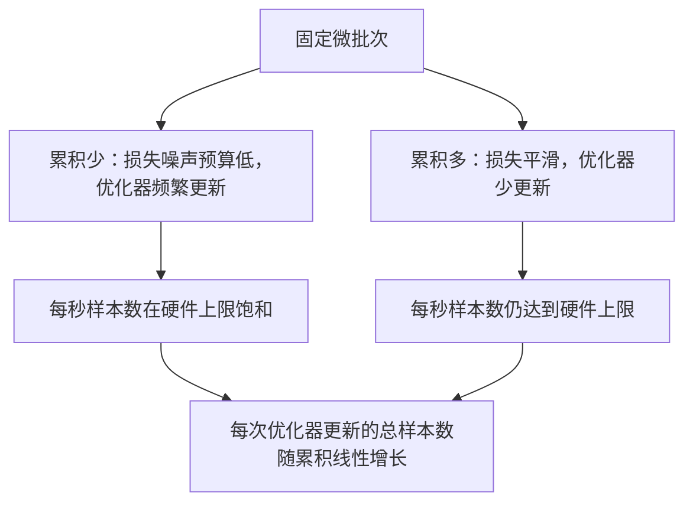

# 梯度累积（Gradient Accumulation）

> 逐个微批次处理，以内存无法一次容纳的有效批量训练。缩放损失，推迟优化器更新，让梯度累积起来。

**Type:** Build
**Languages:** Python
**Prerequisites:** 阶段 19 第 42 至 45 课
**Time:** ~90 分钟

## 学习目标（Learning Objectives）

- 推导有效批量（Effective batch）恒等式：`effective_batch = micro_batch * accum_steps`。
- 实现逐微批次（Micro-batch）损失缩放，使累积梯度匹配一次完整批次反向传播。
- 最后一个微批次前跳过优化器同步，即末步同步（Sync-on-last-step）。
- 阅读吞吐量与有效批量曲线，解释收益递减。

## 问题（The Problem）

你希望有效批量为 512，因为损失曲线更平滑，优化器在这个尺度更新更合理。桌上的加速器只能容纳 32 个样本，再多就内存不足。批量翻倍不可行，模型减半也不可行。业界自 2017 年沿用至今的技巧是运行 16 次反向传播，让梯度在参数缓冲区累积，计数达到目标后才更新优化器。

风险是损失不再与大批次时相同。直接累加 16 个小批次交叉熵，会得到完整批次损失的 16 倍。不缩放时梯度方向正确、幅度却错误，优化器步长大了 16 倍。修复只需一次除法，也很容易忘掉。

## 概念（The Concept）


契约很短：

- 每个微批次的损失在 `backward()` 前除以 `accum_steps`。PyTorch 默认将梯度累加到 `param.grad`，除法将运行中的总和拉回正确尺度。
- 最后一个微批次反向传播后，每个有效批次只触发一次优化器更新。累积中途更新，会使后续运行依赖的所有参数偏离。
- 优化器状态（动量缓冲区、Adam 矩）每个有效步骤推进一次，而非每微批次一次，否则指数移动平均（Exponential moving average）会接收到错误频率，过快走完调度。
- 单设备上这只是计数管理；多进程集群中，同一模式将非最后微批次包在 `no_sync` 上下文，跳过梯度全归约（All-reduce）。最后微批次一次归约全部累积梯度，避免支付 N 次网络成本。

### 用代码证明等价性（The equivalence proof in code）

```python
loss = criterion(model(x_full), y_full)
loss.backward()
opt.step()
```

等价于：

```python
for x, y in chunks(x_full, y_full, n):
    scaled = criterion(model(x), y) / n
    scaled.backward()
opt.step()
```

差异仅来自浮点求和顺序。循环结束时的累积梯度缓冲区，与一次完整批次反向传播产生的张量相同。本课在 `equivalence_check` 中断言最大绝对差小于 1e-4，验证这一点。

### 成本在哪里（Where the cost goes）

每个微批次需要一次前向和反向传播。累积是用时间换内存。`outputs/accum-curve.json` 的吞吐量曲线展示固定微批次下，有效批量增长会发生什么：



没有免费收益。`accum_steps` 翻倍，每次优化器更新的实际耗时也翻倍。变化的是梯度估计方差：相同实际时间预算内，优化器更新更少，但每次平均更多样本。文献把大批量和小批量视为不同优化问题；本课讲实现机制，而非统计学。

```figure
cc-grad-accumulation
```

## 动手实现（Build It）

`code/main.py` 是可运行交付物，完成三件事。

### 第 1 步：等价性检查（Step 1: equivalence check）

`equivalence_check()` 用相同种子构建同一网络的两个副本。一个一次前向处理 16 样本批次，另一个处理四个各 4 样本的数据块，并将损失除以四。函数比较更新前梯度缓冲区与更新后参数，断言 `max_abs_diff < 1e-4`。

### 第 2 步：末步同步模式（Step 2: sync-on-last-step pattern）

`train_one_optimizer_step` 遍历微批次，除最后一个外，每个都进入 `no_sync_context(model)`。单进程时上下文无操作；在分布式数据并行（DDP）中，这里跳过梯度全归约。两种情况的计数管理相同。`sync_counter` 记录离开 no_sync 范围的次数；N 个微批次，每有效步骤计数为一，而非 N。

### 第 3 步：吞吐量曲线（Step 3: the throughput curve）

`sweep_effective_batches` 以固定微批次和一组累积步数运行同一模型，每项设置记录：

- `samples_per_sec`：已处理总样本数除以实际耗时
- `median_step_ms`：每有效步骤耗时的第 50 百分位数
- `sync_calls`：执行的集合通信点
- `avg_loss`：扫描中各次优化器步骤的平均损失

输出写到 `outputs/accum-curve.json`，可在笔记本中复用。

运行：

```bash
python3 code/main.py
```

脚本依次打印等价性差值、扫描表格和 JSON 路径，退出码为零。

## 实际应用（Use It）

生产训练中，梯度累积由一个调节项控制。PyTorch 模式为 `accumulation_steps = effective_batch // (micro_batch * world_size)`。本课不允许使用的框架也包装同样的循环，步骤仍是：缩放损失、非末微批次跳过同步、累积、更新一次。

实际使用的三种模式：

- 微批次大小按占满设备内存选择。更小浪费加速器计算周期，更大会崩溃。
- 有效批量根据学习率调度选择。大有效批量需要缩放学习率与预热，这就是自 2017 年讨论的线性缩放规则（Linear scaling rule）。
- 累积次数连接二者，也是不重写数据加载器就能在运行时自由调节的唯一参数。

## 交付成果（Ship It）

`outputs/skill-gradient-accumulation.md` 记录操作方案，便于同伴接入新仓库：损失按 `accum_steps` 缩放，非末微批次跳过优化器同步，每有效批次更新一次优化器，以 JSON 记录吞吐量与有效批量，让权衡可见。

## 练习（Exercises）

1. 用 `--num-steps 100` 重新扫描，绘制每秒样本数与有效批量关系。曲线在哪里变平？
2. 添加错误缩放变体（不做除法），展示第 1 步相对参考的参数差值。
3. 用 AdamW 替换 SGD，确认优化器状态每有效步骤推进一次，而非每微批次一次。
4. 引入真实 `DistributedDataParallel` 包装器，将 `no_sync_context` 路由到其方法。确认每有效批次 sync_calls 减少 N-1。
5. 修改等价性检查，比较不同微批次拆分（2 组各 8 个与 4 组各 4 个），解释需要放宽的容差。

## 关键术语（Key Terms）

| 术语 | 常见说法 | 实际含义 |
|------|-----------------|------------------------|
| 微批次（Micro batch） | 前向传播的批次 | 单次前向传播中能放入内存的切片 |
| 累积步数（Accum steps） | 每步反向传播次数 | 一次优化器更新前累加的反向传播次数 |
| 有效批量（Effective batch） | 批量 | 微批次大小乘累积步数再乘数据并行进程总数 |
| 损失缩放（Loss scaling） | 除以 N | 每微批次做除法，使梯度总和匹配完整批次 |
| 末步同步（Sync on last） | 跳过其余 | 只在窗口最后一次反向传播执行梯度集合通信 |

## 延伸阅读（Further Reading）

- PyTorch 的 `DistributedDataParallel.no_sync` 文档：末步同步技巧的生产版本。
- Goyal 等人 2017 年的大批量训练线性缩放研究：关注有效批量的经典理由。
- PyTorch 问题跟踪器：梯度累积与混合精度反缩放之间的交互。
- 阶段 19 第 42 至 45 课：本课假定已有的模型、数据加载器、优化器及训练器基础。
- 阶段 19 第 47 课：检查点与恢复，让长时间累积训练能应对运行时限。
