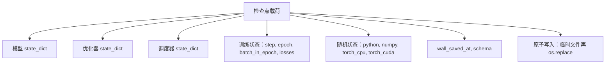
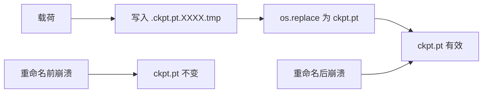
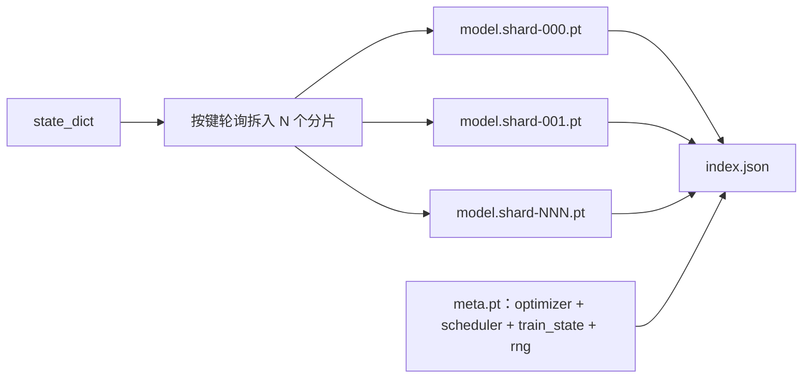

# 检查点保存与恢复（Checkpoint Save and Resume）

> 训练中断会终止运行，检查点让它继续。原子地保存模型、优化器、调度器、损失历史、步骤计数与随机数生成器状态，使任意时刻被终止后，磁盘上都留有有效文件。

**Type:** Build
**Languages:** Python
**Prerequisites:** 阶段 19 第 42 至 45 课
**Time:** ~90 分钟

## 学习目标（Learning Objectives）

- 将完整训练状态捕获到单个载荷（Payload），可在新进程重新加载。
- 先写临时文件再重命名，实现原子保存（Atomic save），不让崩溃留下写到一半的文件。
- 恢复 Python、NumPy 和 PyTorch 的随机数生成器（RNG）状态，使恢复后损失匹配未中断基线。
- 为无法放进单个文件的模型构建分片检查点（Sharded checkpoint）布局，带哈希验证分片和 JSON 索引。

## 问题（The Problem）

你设定训练任务运行 18 小时，实际运行时限是 4 小时。第 11 小时，某位上级批准内核升级，集群重启。没有检查点就得从头开始。没有恢复，还会丢掉前 11 小时学出的优化器状态；即使权重幸存，AdamW 矩也消失了，下一步会突然转向训练轨迹早已越过的方向。

正确交付物是包含继续运行所需一切的单个文件：模型参数、优化器状态、调度器状态、绘图损失历史、当前步骤、轮次、轮内批次计数，以及所有随机来源的 RNG 状态。没有 RNG 状态，恢复后就是另一条损失曲线：同一模型、同一数据，不同打乱顺序、不同随机失活掩码，看板上数值不同。

原子保存是契约的另一半。直接写最终文件名，中途崩溃就留下损坏文件，恢复会读到错误内容。写同目录临时文件再重命名，中途崩溃仍保留此前完好文件。POSIX 文件系统上的重命名是原子的。

## 概念（The Concept）



### 五类状态（The five state buckets）

| 类别 | 重要原因 |
|--------|----------------|
| 模型（Model） | 权重与缓冲区，定义模型本身。 |
| 优化器（Optimizer） | 动量与自适应矩；缺失后下一步就是不同的优化问题。 |
| 调度器（Scheduler） | 学习率在曲线上的位置，余弦调度尤其依赖它。 |
| 训练计数（Train counters） | 步骤、轮次、轮内批次，以及用于看板绘图的损失历史。 |
| RNG 状态（RNG state） | 保证随机失活、数据打乱及模型内任何采样的确定性。 |

### 原子保存（Atomic save）



两条规则。第一，临时文件必须与目标同目录，让重命名留在同一文件系统；跨设备重命名不原子。第二，每次尝试使用唯一临时名称，防止两个写入者互相覆盖。

### 分片检查点（Sharded checkpoints）

模型变大后，单文件载荷过大，难以快速加载和检查，网络共享中途读取异常时也很痛苦。解决办法是把参数状态拆成分片，用小索引连接。



索引记录分片数、各分片 sha256 和元数据文件 sha256。任意哈希不符，加载器明确报错。分片可放在不同物理磁盘；元数据很小，优先读取。

### 在轮次中途恢复（Resume continues mid epoch）

直接跳到下一轮起点恢复，会浪费几分钟至一天工作。解决办法是 `(epoch, batch_in_epoch)` 加 RNG 状态。加载后，训练循环让随机数生成器快进越过本轮已处理批次，从 `batch_in_epoch` 继续。本课代码精确执行，断言恢复后的损失轨迹在 1e-4 内匹配未中断基线。

```figure
cc-atomic-checkpoint
```

## 动手实现（Build It）

`code/main.py` 提供四个基本操作和一个演示驱动器。

### 第 1 步：捕获和恢复 RNG 状态（Step 1: capture and restore RNG state）

`capture_rng_state` 返回字典，含 Python `random.getstate`、NumPy `np.random.get_state`，以及 PyTorch CPU 和 CUDA RNG 字节。`restore_rng_state` 反向恢复。CPU 张量是 PyTorch RNG 能读取的 uint8 字节缓冲区。

### 第 2 步：原子保存（Step 2: atomic save）

`atomic_save` 把载荷写到目标目录的临时文件，再用 `os.replace` 换成最终名称。`atomic_write_json` 对分片索引执行同样操作。

### 第 3 步：完整检查点往返（Step 3: full checkpoint round trip）

`save_checkpoint` 将模型、优化器、调度器、训练状态和 RNG 打包进字典。`load_checkpoint` 反向加载，返回 `TrainState`。模式字段（Schema field）是升级钩子：以后格式变化时提升版本字符串，由加载器分派。

### 第 4 步：分片变体（Step 4: sharded variant）

`save_sharded_checkpoint` 将参数键轮询分配到 N 个分片，各自原子保存，写入包含优化器、调度器与训练状态的元数据文件，再写包含分片 sha256 的 JSON 索引。`load_sharded_checkpoint` 合并前验证每个分片。

### 第 5 步：恢复演示（Step 5: resume demo）

`run_resume_demo` 训练小模型 `total_steps` 步，在 `interrupt_at` 保存检查点后继续。第二个进程恢复检查点，运行余下步骤。函数返回中断点之后两条损失轨迹的最大绝对差。恢复 RNG 后，差值为零或浮点噪声。

运行：

```bash
python3 code/main.py
```

单文件与分片演示都断言最大差小于 1e-4，汇总写入 `outputs/resume-demo.json`。

## 实际应用（Use It）

生产训练栈将检查点保存作为训练器的一部分。形式相同：模型加优化器加调度器加计数器加 RNG，原子写入，按步骤命名便于找到最新文件。分片布局借助并行读取支持大模型加载，index.json 让这件事成立。

应强制三种模式：

- **载荷中的模式是字符串（Schema is a string in the payload）。** 迁移按它分支；没有它，格式演进就会破坏旧运行。
- **每个分片做 sha256（Sha256 every shard）。** 静默截断下载是最糟的错误；加载器不是尽早失败，就是拖到之后失败。
- **保存频率必须可靠（Keep checkpoint cadence honest）。** 每 N 步或按实际分钟间隔保存，以更短间隔为准。否则长步骤崩溃会浪费整个窗口的工作。

## 交付成果（Ship It）

`outputs/skill-checkpoint-save-resume.md` 为新训练脚本提供方案：载荷结构、原子写入、RNG 捕获、分片索引。把技能加入仓库，在周期保存处接入 `save_checkpoint`，启动时接入 `load_checkpoint`，运行就能从终止中恢复。

## 练习（Exercises）

1. 将轮询分片改为按参数组分片（以 `.weight` 和 `.bias` 结尾的层分开）。各布局何时更合适？
2. 扩展保存循环，只保留最近 K 个检查点并清理更旧的。磁盘小时 K 应是多少？
3. 添加 `--ckpt-every-seconds` 标志，按实际时间间隔触发保存，而不只按步骤。
4. 添加启动时校验路径，扫描目录中所有检查点，报告哪些已损坏。
5. 实现 `migrate_v1_to_v2`，给载荷新增字段、提升模式字符串，让加载兼容两版。

## 关键术语（Key Terms）

| 术语 | 常见说法 | 实际含义 |
|------|-----------------|------------------------|
| 原子保存（Atomic save） | “写完后祈祷” | 写同目录临时文件，再用 os.replace 替换目标名 |
| 状态字典（State dict） | “权重” | 以参数名为键的模型参数与缓冲区 |
| 分片检查点（Sharded checkpoint） | “大模型文件” | 每分片一个文件，加元数据文件和带 sha256 的 JSON 索引 |
| RNG 状态（RNG state） | “随机种子” | 捕获 python random、numpy、torch CPU、torch CUDA 状态，而非仅种子 |
| 轮中恢复（Mid-epoch resume） | “重启” | 快进 RNG，从同一轮的下一个批次继续 |

## 延伸阅读（Further Reading）

- POSIX `rename` 语义：`os.replace` 所依赖的原子性依据。
- PyTorch 的 `torch.save` 与 `torch.load` 文档，包括跨设备恢复的 `map_location`。
- 阶段 19 第 46 课：本课检查点载荷能够跨越保存的梯度累积。
- 阶段 19 第 48 课：本方案适配其状态字典格式的分布式包装器。
- Linux 内核 `fsync` 文档：原子重命名背后的持久性保证。
