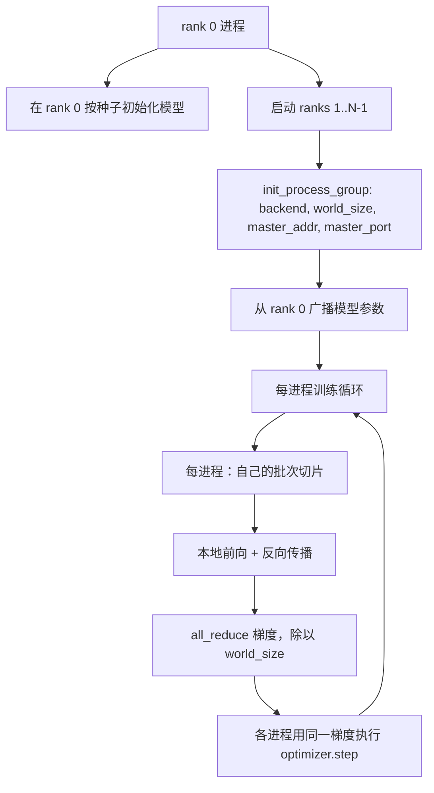
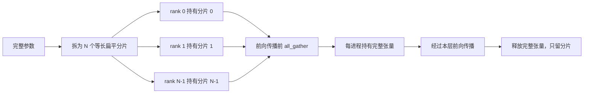

# 从零实现分布式数据并行与 FSDP（Distributed Data Parallel and FSDP from Scratch）

> 多进程训练就是两种集合通信和一条规则：启动时广播参数，反向传播后平均梯度，绝不让各进程对当前步骤产生分歧。

**Type:** Build
**Languages:** Python
**Prerequisites:** 阶段 19 第 42 至 45 课
**Time:** ~90 分钟

## 学习目标（Learning Objectives）

- 使用 `gloo` 后端，在 N 个进程编号（Rank）间建立进程组（Process group），无需特殊硬件。
- 实现最小分布式数据并行（Distributed Data Parallel，DDP）包装器，构造时广播参数，反向传播后全归约梯度。
- 证明逐进程梯度的全归约结果匹配拼接输入上的单进程梯度。
- 实现全分片数据并行（Fully Sharded Data Parallel，FSDP）参数分片示意：每进程持有切片，前向传播时收集完整张量，之后释放。

## 问题（The Problem）

模型能放进一台设备，数据集却不能。优化预算要求每秒看到 N 倍样本。第一个手段是数据并行：每进程用同一模型处理批次的不同切片，优化器更新前平均梯度。第二个手段是 FSDP：模型也放不进一台设备时，每进程持有各参数的一部分，前向传播逐层重建完整张量。

难点是状态管理。参数在进程间漂移，运行会静默损坏。只平均梯度不平均损失，看板就会误导。集合通信后端无法就拓扑达成一致，运行会永久挂起。解决办法是亲手写一次集合通信，不再信任自己无法复现的包装器。

本课在 CPU 运行，不假定 CUDA。`gloo` 后端随每个 PyTorch 构建提供，可使用 `torch.multiprocessing` 工作进程；多 GPU 节点上切为 `nccl`，结构不变。

## 概念（The Concept）



### 关键的两种集合通信（The two collectives that matter）

| 集合通信 | 作用 | 时机 |
|------------|--------------|------|
| `broadcast` | 将一个进程的张量复制到其他全部进程 | 参数初始化、调度器状态、任意一对多同步 |
| `all_reduce` | 跨所有进程对张量求和、均值或最大值，每进程得到结果 | 反向传播后平均梯度 |
| `all_gather` | 各进程贡献一个张量，每进程得到拼接结果 | 逻辑值收集、FSDP 参数解除分片 |

DDP 契约是构造时 `broadcast`，反向传播后 `all_reduce`。FSDP 示意增加每层前向传播前的 `all_gather`。

### 梯度平均匹配单进程梯度（Gradient averaging matches single-process gradient）

N 个进程各用 B 样本批次训练，必须产生与单进程用 N*B 批次训练相同的梯度。诀窍是逐进程梯度求和再除以 N，得到平均损失梯度，恰好等于完整批次上采用均值归约的交叉熵梯度。本课断言手工全归约梯度与单进程参考梯度之间 `max-abs-diff < 1e-3`。

### FSDP 示意（FSDP sketch）



内存收益精确：每进程参数内存降至 1/N。成本是每次前向传播的收集操作。生产 FSDP 将收集与前一层计算重叠，实际耗时远低于朴素估计。本课对每个参数执行往返，断言重建结果与原始值逐位相等。

### CPU 与 gloo 后端（CPU and the gloo backend）

生产目标是 CUDA，但 CPU 上存在相同代码路径。`gloo` 是 CPU 集合通信后端，比 GPU 上的 `nccl` 慢多个数量级，API 却相同。本课以 `backend="gloo"` 初始化进程组，使用 `torch.multiprocessing` 而非 `torchrun` 启动进程；两者最终调用相同的 `torch.distributed`。多 GPU 节点只需改为 `backend="nccl"`、设备张量，以及用 `torchrun` 启动。

```figure
cg-allreduce-ring
```

## 动手实现（Build It）

`code/main.py` 是可运行交付物。

### 第 1 步：建立进程组（Step 1: bring up the process group）

```python
os.environ["MASTER_ADDR"] = "127.0.0.1"
os.environ["MASTER_PORT"] = str(port)
dist.init_process_group(backend="gloo", rank=rank, world_size=world_size)
```

`MASTER_ADDR` 和 `MASTER_PORT` 是会合点（Rendezvous）：各进程连接同一主机的同一端口。本课通过绑定后关闭来选择空闲端口，避免多次运行共用机器时冲突。

### 第 2 步：构造时广播（Step 2: broadcast at construction）

`MinimalDDP.__init__` 遍历所有参数和缓冲区，调用 `dist.broadcast(tensor, src=0)`。rank 0 的值成为标准初始化。没有这一步，各进程按自己的种子初始化，从第一步就分歧。

### 第 3 步：反向传播后全归约梯度（Step 3: all-reduce gradients after backward）

```python
def all_reduce_grads_(module, world_size):
    for p in module.parameters():
        if p.grad is None:
            p.grad = torch.zeros_like(p.data)
        dist.all_reduce(p.grad.data, op=dist.ReduceOp.SUM)
        p.grad.data.div_(world_size)
```

每进程最终得到相同平均梯度。优化器更新在各进程中成为相同输入的函数，因此参数在运行中保持同步。

### 第 4 步：证明等价（Step 4: prove the equivalence）

`manual_all_reduce_matches_single_process` 在 rank 0 构建同一模型，将全归约后梯度与单进程对拼接输入计算的梯度比较，最大绝对差约为 1e-8。

### 第 5 步：FSDP 往返（Step 5: FSDP round trip）

`fsdp_round_trip_sketch` 将参数展平、填充到 `world_size` 的倍数、切片、全收集、移除填充。每进程重建结果等于原始值。这是解除分片步骤；逆操作（前向后重新分片）就是从收集张量切取一片。

运行：

```bash
python3 code/main.py
```

默认进程总数为 2。两个 CPU 进程启动，通过 `gloo` 通信，以零退出。`outputs/ddp-demo.json` 记录各进程参数和、全归约后梯度范数、FSDP 往返结果、手工与参考梯度差。

## 实际应用（Use It）

生产训练栈调用相同基本操作。PyTorch `DistributedDataParallel` 增加：让全归约与反向传播重叠的梯度钩子、将多个小梯度合成一次集合通信的分桶全归约，以及第 46 课使用的 `no_sync` 上下文。

PyTorch FSDP 增加：每层扁平参数视图，让每进程持有一个连续缓冲区；下一层解除分片与当前层计算重叠；以及可选的分片 CPU 卸载（Offload）。

形式不变：启动时广播，反向后归约，参数放不下时分片。

## 交付成果（Ship It）

`outputs/skill-distributed-fsdp-ddp.md` 为新训练脚本提供方案：CPU 用 `gloo`、GPU 用 `nccl` 建立进程组，用构造时广播、反向后归约的 DDP 外层包装模型，可选地按 FSDP 示意的 all_gather 模式分片参数。

## 练习（Exercises）

1. 用 `--world-size 4` 运行，确认各进程参数差幅全程低于 1e-3。
2. 用 `dist.all_reduce(op=dist.ReduceOp.AVG)` 替换手工平均，计时比较。
3. 给 DDP 包装器添加反向传播后钩子，让全归约与剩余反向计算重叠，测量实际耗时改善。
4. 实现 FSDP 重新分片：前向传播后以本地分片替换完整张量，确认每进程内存下降。
5. 在 CUDA 机器上切后端为 `nccl`，记录哪些环境变量改变、哪些不变。

## 关键术语（Key Terms）

| 术语 | 常见说法 | 实际含义 |
|------|-----------------|------------------------|
| 后端（Backend） | “gloo 或 nccl” | 实现集合通信的库，gloo 用于 CPU，nccl 用于 GPU |
| 进程总数（World size） | “总 rank 数” | 组内进程数，组是集合通信操作单位 |
| 进程编号（Rank） | “工作进程 ID” | 组内进程标识，从零编号 |
| 全归约（All-reduce） | “梯度求和” | 跨所有进程对张量求和，每进程得到相同结果 |
| 解除分片（Unshard） | “收集参数” | 通过 all_gather 从各进程切片重建完整张量 |

## 延伸阅读（Further Reading）

- PyTorch `torch.distributed` 文档：本课依赖的集合通信语义。
- `gloo` 库的集合通信列表：与 CUDA `nccl` 基本操作形式相同。
- 阶段 19 第 46 课：用 `no_sync` 包裹 DDP 全归约的梯度累积模式。
- 阶段 19 第 47 课：适用于 DDP 与 FSDP 运行的检查点布局。
- PyTorch FSDP 文档：此处参数分片示意的生产实现。
