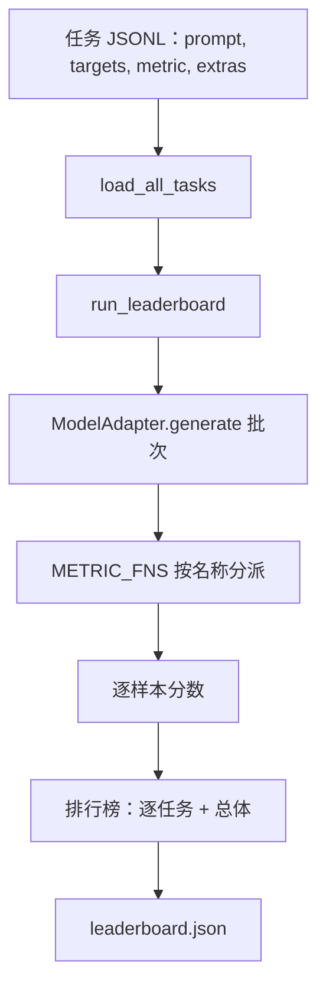
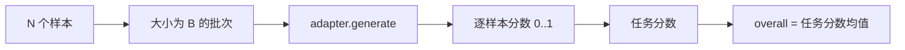

# 语言模型评估运行框架（Language Model Evaluation Harness）

> 如果连任务都无法定义，模型在其上表现好也只是偶然。评估运行框架（Harness）以简短、可替换的结构，统一任务定义、指标、运行器和排行榜。

**Type:** Build
**Languages:** Python
**Prerequisites:** 阶段 19 第 42 至 45 课
**Time:** ~90 分钟

## 学习目标（Learning Objectives）

- 用 JSONL 文件定义任务，每样本包含 `prompt`、`targets`、`metric` 及可选 `extras`。
- 实现五项指标：完全匹配（Exact match）、rouge-l F1、可执行检查、选择题和子串包含。
- 构建按任务组批样本、分派给可替换模型适配器（Model adapter）的运行器。
- 输出带逐任务分数、延迟及可复现总体均值的排行榜 JSON。

## 问题（The Problem）

每周都有新语言模型发布，营销声称它表现优秀。真正的问题是：在哪方面优秀？可信回答来自你自己写的排行榜，因为供应商的排行榜正是他们调优针对的对象。

仓库没有评估框架，你只能凭感觉比较模型；有了它，就能在固定任务集和固定指标上比较分数，并对 JSON 输出做差异检查。框架是昨天与今天运行之间的契约，缺少它就会把回归问题交付出去。

陷阱是框架过度适配单个模型。解决方法反其道而行：框架小到十五分钟可读完，任务小到可以随仓库交付，指标从零编写供同事审计，只有适配器包含模型专用代码。换适配器，排行榜变化；换任务，排行榜变化；其他内容不应变化。

## 概念（The Concept）



### 任务规范（Task spec）

每样本占一行 JSONL：

```json
{"id": "arith-00", "prompt": "compute: 2 + 2", "targets": ["4"], "metric": "exact_match"}
```

需要评分辅助数据的指标，使用 `extras` 携带附加载荷：

```json
{
  "id": "code-00",
  "prompt": "python: write a function f that doubles its input",
  "targets": ["ok"],
  "metric": "code_exec",
  "extras": {"io_pairs": [[1, 2], [3, 6]]}
}
```

任务是 `outputs/tasks/` 下的 `.jsonl` 文件，文件名就是任务名。同文件所有样本共享一个指标。

### 五个夹具任务（The five fixture tasks）

| 任务 | 指标 | 测试内容 |
|------|--------|---------------|
| arithmetic（算术） | exact_match（完全匹配） | 确定性答案的词元级正确性 |
| summary（摘要） | rouge_l | 与单行参考摘要比较的最长公共子序列 F1 |
| code-exec（代码执行） | code_exec | 可执行测试：预测函数必须满足输入输出对列表 |
| multiple-choice（选择题） | multiple_choice | 预测首字母必须匹配允许字母 |
| generation（生成） | substring_contains（子串包含） | 自由文本必须包含至少一个目标子串 |

### 指标契约（The metric contract）

每个指标都是 `(prediction, targets, extras) -> float in [0.0, 1.0]` 函数。框架平均逐样本分数得到任务分数，再平均任务分数得到总分。指标函数很小：

- `exact_match`：转小写、合并空白、比较相等。
- `substring_contains`：同样规范化，然后测试子串。
- `multiple_choice`：将首字符转大写。
- `rouge_l`：最长公共子序列（LCS）长度除以预测和参考长度，计算精确率与召回率的 F1。
- `code_exec`：在受限命名空间执行预测，对所有输入输出对调用 `f(x)`，统计匹配。

code_exec 在删减内置名称的命名空间运行预测。本课测试断言 `import os` 失败，因为命名空间没有 `os`；代码预测无法访问文件系统。

### 模型适配器（The model adapter）

```python
class ModelAdapter(Protocol):
    def generate(self, prompts: Sequence[str]) -> List[str]: ...
    @property
    def name(self) -> str: ...
```

适配器是替换边界。本课提供 `ToyAdapter`，确定性模式匹配器，对五个夹具任务的每个提示词返回正确答案。真实适配器调用模型并返回输出，框架无需区分。

### 运行器（The runner）

`run_task` 每次将 `batch_size` 个提示词组批，分派到指标函数。`run_leaderboard` 遍历所有任务并求平均。`write_leaderboard` 输出带模式字符串（Schema string）的 JSON，让未来格式变化不至于静默破坏看板。



```figure
eval-harness-matrix
```

## 动手实现（Build It）

`code/main.py` 是可运行交付物。

### 第 1 步：初始化夹具任务（Step 1: seed fixture tasks）

`seed_fixture_tasks(target_dir)` 写出五个 `.jsonl` 文件。`main.py` 首次运行且目录为空时初始化它们。

### 第 2 步：加载任务（Step 2: load tasks）

`load_all_tasks(task_dir)` 读取每个 `.jsonl`，返回任务名到 `Example` 记录列表的字典。跳过以 `#` 开头的注释行和空行，便于贡献者给文件加注释。

### 第 3 步：实现指标（Step 3: implement metrics）

每个指标是带单元测试的小函数。本课测试套件有 13 个用例，覆盖规范化、部分重叠、代码执行和不安全代码拒绝。

### 第 4 步：编写运行器（Step 4: write the runner）

`run_task` 迭代批次，生成含分数、正确数、总数和延迟的 `TaskResult`。`run_leaderboard` 遍历所有任务，生成带总体均值的 `Leaderboard`。

### 第 5 步：输出 JSON（Step 5: emit JSON）

`write_leaderboard` 序列化排行榜。`--include-per-example` 导出逐样本记录，分数变化时可与上次运行比较预测。

运行：

```bash
python3 code/main.py
```

脚本首次运行初始化夹具，用玩具适配器评分（它答对全部夹具），写入 `outputs/leaderboard.json`。玩具适配器总分为 1.0；`test_main.py` 的桩适配器测试展示适配器无法回答时，同一框架得到 0.0。

## 实际应用（Use It）

接入真实模型只需写适配器，形式如下：

```python
class HttpAdapter:
    name = "vendor.v1"

    def __init__(self, endpoint, api_key):
        self.endpoint = endpoint
        self.api_key = api_key

    def generate(self, prompts):
        out = []
        for prompt in prompts:
            response = http_post(self.endpoint, prompt, self.api_key)
            out.append(response["text"])
        return out
```

在 `main()` 顶部将 `ToyAdapter` 换成 `HttpAdapter`。框架、任务、指标和排行榜不变。

在真实项目交付框架时，应强制三种模式：

- **固定任务文件（Pin the task files）。** leaderboard.json 要么携带哈希固定的任务内容，要么附带 JSONL；否则任务文件变化就会使分数变化，无法分辨原因。
- **比较预测，而非仅分数（Diff predictions, not just scores）。** `--include-per-example` 让你看到分数下降那天模型说了什么。
- **限制批量大小（Cap the batch size）。** 真实适配器有限流，小批量让框架跨供应商兼容。

## 交付成果（Ship It）

`outputs/skill-lm-eval-harness.md` 提供方案：JSONL 任务规范、五个指标、可替换适配器、批量运行器、带模式字符串的排行榜 JSON。`outputs/tasks/` 的任务文件是夹具，可复制到真实项目作为起点。

## 练习（Exercises）

1. 添加第六个任务，使用从零编写的自定义指标（类似 BLEU 的重叠、类似 BLEURT 的参考评分，或任何契约明确的指标）。
2. 扩展 `code_exec`，捕获标准输出，接受预期标准输出列表作为目标。
3. 添加排行榜差异命令：给定两个 `leaderboard.json`，打印哪些任务变化、变化多少。
4. 限制每样本延迟。为适配器调用包超时，在排行榜显示独立 `timeouts` 列。
5. 用排行榜中的 sha256 固定任务内容，让未来读者确认评的是同一批任务。

## 关键术语（Key Terms）

| 术语 | 常见说法 | 实际含义 |
|------|-----------------|------------------------|
| 任务规范（Task spec） | “评估格式” | 每样本含 prompt、targets、metric、可选 extras 的 JSONL 文件 |
| 指标（Metric） | “如何评分” | 从 (prediction, targets, extras) 到 [0, 1] 浮点数的函数 |
| 适配器（Adapter） | “模型客户端” | 有 generate(prompts) -> list[str] 方法的对象，是唯一模型专用代码 |
| 排行榜（Leaderboard） | “记分板” | 包含逐任务分数、总数、延迟和总体均值的 JSON |
| 代码执行指标（Code exec metric） | “运行再检查” | 在受限命名空间执行预测，与输入输出对比较 |

## 延伸阅读（Further Reading）

- 原版 lm-evaluation-harness：生产参考，规模更大但形式相同。
- HuggingFace 的 lighteval：同一契约的另一实现。
- 阶段 19 第 46 课：本框架所评训练栈使用的梯度累积模式。
- 阶段 19 第 47 课：评估所用检查点格式，应在排行榜固定检查点哈希。
- 阶段 19 第 48 课：产生被测模型的分布式训练栈。
