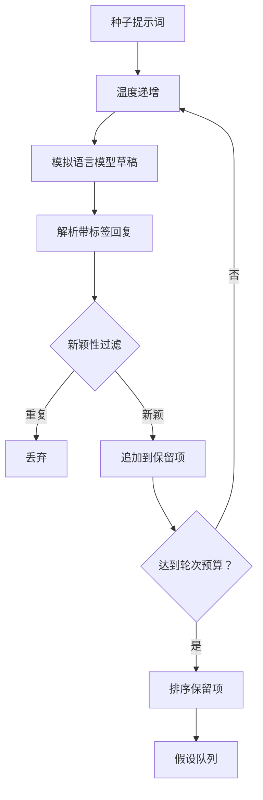

# 假设生成器（Hypothesis Generator）

> 研究智能体（Research agent）两次提出同一个问题，是在浪费词元。关键是让每份草稿都落到新的方向。

**Type:** Build
**Languages:** Python
**Prerequisites:** 阶段 19 路线 A 第 20–29 课
**Time:** ~90 分钟

## 学习目标（Learning Objectives）
- 从种子提示词驱动采样器，将输出转为带类型的假设记录。
- 每轮提高采样温度，让下一份草稿比上一份偏离更远。
- 用小型嵌入模型（Embedding model）与余弦距离阈值过滤近重复。
- 用融合新颖性、具体性和可检验性的评分函数排序保留项。
- 保持每步确定性，使相同种子始终产生相同队列。

## 为什么先生成再过滤（Why generate, then filter）

规划器只向一个模型问一次，就得到一个假设。教学示例中这没问题，研究循环中却不合适。循环需要有深度的排序队列，首个假设失败时，运行器能直接拿到下一个，不必再支付一次完整采样成本。

两个思路结合产生队列。第一是温度递增（Temperature ramping）：每轮采样提高一点温度，鼓励后续草稿探索不同方向。第二是新颖性过滤（Novelty filtering）：每份草稿生成后，测量其与此前所有保留项的嵌入距离，拒绝落在已有簇内的内容。

本课提供模拟语言模型，对固定提示词返回预编排词元序列。模拟足以覆盖完整路径：输入种子提示词、应用温度递增、解析候选、执行新颖性过滤、输出排序队列。

## 假设结构（The Hypothesis shape）

```text
Hypothesis
  id             : int           （单次运行内单调递增）
  text           : str           （主张）
  variables      : list[str]     （条件之间变化的因素）
  metric         : str           （运行器测量的指标）
  baseline_ref   : str | None    （比较引用的论文或运行）
  draft_pass     : int           （产生该草稿的采样轮次）
  temperature    : float         （起草时的采样设置）
  novelty_score  : float         （与此前保留项的距离，0..1）
  rank_score     : float         （排序使用的加权和）
```

`variables` 和 `metric` 不是自由文本。解析器从带标签回复中提取它们。第 52 课运行器构建实验配置时直接读取这些字段。

`baseline_ref` 可选但建议提供。第 53 课评估器需要比较基线；假设未提供时，回退到同一指标的上次运行。

```figure
cg-novelty-ramp
```

## 架构（Architecture）



循环很直接，有意思的是每个方框都有硬性契约。

## 温度递增（Temperature ramp）

从 `t_min` 开始，在 `t_max` 结束，步长为 `(t_max - t_min) / (n_passes - 1)`。每轮以当前温度调用采样器，由 `GeneratorConfig.schedule()` 产生 `n_passes` 个等间隔值。模拟模型根据 `(prompt, temp_bucket)` 在少量预编排回复间切换，以体现温度。桶采用开区间，小幅温度变化即可选择不同桶、产生不同草稿。生产采样器则是真实模型，传入 `temperature=t`。

默认调度为从 `0.2` 到 `1.2` 的六轮。六轮足以填队列，又不为终将被新颖性过滤拒绝的样本付费。低于 `0.2`，模型复述种子；高于 `1.2`，回复往往偏题并解析失败。

## 新颖性过滤（Novelty filter）

每份草稿解析后，生成器嵌入文本，与每个已接受假设比较。嵌入是小型哈希词袋（Hashed bag of words），归一化到单位长度。两个单位向量的余弦距离（Cosine distance）为 `1 - dot(a, b)`。草稿到任意此前保留项的最小距离高于 `novelty_threshold` 时通过，默认阈值为 `0.25`。

哈希嵌入不复杂，确定性、零依赖，足以捕捉明显情况：两份草稿共享大部分名词。生产部署可换成小型句子模型（Sentence model），接口不变。

## 排序分数（Rank score）

```text
rank_score = w_novelty * novelty_score
           + w_specificity * specificity_score
           + w_testability * testability_score
```

三个子分数。`novelty_score` 是到此前保留项的最小嵌入距离。`specificity_score` 是假设中具体变量数除以目标数。`testability_score` 在同时指定指标和基线时为一，仅指标时为一半，否则为零。

默认权重为 `0.4`、`0.3`、`0.3`，存在生成器配置中，下游课程可调整而不必复制代码分支。

## 模拟语言模型（Mock language model）

```python
class MockLLM:
    def sample(self, prompt: str, temperature: float, seed: int) -> str:
        ...
```

给定 `(prompt, temperature, seed)` 三元组，采样器是确定性的。模拟模型保存以 `(prompt_signature, temperature_bucket)` 为键的预编排回复表。没有对应条目时，返回会解析失败的回退回复，测试之一覆盖该路径。

种子会混入回复，使相同 `(prompt, temperature)` 配合不同种子产生不同草稿。测试固定种子保证可复现，真实部署的种子可来自系统时钟或计数器。

## 输出队列（Output queue）

输出为按 `rank_score` 降序排序的 `Hypothesis` 记录列表。第 52 课运行器弹出队首、执行实验，第 53 课评估器回写判定。假设被判为错误时，运行器弹出下一个。

队列有限。为空时，编排器可拓宽种子提示词、重新生成，也可停止并报告预算耗尽。

## 如何阅读代码（How to read the code）

`code/main.py` 定义 `Hypothesis`、`MockLLM`、`HypothesisGenerator` 和确定性演示。生成器只提供 `run(seed_prompt)` 方法，返回排序队列；轮次数从 `GeneratorConfig.n_passes` 读取，不作为参数传入。嵌入是哈希词元袋，新颖性过滤和排序评分各一个函数。不依赖 `numpy`，嵌入数学纯用标准库，保持可移植。

`code/tests/test_generator.py` 覆盖正常流程、重复拒绝、解析失败、温度递增边界与排序。

## 在流程中的位置（Where this slots in）

第 50 课产生队列。第 51 课取队首，搜索文献以确认或反驳。第 52 课取同一队首执行真实实验。第 53 课读取两者输出并作判定。四课组成无人参与的研究循环，但人可在任意边界介入。
