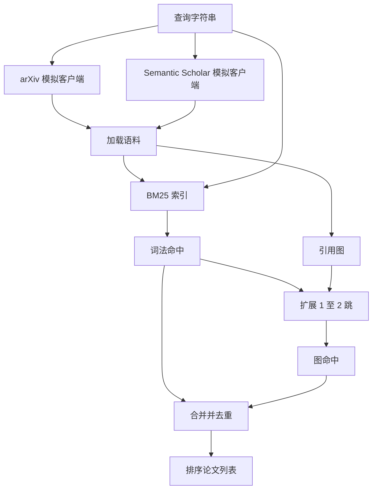

# 文献检索（Literature Retrieval）

> 提出假设成本低，弄清是否已有人证明才昂贵。构建检索层，在运行器启动沙箱前回答这个问题。

**Type:** Build
**Languages:** Python
**Prerequisites:** 阶段 19 路线 A 第 20–29 课
**Time:** ~90 分钟

## 学习目标（Learning Objectives）
- 建模小型论文记录，包含循环下游读取的字段。
- 仅用标准库数据结构，在摘要上构建 BM25 索引。
- 遍历引用图（Citation graph），找出词法搜索遗漏的论文。
- 按稳定论文 ID，对词法与图遍历命中去重。
- 将两个模拟外部 API 包在同一客户端后，接入真实端点时上游调用点不变。

## 为什么检索两遍（Why two retrieval passes）

摘要关键词搜索返回与查询共享词汇的论文，覆盖大部分情况，却漏掉两类。第一，奠基论文使用不同词汇，例如搜索“稀疏注意力”会漏掉标题为“Transformer 路由中的块选择”的论文。第二，相关论文是引用已知锚点的后续工作；先找锚点再向前遍历，比暴力搜索摘要池高效。

本课实现两遍。摘要 BM25 捕捉词法命中；引用图遍历将种子集向前、向后扩展一至两跳。并集按论文 ID 去重，以简单组合分数排序。

## 论文结构（The Paper shape）

```text
Paper
  id          : str           （稳定标识符，模拟语料使用 "p001"）
  title       : str
  abstract    : str
  year        : int
  authors     : list[str]
  references  : list[str]     （本论文引用的论文 ID）
  citations   : list[str]     （引用本论文的论文 ID）
  source      : str           （提供记录的模拟 API，"arxiv" 或 "s2"）
```

references 与 citations 字段组成有向引用图。两个模拟 API 返回字段重叠但不完全相同，语料加载器按 `id` 合并。

```figure
cg-citation-hops
```

## 架构（Architecture）



检索客户端负责两遍检索及合并。调用者传入查询，得到排序列表，每条含解释排序的逐论文评分字段（`bm25_score`、`graph_distance`、`recency_score`、`final_score`）。

## 从零实现 BM25（BM25 from scratch）

实现采用标准 Okapi BM25，默认参数 `k1=1.5`、`b=0.75`。索引是两个字典：`term -> doc_frequency` 与 `term -> list of (doc_id, term_count)`。文档长度为摘要词元数，平均长度在建索引时计算一次。查询评分为各查询词项的 `idf * tf_norm` 之和，`tf_norm` 是标准 BM25 长度归一化词频。

分词器先 `lower`，再按非字母数字拆分，不做词干提取（Stemming）。生产系统可换小型词干提取器，接口不变。

```text
idf(t)      = log((N - df + 0.5) / (df + 0.5) + 1.0)
tf_norm(t)  = (f * (k1 + 1)) / (f + k1 * (1 - b + b * dl / avgdl))
score(d, q) = sum over t in q of idf(t) * tf_norm(t)
```

## 引用图遍历（Citation graph traversal）

图从语料构建一次。正向边由论文指向其参考文献，反向边由论文指向引用它的论文。以排名最高的 BM25 命中为种子执行广度优先搜索（Breadth-first search），最多两跳。

两跳是刻意上限。一跳太浅，智能体往往需要直接祖先或后继。三跳会在连通图上使结果规模爆炸，且容易偏题。本课将跳数上限暴露为配置，供下游循环收紧。

## 去重与排序（Dedup and ranking）

两遍返回重叠集合，按论文 ID 合并。每论文最终分数为加权组合。

```text
final_score = w_bm25 * bm25_score_norm
            + w_graph * graph_score
            + w_recency * recency_score
```

`bm25_score_norm` 为 BM25 分数除以合并集中最高 BM25 分数，因此在零至一之间。`graph_score` 对直接词法命中为一，一跳为 `0.6`，两跳为 `0.3`，其他为零。`recency_score` 从语料最早年份的零，线性升至最晚年份的一。

默认权重为 `0.5`、`0.3`、`0.2`，属于配置；发展缓慢的主题可调低时效性权重，快速发展的主题则调高。

## 模拟语料（Mock corpus）

`build_corpus()` 生成一百篇论文。每篇有手写标题和摘要，属于五个主题之一：注意力稀疏化、检索增强、低秩适配器、数据集蒸馏、评估运行框架。参考与引用连接成各主题内的连通子图，并有少量跨主题边。

两个模拟 API 客户端（`ArxivMockClient`、`SemanticScholarMockClient`）读取同一语料，暴露不同字段。arXiv 返回标题、摘要、年份、作者，Semantic Scholar 增加参考与引用。客户端按 ID 合并；跨客户端字段分歧处理留给后续课程。

## 第 52、53 课读取什么（What lessons 52 and 53 read）

第 52 课运行器读取 `paper.id`、`paper.title` 和摘要前三句，作为实验上下文。第 53 课评估器读取 `paper.year` 和 `paper.references`，将基线归到具体论文。

检索客户端返回 `RetrievalResult`，同时包含排序列表和逐查询指标：命中数、平均分、最高分、总实际耗时。运行器记录它们，使下游可观测性（Observability）流程能绘制质量随时间变化。

## 如何阅读代码（How to read the code）

`code/main.py` 定义 `Paper`、`ArxivMockClient`、`SemanticScholarMockClient`、`BM25Index`、`CitationGraph`、`RetrievalClient` 和确定性演示。模拟客户端与语料同文件，保持可移植。BM25 实现一个类、六十行，图遍历一个方法。

`code/tests/test_retrieval.py` 覆盖词法路径、图路径、合并、去重与空查询。

## 在流程中的位置（Where this slots in）

第 50 课产生假设，第 51 课搜索文献检查它是否已有定论，尚未解决则第 52 课执行实验。第 53 课读取检索结果与实验指标并作判定。检索客户端是四阶段中成本最低的，在编排器中先运行。
