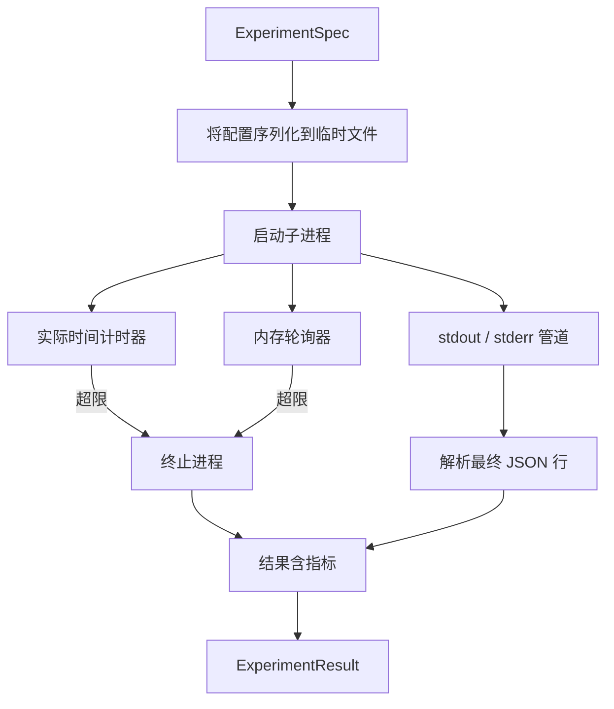

# 实验运行器（Experiment Runner）

> 循环是否可信，取决于测量是否可信。构建运行器，接收规范，在沙箱化子进程中执行，输出评估器可信任的 JSON 指标数据。

**Type:** Build
**Languages:** Python
**Prerequisites:** 阶段 19 路线 A 第 20–29 课
**Time:** ~90 分钟

## 学习目标（Learning Objectives）
- 将实验编码为带类型的规范（Spec），供运行器序列化并传给子进程。
- 启动带硬性实际时间超时和软内存上限的子进程，将两者暴露为终止条件。
- 将标准输出、标准错误与结构化指标收集进单个结果记录。
- 构建消融表（Ablation table），基于固定基础规范每次扫描一个配置项。
- 给定种子时保持结果确定性，让评估器跨运行看到相同数值。

## 为什么用子进程（Why a subprocess）

研究循环运行不可信代码。假设来自采样器，实验脚本也来自同一路径；把任一视为安全并在进程内运行，就是冒着崩溃连带击倒编排器的风险。子进程是语言提供的最简单隔离：独立进程、独立地址空间、父进程侧信号句柄。

这里的运行器不实现完整沙箱（Sandboxing）。没有 cgroup、seccomp 过滤或命名空间重映射；有的是实际时间超时、监测内存增长的轮询循环，以及任一超限时终止进程的路径。这是更复杂沙箱都会扩展的运行时契约。本课保持其小到可以一次读完。

## 实验规范结构（The ExperimentSpec shape）

```text
ExperimentSpec
  spec_id        : str            （稳定 ID，"exp_001"）
  hypothesis_id  : int            （关联第 50 课队列）
  script_path    : str            （待运行 Python 脚本路径）
  config         : dict           （作为一个 JSON 参数传给脚本）
  seed           : int            （实验的确定性种子）
  wall_timeout_s : float          （硬超时，超出即终止）
  memory_cap_mb  : int            （软上限，轮询检测，超出即终止）
  metric_keys    : list[str]      （评估器读取的字段）
```

脚本位于磁盘；运行器把配置写进临时文件，由脚本读取。脚本应在标准输出打印单行 JSON，其键覆盖 `metric_keys`。其他标准输出也捕获，但指标解析器忽略。

```figure
cg-runner-limits
```

## 架构（Architecture）



运行器是一个类、一个主方法。轮询器是小线程，每个轮询间隔醒来一次；可用时从 proc 文件系统读取相当于子进程 `psutil` 的信息，平台不提供时回退为无操作。

## 为什么是软内存上限（Why a soft memory cap）

硬内存上限需要 `resource.setrlimit`，只在 POSIX 工作。本课采用可移植方法：从平台轮询驻留集大小（Resident set size，RSS），超过上限便终止子进程。因为轮询间隔非零，进程可在两次轮询间冲过上限又回落，所以是软限制。运行器记录观测到的最大 RSS，评估器可看到运行距上限多近。

系统不支持进程检查时，轮询器记录一次警告并禁用自身。实际时间超时仍生效，测试覆盖两条路径。

## 捕获标准输出和标准错误（Capturing stdout and stderr）

运行器在完成时排空并读取两条管道。逐行扫描标准输出，最后一个可解析为 JSON 且含全部必需 `metric_keys` 的行作为指标。更早 JSON 行以 `intermediate_metrics` 保留在结果中，供评估器绘制学习曲线。

标准错误原样捕获。非零退出码不会让运行器抛异常，而是记录到结果。即使脚本打印了指标，任何非零退出仍标为 `"crash"`，让评估器默认将未完整运行视为失败。

## 消融表（Ablation table）

```python
def ablate(base: ExperimentSpec, knob: str, values: list[Any]) -> list[ExperimentSpec]:
    ...
```

给定基础规范与配置项名称，辅助函数为每个值返回一份覆盖 `config[knob]` 的规范。每份获得派生 `spec_id`（`f"{base.spec_id}_{knob}_{value}"`）。本课 `AblationRunner` 按顺序运行，返回以配置项值为键的 `AblationTable`。

为什么每次只动一项？全因子扫描（Full factorial sweep）会指数膨胀，结果难以解释。单项扫描产生评估器可绘制的清晰坐标轴。本课的多项扫描只支持调用者组合多次单项消融。

## 确定性（Determinism）

每份规范带种子。运行器通过配置字典（`config["__seed"] = spec.seed`）传给脚本。`code/experiments/` 模拟实验遵守种子，跨运行产生相同指标。第 53 课评估器依赖此性质；否则所谓“回归”可能只是另一次随机初始化。

## 模拟实验脚本（The mock experiment script）

本课提供实验脚本 `code/experiments/sparsity_experiment.py`。它是真实脚本，读取配置文件，用 numpy 随机计算模拟小型训练，打印 JSON 指标。支持 `sleep_s` 配置测试超时，`allocate_mb` 测试内存轮询器。

模拟没有训练真实模型，只是数值计算模仿训练循环形式：损失曲线、最终困惑度、实际耗时。重点是运行器，而非模拟。真实实验脚本会导入模型。

## 结果结构（Result shape）

```text
ExperimentResult
  spec_id              : str
  hypothesis_id        : int
  exit_code            : int
  terminal             : "ok" | "timeout" | "oom" | "crash"
  wall_time_s          : float
  peak_rss_mb          : float | None
  metrics              : dict
  intermediate_metrics : list[dict]
  stdout_tail          : str
  stderr_tail          : str
```

评估器先读 `metrics` 和 `terminal`。终止状态不是 `"ok"` 就算失败运行，自动给出判定；否则将指标送入显著性检验（Significance test）。

## 如何阅读代码（How to read the code）

`code/main.py` 定义 `ExperimentSpec`、`ExperimentResult`、`ExperimentRunner`、`AblationRunner` 与确定性演示。子进程管理一个类，内存轮询器一个小线程，消融辅助逻辑一个函数。

`code/experiments/sparsity_experiment.py` 是测试用模拟实验，从 argv 读取配置路径，完成时输出单行 JSON 指标。

`code/tests/test_runner.py` 覆盖成功、超时、崩溃、消融表，以及两次运行间确定性检查。

## 在流程中的位置（Where this slots in）

第 50 课生成假设，第 51 课过滤文献已解决的内容，第 52 课运行剩余假设的实验。第 53 课读取结果、运行显著性检验并作判定，编排器按假设 ID 存储。
