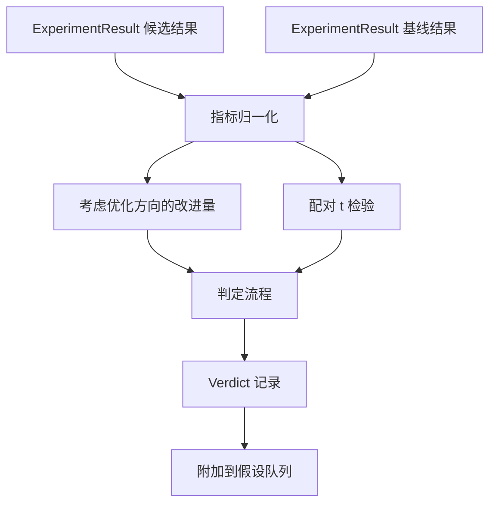

# 结果评估器（Result Evaluator）

> 运行器产出了数值。评估器（Evaluator）负责判断这些数值代表改进、退步还是噪声。构建判定流程，将指标转化为一句结论。

**Type:** Build
**Languages:** Python
**Prerequisites:** 阶段 19 方向 A 第 20–29 课
**Time:** ~90 分钟

## 学习目标（Learning Objectives）
- 根据指标的优化方向和固定阈值，比较候选运行与基线（Baseline）。
- 从零实现针对各随机种子指标的配对 t 检验（Paired t Test），并解读得到的 p 值。
- 对对数尺度指标进行归一化，让下游报告能将其与线性指标一起使用。
- 为每个假设输出判定，供编排器附加到第 50 课的队列中。
- 保持每一步都是纯函数，确保相同输入始终产生相同判定。

## 为什么使用配对检验（Why a paired test）

运行器输出的单个数值无法说明变化是否真实。同一配置换一个随机种子，就会得到不同的困惑度（Perplexity）。这种变化可能只是噪声。正确的比较应当配对：使用相同种子和相同数据，分别运行一次候选配置与基线配置。每个种子贡献一个差值。这些差值的均值就是效应，其标准误（Standard Error）就是噪声底限。

本课从零实现检验，不使用 `scipy.stats`。全部数学计算足够简短，一屏就能读完。

```text
diffs    = [a_i - b_i for i in seeds]
mean     = sum(diffs) / n
variance = sum((d - mean) ** 2 for d in diffs) / (n - 1)
t_stat   = mean / sqrt(variance / n)
df       = n - 1
p_value  = two_sided_p(t_stat, df)
```

双侧 p 值使用正则化不完全贝塔函数（Regularised Incomplete Beta Function）计算。本课提供一个使用 Lentz 连分数（Continued Fraction）的小型实现，全部只需 60 行标准库数学代码。

## 考虑优化方向的改进量（Direction aware improvement）

有些指标越高越好，例如准确率和吞吐量；另一些越低越好，例如损失、困惑度和实际耗时。评估器为每个指标保留一个 `direction` 字段。

```text
if direction == "higher_is_better":
    improvement = (candidate - baseline) / abs(baseline)
elif direction == "lower_is_better":
    improvement = (baseline - candidate) / abs(baseline)
```

改进量带有正负号。对于越高越好的指标，负改进量意味着候选配置更差。判定流程同时考虑符号和幅度。

固定阈值（`improvement_threshold=0.02`，即百分之二）决定变化是否大到足以给出结论。低于这个值时，无论 p 值如何，都判为噪声（noise）；该循环不关心用户无法测量出来的变化。

```figure
cg-paired-verdict
```

## 架构（Architecture）



评估器执行三项独立计算，并在判定流程中汇总结果。每项计算都是不共享状态的纯函数（Pure Function）。

## 对数归一化（Log normalisation）

困惑度随损失呈指数变化。损失下降 0.1，对应的困惑度下降幅度会大得多。直接比较两种配置的困惑度没有问题，但若要在同一份报告中把它与线性指标混合使用，就需要归一化。

本课对 `scale` 字段为 `"log"` 的指标先取自然对数，再计算改进量。随后在对数空间中应用阈值。对于越低越好的指标，困惑度从 32 降至 28 对应 `log(28) - log(32) = -0.133`，明显超过百分之二的阈值。

```text
if scale == "log":
    a = log(candidate)
    b = log(baseline)
else:
    a = candidate
    b = baseline
```

`scale="linear"`（默认值）的指标跳过这一步变换。两者使用同一条代码路径。

## 按随机种子配对检验（Per seed paired test）

第 52 课的运行器为每次运行输出一份最终指标数据。配对检验要求候选配置和基线配置分别为每个种子提供一份指标数据。编排器遍历种子列表，在两种配置下运行相同实验，再把两个 `ExperimentResult` 记录列表交给评估器。

评估器按种子配对（种子位于 `result.metrics["seed"]`），并遍历指定指标。如果两个列表的种子不匹配，评估器抛出 `PairingError`，编排器应重新运行实验。

## 判定记录结构（The Verdict shape）

```text
Verdict
  hypothesis_id          : int
  metric                 : str
  direction              : "higher_is_better" | "lower_is_better"
  scale                  : "linear" | "log"
  candidate_mean         : float
  baseline_mean          : float
  improvement            : float       （带符号的比例；参见方向规则）
  p_value                : float | None  （n < 2 时为 None）
  significance_threshold : float
  improvement_threshold  : float
  verdict                : "improved" | "regressed" | "noise" | "failed"
  rationale              : str
```

判定流程是一张小型决策表：

```text
1. 如果任一候选结果满足 terminal != "ok"：verdict = "failed"
2. 否则，如果 |improvement| < improvement_threshold：verdict = "noise"
3. 否则，如果 p_value 为 None 或 p_value > significance：verdict = "noise"
4. 否则，如果 improvement > 0：verdict = "improved"
5. 否则：verdict = "regressed"
```

判定理由是一句人类可读的说明，编排器可以将其连同假设 ID 写入日志。

## 如何阅读代码（How to read the code）

`code/main.py` 定义了 `MetricSpec`、`Verdict`、`Evaluator`、t 统计量和不完全贝塔函数辅助工具，以及一个确定性演示。t 检验完全使用标准库数学功能实现；numpy 只用于读取指标列表并计算均值和方差。

`code/tests/test_evaluator.py` 覆盖改进路径、退步路径、噪声路径（改进量过小）、噪声路径（n 过小）、失败终态路径、对数归一化路径、与已知参考值对照的 t 检验，以及配对错误。

## 在流程中的位置（Where this slots in）

第 50 课生成假设队列，第 51 课过滤掉文献已有定论的假设，第 52 课跨多个种子分别运行候选配置和基线配置。第 53 课读取这些运行结果并写出判定。编排器将四者串联起来：

```text
for hypothesis in queue:
    literature = retrieval.search(hypothesis.text)
    if literature_settles(hypothesis, literature):
        attach(hypothesis, verdict="settled")
        continue
    candidates = runner.run_all(specs_for(hypothesis))
    baselines  = runner.run_all(baseline_specs_for(hypothesis))
    metric_spec = MetricSpec("perplexity", direction=LOWER, scale=LOG)
    verdict = evaluator.evaluate(hypothesis.id, metric_spec, candidates, baselines)
    attach(hypothesis, verdict)
```

本课不包含该编排器；这四课定义的数据类（Dataclass）已经足以将它们组合起来，不需要其他衔接代码。
