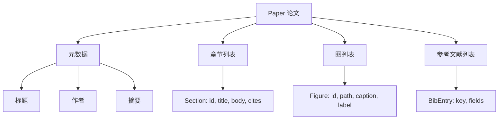
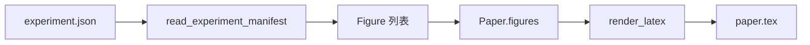
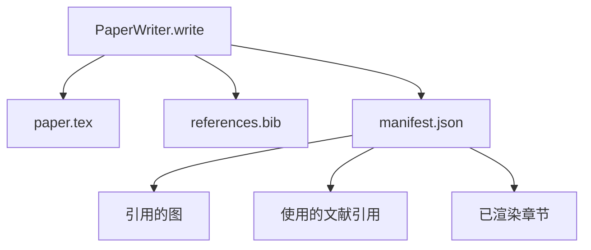

# 论文撰写器（Paper Writer）

> LaTeX 骨架是研究者与排版器之间的契约（Contract）。契约一旦遭到破坏，文档就无法编译，并会明确报错。先构建骨架，再填充内容。

**Type:** Build
**Languages:** Python
**Prerequisites:** 阶段 19 第 50–53 课
**Time:** ~90 分钟

## 学习目标（Learning Objectives）

- 将研究论文视为具有明确章节关系图的结构化产物，而非自由格式文档。
- 在撰写任何正文之前，生成声明摘要、章节、图位和参考文献键的 LaTeX 骨架。
- 通过确定性的槽位机制，将实验输出中的图（路径与图注）注入骨架。
- 接入模拟正文生成器（Mocked Prose Generator），根据结构化提纲填充各节，使执行框架无需模型也能测试。
- 输出一个 `paper.tex`、一个 `references.bib`，以及列出所有引用图和已用文献引用的清单。

```figure
ch-paper-skeleton
```

## 为什么先构建骨架（Why a skeleton first）

从正文开始的草稿会积累结构债务。引言多出三段本应放在相关工作中的文字；图尚未定义就被引用；同一篇论文在参考文献中出现三个键。等作者注意到时，重写成本已超过初次写作的成本。

骨架将这个顺序反转。预先以数据声明结构：章节是带名称和顺序的槽位，图是带 ID 和图注的槽位，参考文献键与其指向的条目在开头声明。随后逐个槽位生成正文。在任何正文写入之前，执行框架就能验证每张图都有槽位、每次引用都有条目、每个章节都出现在目录中。

这与前面课程处理计划、工具调用和追踪记录时采用的规范相同。结构就是契约。

## 论文数据结构（The Paper shape）



每个字段都是普通 Python 数据。渲染器是从 `Paper` 到 LaTeX 字符串的纯函数（Pure Function）。执行框架可以在渲染前检查论文：统计章节、列出缺失的图文件，并检查每个 `\cite{key}` 都有对应的 `BibEntry`。

## 渲染契约（The render contract）

渲染器保证三个性质。第一，骨架中的每个图位都输出一个 `\begin{figure}` 块，并带有 `fig:<id>` 形式的稳定标签。第二，每个章节都输出一个 `\section{}`，并带有 `sec:<id>` 形式的稳定标签，使交叉引用可以工作。第三，参考文献输出一个 `\bibliography` 块，其 `references.bib` 恰好包含论文声明的条目，不多也不少。

违反任何一项都会导致渲染错误，而不是警告。骨架就是契约；渲染时静默丢弃一张图，就是违反契约。

## 从实验注入图（Figure injection from experiments）

本方向前面的课程以 JSON 清单形式生成实验输出。每份清单携带一个产物列表，其中包含路径和简短图注。论文撰写器读取该清单，生成 `Figure` 记录。



注入过程是确定性的。图 ID 由实验名称加单调递增计数器派生；图注来自清单；路径会规范化为相对于论文输出目录的路径，因此即使实验输出位于磁盘其他位置，LaTeX 也能编译。

## 模拟正文生成器（The mocked prose generator）

本课不调用模型。`MockProseGenerator` 读取提纲结构，并以确定性方式输出正文。提纲为每个章节提供一个短字符串。生成器将这个字符串扩展为两个短段落，并融入章节标题。只有提纲声明了图和文献引用时，生成的正文才会提及它们。

这足以测试撰写器的全部行为。真实实现会将生成器替换为模型调用，外围执行框架无需改变。这就是将正文生成器声明为可调用对象（Callable）的价值：测试替换为确定性生成器，生产环境替换为模型生成器，流水线其余部分保持一致。

## 清单输出（The manifest output）

撰写器向输出目录写出三个文件。



下游评估器或评审循环（Critic Loop）读取的是清单。它不解析 LaTeX，而是读取清单。下一课的评审循环以该清单为输入，生成反馈列表。因此，清单才是契约的一部分，LaTeX 则不是。

## 校验关卡（Validation gates）

写入任何文件之前，撰写器执行四项检查。

1. 论文内的每个图 ID 都唯一。
2. 每个章节的 `cites` 字段引用的参考文献键，都已在论文中声明。
3. 摘要非空。
4. 标题非空。

任一检查失败都会抛出带有明确原因的 `PaperValidationError`。执行框架将该原因呈现为失败模式。不允许部分写入：要么三个文件全部输出，要么一个都不输出。

## 如何阅读代码（How to read the code）

`code/main.py` 定义了 `Paper`、`Section`、`Figure`、`BibEntry`、`PaperValidationError`、`MockProseGenerator`、`PaperWriter` 和 `render_latex` 函数。`write` 方法接收输出目录，写出 `paper.tex`、`references.bib` 和 `manifest.json`。`read_experiment_manifest` 辅助函数将实验清单列表转换为 `Figure` 记录。

`code/tests/test_paper_writer.py` 覆盖：无章节的骨架渲染、含两个章节和两张图的完整渲染、缺失文献引用检查、图 ID 重复检查、清单内容，以及 LaTeX 字符串契约（每个章节输出一个 `\section{}`，每张图输出一个 `\begin{figure}`）。

## 进一步探索（Going further）

真实实现会需要两项扩展。第一，多格式渲染：同一 `Paper` 结构可生成博客用 Markdown 和预览用 HTML，渲染器成为 `Paper` 上的一种策略。第二，文献引用补全：给定 DOI 本地缓存，撰写器根据引用键获取 BibTeX 条目。两者都有价值，也都可以在不改动骨架契约的前提下加入。

骨架是这个方案的核心：以数据声明章节、图和文献引用，向槽位生成正文，并在输出 LaTeX 的同时输出清单。其他改进都在此基础上组合。
