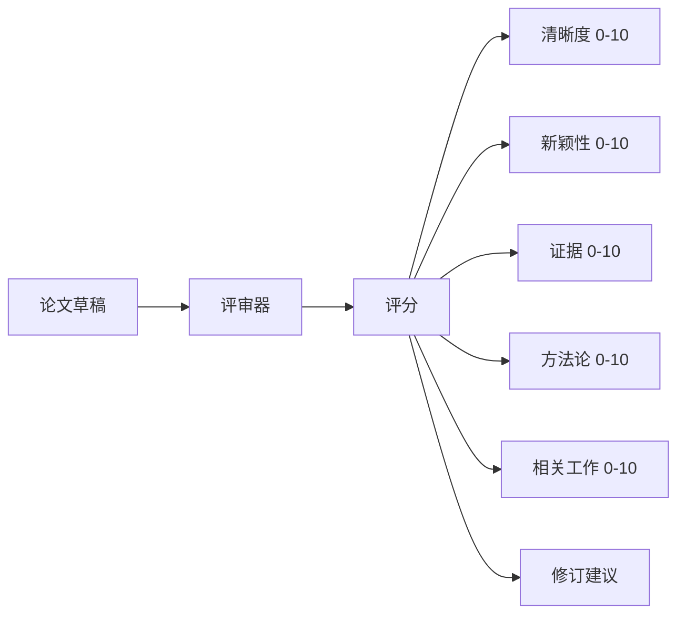
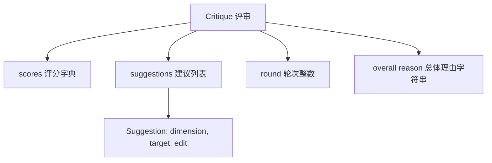
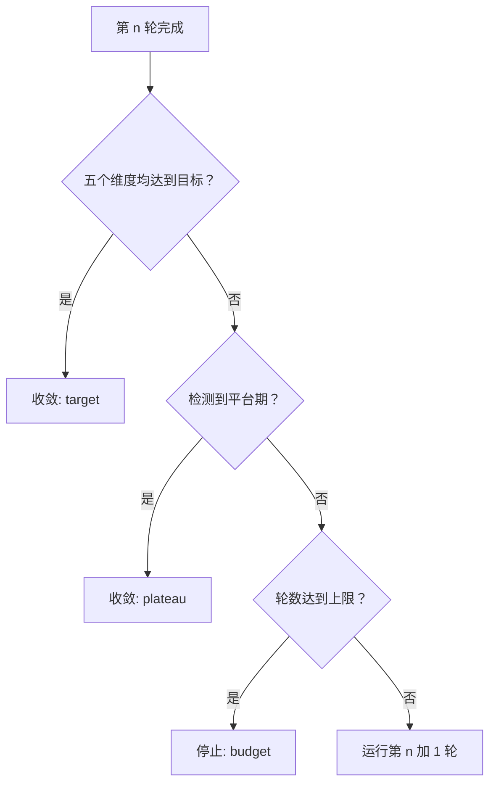
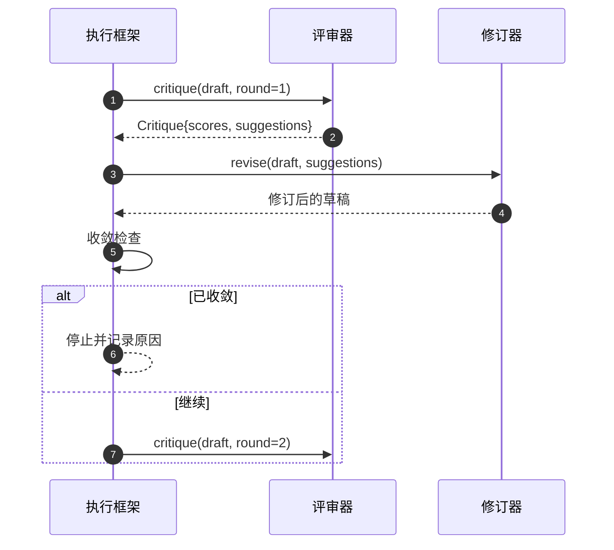

# 评审循环（Critic Loop）

> 第一次就回答“看起来不错”的评审器有问题；始终回答“需要改进”的评审器也有问题。值得构建的是能够收敛的评审器，而收敛需要通过工程设计来实现。

**Type:** Build
**Languages:** Python
**Prerequisites:** 阶段 19 第 50–53 课
**Time:** ~90 分钟

## 学习目标（Learning Objectives）

- 从五个固定维度为论文草稿评分：清晰度、新颖性、证据、方法论和相关工作。
- 将每轮评审应用为结构化修订差异（Revision Diff），而不是自由改写。
- 通过比较各轮分数检测收敛；在进入平台期、达到目标或预算耗尽时停止。
- 用最大迭代预算限制轮数，避免不收敛的评审器永远运行。
- 输出逐轮追踪记录（Trace），让仪表盘或下一阶段可以绘制评分轨迹。

```figure
ch-critic-converge
```

## 为什么使用五个固定维度（Why five fixed dimensions）

自由格式评审器是一个返回一段建议的模型。下一轮修订把这段文字当作背景上下文。改写是否回应了批评无法验证，因为批评从一开始就没有结构。

五个维度为执行框架提供了一份契约（Contract）。



分数是一个向量。执行框架跨轮次观察每个维度。某次修订提高了清晰度，却大幅降低了证据评分，这就是证据维度的退步，收敛检查能够发现它。仅靠模型的评审器无法提供这种保证。

## 评审数据结构（The Critique shape）



每条建议都携带它要改善的维度、目标章节，以及修订器可执行的 `edit` 指令。修订器也是一个可调用对象（Callable）。本课提供一个确定性修订器，将编辑指令解释为向章节追加内容的操作。模型驱动的修订器则会将同一字段解释为提示词。契约不变。

## 按优先级排列的收敛规则（Convergence rules, in order）

以下三个条件中的任意一个触发时，评审循环终止。



达到目标是最严格的情形：五个维度（清晰度 clarity、新颖性 novelty、证据 evidence、方法论 methodology、相关工作 related_work）中的每一个，都必须满足 `>= target_score`（默认 `8.0`），循环才返回成功。均值很高但某一维度薄弱，并不足够。平台期（Plateau）检测将本轮均值与上一轮均值比较。如果连续两轮的改进量低于 `plateau_epsilon`（默认 `0.1`），循环以 `plateau` 退出。预算是轮数的硬上限（默认 `5`），达到后以 `budget` 退出。

顺序很重要：目标优先于平台期，平台期优先于预算。如果第三轮同时达到目标并触发平台期，结果应是 `target`，而不是 `plateau`。

## 为什么平台期检测需要两轮（Why plateau detection runs over two rounds）

一轮没有进展可能是噪声。即使草稿固定，真实评审器每次迭代也会给出略有不同的评分，因为确定性评分仍然依赖应用了哪些建议以及应用顺序。要求连续两轮都处于平台期，可以过滤这种噪声。如果执行框架报告平台期，就说明草稿确实停止改善了。

## 本课中的确定性评审器（The deterministic critic in this lesson）

本课不调用模型。提供的评审器是一个可调用对象，根据三类信号为草稿评分：章节正文平均长度（清晰度）、图和文献引用的数量（证据），以及论文元数据中的 `originality_tag` 字段（新颖性）。修订器知道如何提高每项评分。

```text
clarity      随章节正文平均长度的增加而提高
novelty      在 originality_tag 设为 "high" 时提高
evidence     在章节的 figure_refs 非空时提高
methodology  在存在标题为 "Method" 且有正文的章节时提高
related-work 在存在标题为 "Related Work" 且有正文的章节时提高
```

修订器将每条建议解释为一次定向追加操作。第一轮之后，执行框架便能观察到分数上升。测试利用这一性质，断言循环会缩小与目标的差距。

## 完整循环契约（The full loop contract）



执行框架管理轮次计数器、追踪记录和收敛检查；评审器负责评分；修订器负责差异。三者都不触碰其他组件的状态。

## 追踪输出（The Trace output）

每轮输出一个追踪事件，包含轮次编号、评分向量、建议数量和收敛判定。完整追踪记录与最终草稿一起返回。下游仪表盘可以绘制逐轮评分图。下一课的迭代调度器读取追踪记录，判断该分支是否值得保留。

## 防止失效评审器耗尽资源的预算（Budgets that protect against bad critics）

如果评审器提出的建议从不提高评分，循环就会一直运行到最大迭代上限。追踪记录会揭示这一点：五轮运行、分数不变、判定为 `budget`。用户会将其识别为评审器问题，而不是草稿问题。反之，如果只呈现最终草稿，就会隐藏诊断线索。追踪优先的设计能够将问题显露出来。

## 如何阅读代码（How to read the code）

`code/main.py` 定义了 `Critique`、`Suggestion`、`Critic` 协议、`Reviser` 协议、`CriticLoop`，以及返回确定性评审器和配套修订器的 `make_deterministic_critic_pair` 工厂。代码包含一个最小 `Paper` 结构，使本课可独立使用。

`code/tests/test_critic_loop.py` 覆盖：第一轮之后的单调改进、经过调整的草稿达到目标收敛、连续两轮持平后的平台期检测、没有建议带来改善时的预算耗尽、修订器应用建议，以及追踪记录结构。

## 进一步探索（Going further）

真实实现会需要两项扩展。第一，维度权重：面向研讨会的论文赋予新颖性比方法论更高的权重，期刊论文则相反。收敛检查因此改用加权均值。第二，双评审器（Paired Critics）：一个评审器打分，另一个在修订器收到建议之前裁定这些建议。两者都有价值，也都基于相同的 `Critique` 结构组合。

这个方案的核心是评分向量。一旦评审被结构化，其他改进，无论是收敛规则、仪表盘还是双评审器，都可以在不改变循环的情况下接入。
