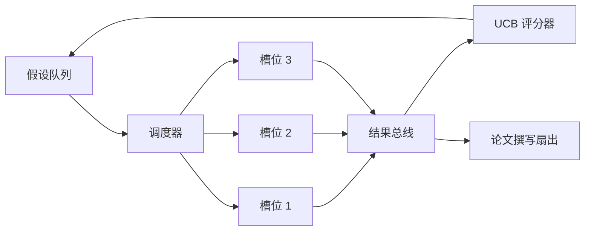
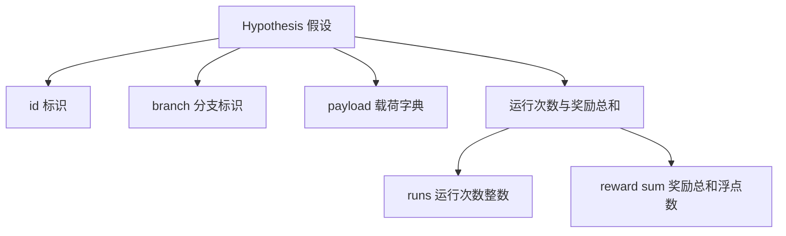
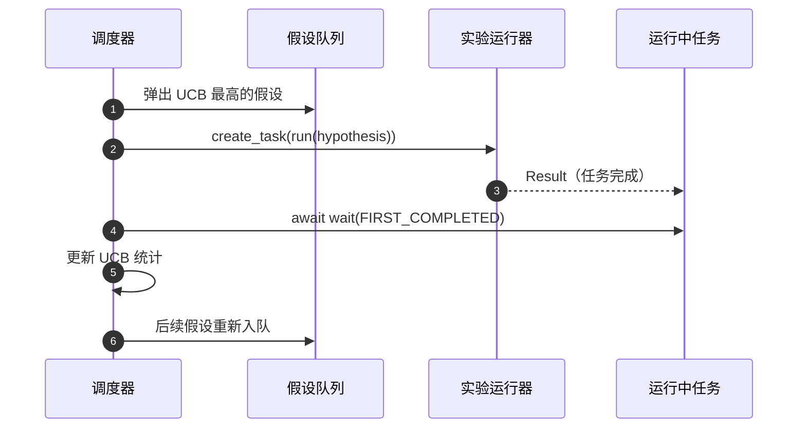

# 迭代调度器（Iteration Scheduler）

> 没有调度器的研究循环，只是一个被赋予过高期待的队列。调度器决定停止探索哪些方向，而这项决定正是核心所在。

**Type:** Build
**Languages:** Python
**Prerequisites:** 阶段 19 第 50–53 课
**Time:** ~90 分钟

## 学习目标（Learning Objectives）

- 将研究工作流建模为向并行实验槽位分发任务、再汇聚结果的假设队列。
- 使用 asyncio 并发运行多个实验，使调度器能够让所有槽位持续工作。
- 用置信上界（Upper Confidence Bound，UCB）为每个假设分支评分，使调度器能剪除低收益分支，又不放弃探索。
- 将已完成结果扇出（Fan-out）到论文撰写阶段和重新入队阶段，使高收益分支产生后续假设。
- 输出逐次迭代追踪记录，包含分支评分、槽位占用和剪枝决策。

```figure
ch-ucb-scheduler
```

## 为什么需要调度器而非工作列表（Why a scheduler, not a worklist）

平铺的工作列表按提交顺序运行任务。当各任务互相独立时，这样做没有问题。但研究任务并不独立：第三个实验的发现会改变第四、第五个实验的优先级。读取汇聚结果并重新排列队列的调度器，能够让每单位算力完成更多有用工作。

关键设计选择是评分规则。贪心评分器总是选择当前领先者，从不探索；均匀评分器从不利用已有优势。UCB（置信上界）取两者之间的路径：利用领先分支，同时为尝试较少的分支预留容量。

## 系统结构（The system shape）



队列保存假设。槽位空闲时，调度器选择 UCB 最高的假设。每个槽位异步运行一个实验。完成的实验将结果发送到总线。总线更新来源分支的 UCB 统计数据，并在分支收益越过阈值时，将结果扇出到论文撰写阶段。

## 假设数据结构（The Hypothesis shape）



`branch` 是 UCB 统计数据的键。多个假设可以共享同一分支（分支是研究方向，假设是该方向上的一次试验）。`runs` 是该分支已完成实验的数量，`reward_sum` 是累计奖励。UCB 读取这两个值。

## UCB 评分（UCB scoring）

本课使用经典的 UCB1 公式。

```text
ucb(branch) = mean_reward(branch) + c * sqrt( ln(total_runs) / runs(branch) )
```

`total_runs` 是所有分支已完成实验的总数。`c` 是探索权重，本课默认使用 `sqrt(2)`。运行次数为零的分支得到 `+inf`，使尚未尝试的分支始终先被调度。平均奖励高的分支会保持高分，直到其他分支追上；运行很多次却收获不大的分支，则会被运行较少的替代分支超越。

剪枝（Pruning）检查独立于选择器。分支在至少经过 `prune_after_runs` 次试验（默认 `3`）后，若平均奖励低于绝对下限（默认 `0.2`），剪枝会将其从后续调度中移除。这使队列保持有界。

## 使用 asyncio 的并行槽位（Parallel slots with asyncio）

调度器用 `asyncio.create_task` 驱动实验。每个任务运行实验运行器，它是返回 `Result` 的 `async def` 可调用对象。主循环通过 `asyncio.wait(..., return_when=asyncio.FIRST_COMPLETED)` 等待正在运行的任务集合，并在每次完成时触发评分更新。



三个槽位并发运行。主循环从不阻塞在单个实验上。只要有槽位空闲，调度器就继续启动新任务，直到队列为空且没有运行中的任务。

## 扇出：论文触发器（Fan-out: paper triggers）

当分支平均奖励越过 `paper_threshold`（默认 `0.7`），且该分支尚未生成论文时，调度器向输出列表扇出一个 `paper.trigger` 事件。下游的第 54 课论文撰写器会接收它。本课将触发事件收集为列表，以便测试断言。

## 扇出：后续假设（Fan-out: follow-up hypotheses）

高收益结果到达时，调度器可以调用用户提供的 `expander`，在同一分支上生成一个或多个后续假设。扩展器（Expander）是从 `Result` 到 `list[Hypothesis]` 的纯函数。本课提供一个确定性扩展器：凡是奖励超过论文阈值的结果，都生成两个后续假设。

## 预算（Budgets）

两项预算保护调度器，避免循环失控。

```text
max_experiments    : 所有分支运行的实验总数
max_seconds        : 实际耗时上限（asyncio 时间）
```

任一预算触发后，调度器停止调度新任务，等待运行中的任务结束，再返回最终追踪记录。追踪记录包含 `stop_reason`。

## 追踪记录与最终报告（The Trace and final report）

每项调度决策（选择、派发、结果、剪枝、扇出）都输出一个事件。最终报告汇总各分支统计、总运行次数、总实际耗时和已触发的论文事件。下一课的端到端演示读取该报告来驱动论文撰写器。

## 如何阅读代码（How to read the code）

`code/main.py` 定义了 `Hypothesis`、`Result`、`BranchStats`、`IterationScheduler`，以及返回奖励可预测的 asyncio 实验运行器的 `make_deterministic_runner` 工厂。运行器休眠固定的 `delay_ms`（默认 `5ms`），以便观察并发行为。

`code/tests/test_scheduler.py` 覆盖：UCB 优先选择未尝试分支、并行槽位占用、越过阈值时的论文触发、低收益试验后的分支剪枝、扇出后续假设，以及预算退出（实验数量和实际耗时两种）。

## 进一步探索（Going further）

真实实现会需要三项扩展。第一，跨会话持久化 UCB 统计：当前统计保存在内存中；真实调度器应将其写入检查点，使重启后仍保留已经花费的探索预算。第二，多目标评分（Multi-objective Scoring）：每个结果输出向量而非标量奖励，UCB 因此成为帕累托式（Pareto-style）选择器。第三，上下文多臂老虎机（Contextual Bandits）：选择器以假设特征（长度、复杂度）为条件，让相似假设共享探索经验。

调度器让研究不再只是工作列表。一旦接入 UCB 并让槽位并行运行，其他改进都可以在其上组合。
