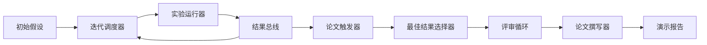
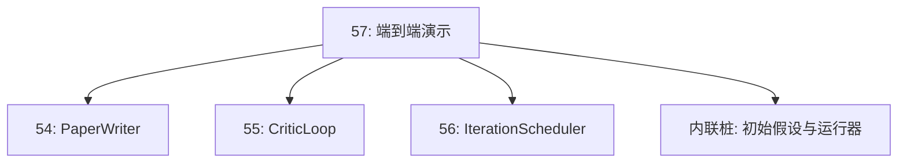
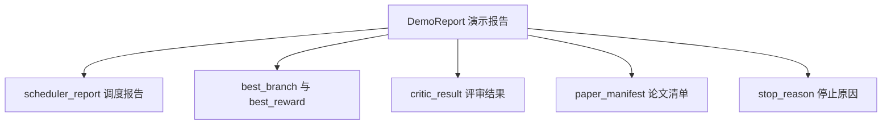

# 端到端研究演示（End-to-End Research Demo）

> 演示要求你前面编写的每份契约都能组合在一起。如果其中任何一份暴露出缺口，本课的演示就应将它发现。

**Type:** Build
**Languages:** Python
**Prerequisites:** 阶段 19 第 50–53 课
**Time:** ~90 分钟

## 学习目标（Learning Objectives）

- 端到端接通自动研究循环：初始假设、实验运行器、调度器、评审循环和论文撰写器。
- 通过普通 Python 导入，而不是框架，组合方向 D 前四课中的基础组件。
- 让循环运行到自行终止，并输出一份列出每个阶段输出的演示报告。
- 保持演示的确定性，使测试套件能够断言最终结构。
- 任一阶段的契约被破坏时，呈现明确的失败模式，防止下一阶段使用损坏的输入继续运行。

```figure
ch-research-pipeline
```

## 此处组合了哪些组件（What composes here）



共五个阶段。初始输入是含三个假设的列表。调度器使用三个并行槽位，在这些假设上运行六个实验。总线报告一个或多个论文触发事件。选择器挑选唯一的最佳结果。评审循环在基于该结果构建的草稿上迭代。论文撰写器输出最终 LaTeX、BibTeX 和清单。

## 为什么导入而不是复制（Why import, not copy）

前面的每课都提供一个带有公开数据类和函数的 `main.py`。演示通过调整 `sys.path`，使其指向每课的父目录，来导入这些组件。这不是框架接线，而是与前面课程测试文件已经使用的相同导入方式。



内联桩（Inline Stub）代替第 50 至 53 课：一个小型初始假设生成器和一个同步奖励函数。用户只需调整两处导入，就能将内联桩替换为那些课程中的真实基础组件。

## 确定性保证（Determinism guarantees）

演示从构造上保证确定性。实验运行器使用设置了种子的 numpy。评审循环的修订器按固定顺序遍历固定维度。论文撰写器使用第 54 课的模拟正文生成器。调度器的 UCB 选择器按迭代顺序处理平局，而不是随机选择。

给定相同种子，演示会输出相同报告。测试通过运行演示两次并比较清单，断言这一性质。

## 演示报告结构（The demo report shape）



每个字段都原样来自上游阶段。演示不变换任何输出，而是将它们组合起来。这正是该演示要检验的内容。

## 失败模式处理（Failure mode handling）

每个阶段要么成功，要么抛出明确类型的错误。

```text
调度器 ........ 返回 SchedulerReport，其中 stop_reason
                属于 {queue_empty, max_experiments, deadline}
最佳结果选择 .. 若未触发任何论文事件，则抛出 NoTriggerError
评审循环 ...... 返回 LoopResult，状态为 converged 或 stopped
论文撰写器 .... 契约被破坏时抛出 PaperValidationError
```

任一阶段失败都会以明确类型的异常短路演示。测试固定了这份契约：`test_no_triggers_raises_typed_error` 和 `test_best_picker_raises_when_no_triggers` 断言，在没有分支触发事件时，选择器抛出 `NoTriggerError` / `BestResultError`，并且始终不会调用撰写器。

## 最佳结果选择器（The best-result picker）

调度器按分支输出论文触发事件。选择器在所有触发事件中挑选平均奖励最高的分支。平局按分支 ID 的字母顺序处理，使演示保持确定性。选择器是一个小型纯函数（Pure Function）；测试用固定的调度报告锁定其行为。

## 接入评审循环（Wiring the critic loop）

第 55 课的评审循环操作 `MiniPaper`。演示根据选中的分支构建 `MiniPaper`：将分支 ID 填入摘要，预置两个章节（引言 Introduction 和结果 Results），并根据分支平均奖励设置 `originality_tag`（`>= 0.8` 时为 high，`>= 0.6` 时为 medium，否则为 low）。

随后修订器迭代草稿直到收敛，输出交给论文撰写器。

## 接入论文撰写器（Wiring the paper writer）

第 54 课的论文撰写器操作包含图和参考文献的完整 `Paper` 结构。演示通过 `mini_to_full_paper` 升级已收敛的 `MiniPaper`：为所选分支附加一张图，并根据评审器建议的引用键并集构建一份小型合成参考文献。演示添加的每个文献引用都会同时加入参考文献列表，因此能够通过校验。

## 如何阅读代码（How to read the code）

`code/main.py` 定义了 `BestResultError`、`NoTriggerError`、`DemoReport`、`pick_best_branch`、`build_mini_paper`、`mini_to_full_paper` 和 `run_demo`。顶部导入一次性调整 `sys.path`，并从对应课程引入 `PaperWriter`、`CriticLoop` 和 `IterationScheduler`。

`code/tests/test_e2e.py` 覆盖：演示端到端运行并输出五个字段均已填充的报告、两次运行之间的确定性、没有分支越过阈值时的 NoTriggerError、撰写器契约被破坏时的 PaperValidationError、论文清单包含所选分支的图，以及调度器停止原因属于预期值之一。

## 进一步探索（Going further）

演示测试通过后，值得接入三项扩展。第一，持久化状态：每个阶段的结果写入小型 JSON 存储，让重启后可以恢复，而无需重新执行成本较低的阶段。第二，仪表盘：将调度器和评审循环的追踪事件绘制在同一条时间线上。第三，真实模型调用：将模拟正文生成器和确定性评审器替换为模型驱动版本，接线方式保持不变。

演示的任务是证明组合就是架构。五课、四次导入、一份报告。下一次添加阶段时，接线代码恰好增加一行。
