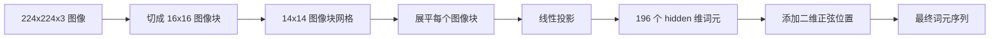

# 视觉编码器图像块（Vision Encoder Patches）

> 读取像素的视觉模型需要一个像素分词器（Tokenizer）。图像块嵌入（Patch Embedding）就是这个分词器：将图像切成方块网格，展平每个方块，通过一层线性投影，再加入二维位置信号，让 Transformer 知道每个方块在原图中的位置。

**Type:** Build
**Languages:** Python
**Prerequisites:** 阶段 19 第 30–37 课（方向 B 基础）
**Time:** ~90 分钟

## 学习目标（Learning Objectives）

- 将图像分词为固定长度的图像块嵌入序列。
- 实现基于 `Conv2d` 的图像块投影，使其与先展开再线性变换的数学计算一致。
- 构建确定性的二维正弦位置嵌入（2D Sinusoidal Position Embedding），让词元顺序编码空间位置。
- 在合成夹具上验证图像块数量、嵌入形状，以及 `Conv2d` 与展开操作的等价性。

## 问题（The Problem）

Transformer 接收向量序列，图像则是三通道网格。将每个像素作为一个词元（Token）读取会使序列长度暴涨：一张 224x224 RGB 图像包含 150,528 个词元，12 层 Transformer 无法承受对应的注意力计算开销。把整张图像当作一个巨大的展平向量，又会丢失局部性（Locality），注意力层无法恢复它。编码器前端的任务，是将像素网格压缩为几百个词元，每个词元概括一个方形区域。

图像块嵌入通过一次线性投影解决这个问题。将 224x224 图像切成 16x16 图像块，会得到 14x14 网格，共 196 个图像块。每个图像块从 `(3, 16, 16) = 768` 个像素值展平为一个向量，再由线性层映射到模型隐藏维度。Transformer 看到的是 196 个维度为 `hidden`（通常为 768）的词元，再加一个 CLS 词元。这种序列规模才适合后续网络处理。

## 概念（The Concept）



### 为什么使用图像块而不是像素（Why patches, not pixels）

注意力计算开销与序列长度的平方成正比。196 个词元的序列每头每层需要 `196 * 196 = 38,416` 个注意力分数；150,528 个词元的序列需要 `150,528 * 150,528 = 22.6 billion`。图像块将注意力计算量降低约 590,000 倍，而一个 16x16 区域已包含足以支持高层视觉任务的信号。代价是丢失单个图像块内部的细粒度空间细节，因此下游多模态系统在精确定位重要时，通常会运行第二条高分辨率分支。

### 为什么一层线性投影就足够（Why a linear projection is enough）

每个图像块都被视为独立向量。投影学习一组基：边缘检测器、颜色滤波器和简单纹理。单层线性层很小（ViT-Base 为 `768 * 768 = 589,824` 个参数），训练也快。更深的卷积前端确实存在（即“混合式”ViT，Hybrid ViT），但简单的线性投影是标准方案，大多数现代开放权重编码器都采用这一结构。

### 卷积技巧（The `Conv2d` trick）

不带填充的 `Conv2d(in_channels=3, out_channels=hidden, kernel_size=patch_size, stride=patch_size)` 与先展开再线性变换产生相同数值结果，因为每个输出位置都将图像块像素与一个滤波器做点积。这个卷积就是图像块投影。大多数生产代码库采用这种写法，因为它在 GPU 上更快，也少一次形状重排。

### 位置嵌入（Position embeddings）

投影输出的词元不携带顺序信息。二维正弦嵌入为每个词元提供固定信号，编码其 `(row, col)` 位置。嵌入维度的一半使用多频率 sin/cos 编码行位置，另一半编码列位置。编码是确定性的，因此可以无需重新训练就切换分辨率，也能顺畅地插值到模型训练时从未见过的网格。

| 组件 | 形状 | 参数量 |
|-----------|-------|------------|
| 图像块投影（`Conv2d`） | `(hidden, 3, patch, patch)` | `3 * P * P * hidden + hidden` |
| 位置嵌入（固定） | `(num_patches, hidden)` | 0（计算得到，不学习） |
| CLS 词元（可学习） | `(1, hidden)` | `hidden` |

在 224 分辨率下，ViT-Base/16 的投影包含 590,592 个参数，CLS 词元包含 768 个参数，正弦位置嵌入不含参数。下一课（59）将在这个前端上堆叠一个 12 层 Transformer。

### 用等价性做合理性检查（Equivalence as a sanity check）

图像块步骤有两种写法：`Conv2d` 投影，以及显式的先展开再线性变换。相同权重下，两者必须产生相同输出。否则，展开的数学计算就有错误，编码器的后续部分也缺乏可靠基础。本课测试会检验这种等价性。

```figure
ch-patch-tokenizer
```

## 动手构建（Build It）

`code/main.py` 实现了：

- `PatchEmbed`：封装 `Conv2d` 以执行图像块投影的 `nn.Module`。
- `sinusoidal_2d(grid_h, grid_w, dim)`：构建二维位置表的无状态函数。
- `VisionFrontEnd`：在一次前向传播中组合图像块嵌入、前置 CLS 和位置相加。
- `synthesize_image(seed)` 辅助函数：通过 `numpy.random` 构建确定性的 224x224x3 夹具。
- 一个演示：让一张夹具图像经过前端，打印输出形状、CLS 词元范数和位置嵌入的一行。

运行：

```bash
python3 code/main.py
```

输出：224x224 夹具被分词为形状 `(1, 197, 768)` 的序列。首个词元是 CLS，后面 196 个是图像块词元。同一行内的位置嵌入范数一致，这是正弦编码的特征。

## 使用场景（Use It）

相同的图像块前端出现在各种现代视觉语言模型中：CLIP ViT-L/14、SigLIP、DINOv2、Qwen-VL 系列和 InternVL 系统，都从 `Conv2d` 图像块投影加位置信号开始。各系列的差异位于下游（CLS 与无 CLS 池化、寄存器词元 Register Tokens、14 与 16 的不同图像块尺寸，以及通过位置插值实现的动态分辨率）。本课的前端是这些模型共同的基础。

## 测试（Tests）

`code/test_main.py` 覆盖：

- 图像块数量符合 `(image_size / patch_size) ** 2`
- 输出形状符合 `(batch, num_patches + 1, hidden)`
- 在小型夹具上，`Conv2d` 投影等于手工先展开再线性变换
- 多次调用得到的正弦位置表具有确定性
- CLS 词元跨批次维度广播，且不发生泄漏

运行测试：

```bash
python3 -m unittest code/test_main.py
```

## 练习（Exercises）

1. 将正弦位置替换为可学习的 `nn.Parameter`，并比较一个微型合成分类任务的首轮损失。固定分辨率下，可学习位置胜出；训练后改变分辨率时，正弦位置胜出。

2. 将 `Conv2d` 替换为显式的 `nn.Unfold` 加 `nn.Linear`，断言输出在浮点容差内一致。数学计算相同，只是两种写法。

3. 添加对非正方形图像块尺寸的支持（例如用于宽幅输入的 32x16），并验证位置表能处理非正方形网格。

4. 在批大小为 1、8、64 时分析图像块步骤的性能。图像块投影很少成为瓶颈，下游注意力层才占主导。

5. 在包含圆、正方形、三角形和星形的四分类合成形状数据集上，将前端作为冻结特征提取器进行训练。CLS 词元输出应当线性可分。

## 关键术语（Key Terms）

| 术语 | 含义 |
|------|---------------|
| 图像块（Patch） | 图像中的方形子区域，通常为 14x14 或 16x16 |
| 图像块嵌入（Patch Embedding） | 将一个展平图像块线性投影到隐藏维度 |
| 序列长度（Sequence Length） | 图像块分词后的词元数量，通常还包含 CLS |
| 正弦位置（Sinusoidal Position） | 编码二维网格坐标的固定 sin/cos 信号 |
| CLS 词元（CLS Token） | 前置于序列的可学习向量，用作池化头 |

## 延伸阅读（Further Reading）

- 《一张图像相当于 16x16 个词》（An Image is Worth 16x16 Words，ViT，2021），了解最初的图像块嵌入框架。
- 《注意力就是你所需要的一切》（Attention Is All You Need，2017），了解此处扩展到二维的正弦位置公式。
- DINOv2 论文，了解寄存器词元，可将其作为第 6 项练习添加。
