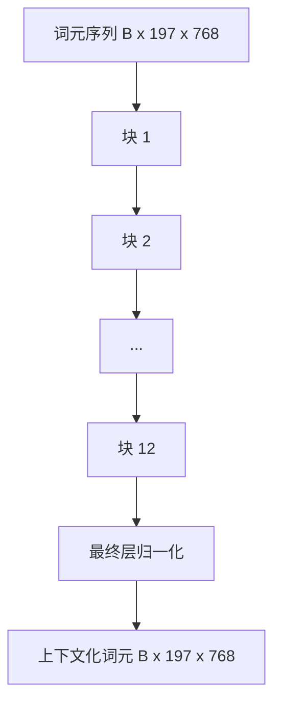
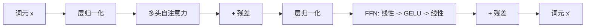

# 视觉 Transformer 编码器（Vision Transformer Encoder）

> 仅有图像块还不能理解图像。一个具有 12 个注意力头的 12 层前置层归一化（Pre-LN）Transformer，将图像块词元序列变为上下文化词元序列，并由 CLS 词元在最终隐藏状态中汇聚整张图像的特征。本课构建现代视觉语言模型的核心计算部分。

**Type:** Build
**Languages:** Python
**Prerequisites:** 阶段 19 第 30–37 课（方向 B 基础）
**Time:** ~90 分钟

## 学习目标（Learning Objectives）

- 实现包含多头自注意力（Multi-head Self-attention）和前馈子层的前置层归一化 Transformer 块。
- 堆叠 12 个具有 12 个注意力头的块，构建 ViT-Base 编码器。
- 将第 58 课的图像块前端接入编码器，并运行一次前向传播。
- 验证 CLS 词元会聚合每个图像块的信息。

## 问题（The Problem）

图像块嵌入生成 197 个词元组成的序列，每个词元都是一个不了解其他图像块的向量。对于一张猫的图片，每个图像块都需要知道哪些图像块包含胡须、哪些包含背景、哪些包含眼睛。Transformer 正是逐层通过注意力建立这种联系的机制。没有它，图像块前端只是一个设计巧妙却没有理解能力的分词器。

标准方案是 12 个块深、12 个头宽，使用前置层归一化、GELU 激活和 4 倍前馈扩展。这一方案构成了 CLIP ViT-L、SigLIP、DINOv2、Qwen-VL 系列、InternVL，以及 2025–2026 年其他开放权重视觉编码器的主干。方案已经足够稳定，阅读这些论文时，除非它们明确说明不同之处，否则可以假定采用这种块结构。

## 概念（The Concept）





### 前置与后置层归一化（Pre-LN vs post-LN）

原始 Transformer 将层归一化（LayerNorm）放在残差之后。前置层归一化（每个子层之前执行 LayerNorm）是现代视觉语言模型采用的版本，因为它无需学习率预热技巧就能稳定训练。区别只是前向传播中的一行代码，但在 12 层及更深的网络中，梯度流表现差异很大。

### 多头自注意力（Multi-head self-attention）

每个头将词元向量投影为自己的一组三元组 `(query, key, value)`，维度为 `head_dim = hidden / num_heads`。当 `hidden = 768` 且 `heads = 12` 时，每个头有 `dim = 64`。12 个头并行计算注意力，再将输出拼接回 768 维，并经过输出投影。多头的意义在于，一个头可以学习“关注猫的眼睛”，另一个学习“关注背景渐变”，而不互相干扰。

### 为什么使用 4 倍前馈扩展（Why the 4x feed-forward expansion）

前馈网络（FFN）执行 `hidden -> 4 * hidden -> hidden`，中间使用 GELU。系数 4 来自经验，自 2017 年以来一直沿用于语言和视觉 Transformer。在固定数据预算下，更小（2 倍）会欠拟合，更大（8 倍）会过拟合。多层感知机（MLP）存储了模型学到的大部分事实，而这些事实就位于更宽的中间层。

| 组件 | ViT-Base 规模下的参数量 |
|-----------|------------------------------|
| 每块的 qkv 投影 | `3 * 768 * 768 = 1.77M` |
| 每块的输出投影 | `768 * 768 = 590K` |
| 每块的 FFN（4 倍扩展） | `2 * 768 * 4 * 768 = 4.72M` |
| 每块的层归一化 | `4 * 768 = 3K` |
| 每块合计 | 约 710 万 |
| 12 个块 | 约 8500 万 |
| 加上前端 | 总计约 8600 万 |

ViT-Base 是一个拥有 8600 万参数的编码器。按 2026 年的标准看，这个规模较小（SigLIP-So400M 为 4 亿，Qwen-VL 的 ViT 为 6.75 亿），但除了宽度和深度，架构完全相同。

### 是否需要因果掩码（Causal mask or not?）

视觉 Transformer 只有编码器，并且是双向的：对于任意词元对，词元 `i` 都可以关注词元 `j`。不使用掩码。第 61 课的解码器侧交叉注意力会使用因果掩码（Causal Mask），但在视觉编码器内部，注意力完全连接。

### CLS 词元学到了什么（What the CLS token learns）

CLS 词元最初是一个可学习参数，自身没有图像块内容，并通过每个块中的注意力积累信息。到最终层时，CLS 行成为整张图像的向量摘要；下游头将这个单一向量投影为类别逻辑值（Logits）、对比嵌入（Contrastive Embeddings），或供文本解码器使用的交叉注意力键。

```figure
ch-cls-funnel
```

## 动手构建（Build It）

`code/main.py` 实现了：

- `MultiHeadSelfAttention`：包含 `qkv` 和输出投影、缩放点积注意力（Scaled Dot-product Attention）计算，以及形状断言。
- `FeedForward`：采用 4 倍扩展的 GELU MLP。
- `Block`：通过残差连接组合注意力与前馈子层的前置层归一化块。
- `ViT`：堆叠 12 个块，并在末尾执行层归一化。
- `VisionEncoder`：将第 58 课的 `VisionFrontEnd` 接入 `ViT` 堆栈，提供返回上下文化序列和池化 CLS 向量的 `forward()`。
- 一个演示：将合成的 224x224 夹具图像送入完整编码器，打印输入形状、输出形状、参数量，以及每隔一层的 CLS 范数。

运行：

```bash
python3 code/main.py
```

输出：夹具被编码为 `(1, 197, 768)` 张量。随着层逐步叠加，CLS 范数向上变化，然后在最终层归一化处稳定。报告的总参数量约为 8600 万。

## 使用场景（Use It）

除宽度和深度外，此处定义的编码器与 2025–2026 年各种开放权重视觉语言模型（VLM）内部的块堆栈相同。差异在于：

- **宽度与深度。** ViT-Large 为 `hidden=1024, depth=24, heads=16`；SigLIP So400M 为 `hidden=1152, depth=27, heads=16`。块相同。
- **池化头。** CLS 池化（本课）、平均池化（SigLIP）或注意力池化（后续 VLM）。
- **位置处理。** 固定正弦位置（第 58 课）、可学习一维位置、ALiBi 或二维旋转位置嵌入（2D RoPE）。块的数学计算不变。
- **寄存器词元（Register Tokens）。** DINOv2 前置 4 个额外可学习词元，只需一行代码。

这个块堆栈是基础。接下来的第 60–63 课将在其上构建。

## 测试（Tests）

`code/test_main.py` 覆盖：

- 单个块保持形状，且这一性质不随输入批大小改变
- 注意力分数沿键轴之和为一（softmax 合理性检查）
- 残差路径已经接通（零输入仍通过 CLS 词元产生非零输出）
- 4 层堆叠的前向传播产生正确形状
- 梯度能够从 CLS 输出流向图像块投影

运行测试：

```bash
python3 -m unittest code/test_main.py
```

## 练习（Exercises）

1. 添加寄存器词元（CLS 之后前置 4 个可学习向量）并重新运行。通过最后一层 softmax 分布的熵，比较注意力图的平滑程度。

2. 将前置层归一化换成后置层归一化，在合成形状分类器上训练一轮。观察哪一种无需学习率预热就能稳定训练。

3. 将因果掩码实现为 `attn_mask` 参数，使同一块可以复用为解码器块。掩码形状为 `(seq, seq)`，是下三角矩阵。

4. 用 `torch.profiler` 在批大小为 1、8、64 时分析一次前向传播。MLP 层主导实际耗时，而非注意力层。

5. 将一个注意力头的 q-k-v 投影替换为低秩 LoRA 适配器，冻结其余部分，验证梯度只流向预期位置。

## 关键术语（Key Terms）

| 术语 | 含义 |
|------|---------------|
| 前置层归一化（Pre-LN） | 在每个子层之前而非之后执行 LayerNorm |
| 自注意力（Self-attention） | 每个词元关注同一序列中的所有其他词元 |
| 多头（Multi-head） | 隐藏维度分配给 `H` 个独立注意力头 |
| 前馈扩展（FFN Expansion） | 前馈层先扩展到 `4 * hidden`，再收缩 |
| CLS 池化（CLS Pooling） | 使用首个词元的最终隐藏状态作为图像摘要 |

## 延伸阅读（Further Reading）

- 《一张图像相当于 16x16 个词》（An Image is Worth 16x16 Words，ViT，2021），了解编码器方案。
- DINOv2（2023），了解寄存器词元和自监督预训练目标。
- SigLIP（2023），了解平均池化变体，以及第 62 课使用的 sigmoid 对比损失。
