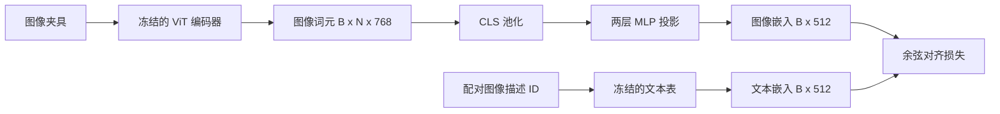

# 模态对齐投影层（Projection Layer for Modality Alignment）

> 视觉编码器生成图像词元，文本解码器接收文本词元，两者处于不同的向量空间。一个小型两层多层感知机（MLP）将图像词元投影到文本嵌入空间，再通过与配对图像描述之间的余弦对齐损失（Cosine Alignment Loss），使两个空间达成一致。投影是视觉语言模型中最小的部分，也是对迁移最重要的部分。

**Type:** Build
**Languages:** Python
**Prerequisites:** 阶段 19 第 30–37 课（方向 B 基础）
**Time:** ~90 分钟

## 学习目标（Learning Objectives）

- 构建两层 MLP 投影，将图像特征映射到文本嵌入空间。
- 构建模拟文本嵌入表（不使用预训练分词器，也不使用真实语料）。
- 计算投影后图像词元与配对图像描述嵌入之间的余弦对齐损失。
- 冻结视觉编码器和文本表，仅训练投影。

## 问题（The Problem）

你已经有一个视觉编码器（第 58–59 课），生成维度为 `vision_hidden = 768` 的词元。你希望在其上接入一个嵌入维度为 `text_hidden = 512` 的文本解码器（其他数值也同样合理）。解码器期望具有文本表示形式的词元。图像词元并非如此：它们处于编码器在纯视觉预训练期间学到的一组基中，与解码器的词向量没有关系。

两层 MLP 投影（线性、GELU、线性）连接这两个空间。它足够小（约 `768 * 1024 + 1024 * 512 = 1.3M` 个参数），可以在单张 GPU 上几分钟内完成训练，而且是对齐阶段唯一需要学习的部分。视觉编码器保持冻结，文本嵌入表保持冻结，只有投影发生变化。这就是 LLaVA 于 2023 年采用、BLIP-2 以 Q-Former 重新表述、此后各种开放权重视觉语言模型（VLM）以某种形式沿用的方案。

## 概念（The Concept）



### 投影前先池化（Pooling before projection）

视觉编码器输出 197 个词元，文本侧则只有一个描述级嵌入。要对齐两者，每个样本都需要一个图像级向量。CLS 池化最简单：取编码器的首个词元并对其投影。对全部 197 个词元做平均池化是另一种选择，也是 SigLIP 使用的方式。两者都会将 197 个向量汇聚为一个。

### 为什么是两层而不是一层（Why two layers and not one）

单次线性投影能够旋转和缩放，但当两个空间的曲率不匹配时，无法修正它们的基。两个线性层之间的 GELU 为投影提供一次非线性弯曲，经验上足以将 CLIP 风格特征与语言模型嵌入对齐。更深的投影（LLaVA-NeXT 使用 GLU；Qwen-VL 使用注意力层堆栈）属于扩展；两层 MLP 是标准基线，也是 BLIP-2 的 Q-Former 投影头底层采用的结构。

| 层 | 形状 | 参数量 |
|-------|-------|------------|
| fc1 | `(vision_hidden, projection_hidden)` | `768 * 1024 + 1024` |
| 激活 | GELU | 0 |
| fc2 | `(projection_hidden, text_hidden)` | `1024 * 512 + 512` |

一个 `768 -> 1024 -> 512` 的头约有 130 万参数。

### 余弦对齐损失（Cosine alignment loss）

对齐并不意味着 `image_emb == text_emb`。对齐意味着在联合空间中，`image_emb` 与 `text_emb` 指向相同方向。余弦损失为 `1 - cos_sim(image, text)`，范围从 0（完全对齐）到 2（方向相反）。训练推动每对样本的这个值趋向零。第 62 课会将其推广为对比批次（InfoNCE），要求每张图像与自己的描述，比与批次中任何其他描述都更接近；本课采用逐对版本，以便观察训练动态。

### 冻结编码器是关键（Frozen encoder is the trick）

视觉编码器拥有 8600 万参数，文本表还有几百万参数。用模拟语料训练全部参数不可行。冻结两者后，只有投影的 130 万参数发生变化，在合成配对数据上训练几百步就足以降低损失。这正是各种基于适配器（Adapter）的 VLM 的运行方式：重量级部分保持冻结，轻量连接模块负责训练。

```figure
ch-projection-bridge
```

## 动手构建（Build It）

`code/main.py` 实现了：

- `MLPProjector(in_dim, hidden_dim, out_dim)`：具有 GELU 激活的两层线性 MLP。
- `MockTextEmbedding(vocab_size, dim)`：根据种子确定性初始化的冻结嵌入表。
- `make_pair(seed, vocab_size)`：合成一个配对的（图像、描述）样本。描述是短 ID 序列；描述嵌入通过对词元嵌入做平均池化得到。
- `cosine_alignment_loss(image_emb, text_emb)`：逐对的 `1 - cos_sim` 目标。
- 一个训练循环：在 32 对合成样本上循环训练投影 200 步，视觉编码器和文本表保持冻结，每 25 步打印损失。

运行：

```bash
python3 code/main.py
```

输出：训练报告显示，损失从初始约 1.07 降至 200 步内约 0.80，说明仅靠投影就能将图像词元拉向文本空间。程序还会打印每对样本最终的余弦相似度。

## 使用场景（Use It）

同样的模式出现在各种开放权重 VLM 中：

- **LLaVA 1.5。** 两层 GELU MLP 从 CLIP-ViT-L 隐藏维度投影到 LLaMA 嵌入维度。冻结视觉编码器、冻结大语言模型（LLM），只训练投影（随后在第二阶段解冻 LLM）。
- **BLIP-2。** Q-Former 让 32 个可学习查询词元通过交叉注意力读取图像词元，再投影到 LLM 嵌入维度。Q-Former 最末端的投影头对应本课的 MLP。
- **MiniGPT-4。** 用单层线性投影，将 BLIP-2 Q-Former 输出映射到 Vicuna 嵌入维度。
- **Qwen-VL。** 使用多层交叉注意力适配器，但最后一个部分仍是投影到语言模型（LM）的嵌入维度。

结构各异，但作用相同：池化图像词元、投影到文本嵌入维度、单独训练。

## 测试（Tests）

`code/test_main.py` 覆盖：

- 投影器输出形状符合配置的 `out_dim`
- 冻结文本嵌入表中，启用 `requires_grad` 的参数数量为零
- 相同向量的余弦损失为零，反平行向量的损失为 2
- 一次反向传播后，梯度能够流过投影器
- 训练循环从第 0 步到第 200 步降低了损失

运行测试：

```bash
python3 -m unittest code/test_main.py
```

## 练习（Exercises）

1. 将 CLS 池化替换为对 196 个图像块词元的平均池化，比较 200 步后的最终损失。平均池化通常在合成数据上训练更快；CLS 在自然图像上样本效率更高。

2. 为余弦损失添加可学习的标量温度（`cos / tau`），观察 `tau` 过小（梯度噪声）或过大（损失停留在较高平台）时会发生什么。

3. 将两层 MLP 替换为单层线性层，量化损失差距。非线性对自然图像特征更重要，对合成特征影响较小。

4. 对投影器权重添加小幅 L2 惩罚，观察它与余弦对齐的相互作用（余弦具有尺度不变性，因此惩罚主要收缩未使用的方向）。

5. 持久化投影器权重，再重新加载，在不执行视觉编码器反向传播的情况下运行推理，验证部署时只需要投影器。

## 关键术语（Key Terms）

| 术语 | 含义 |
|------|---------------|
| 模态对齐（Modality Alignment） | 使图像和文本嵌入能够在同一个共享空间中比较 |
| 投影头（Projection Head） | 将一个空间映射到另一个空间的小模块，通常是两层 MLP |
| 余弦相似度（Cosine Similarity） | 点积除以两个 L2 范数的乘积 |
| 冻结编码器（Frozen Encoder） | 视觉（或文本）模型的全部参数都设置为 `requires_grad=False` |
| 模拟语料（Mock Corpus） | 用于训练的合成配对数据，避免依赖数据集下载 |

## 延伸阅读（Further Reading）

- LLaVA 论文，了解两阶段训练（先训练投影，再解冻语言模型）。
- BLIP-2 论文，了解作为可学习投影替代方案的 Q-Former。
- Qwen-VL 技术报告，了解作为更深投影头的交叉注意力适配器。
