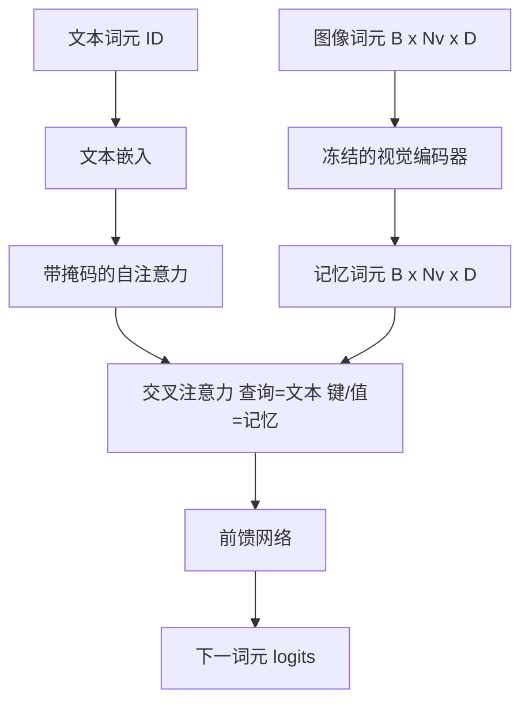
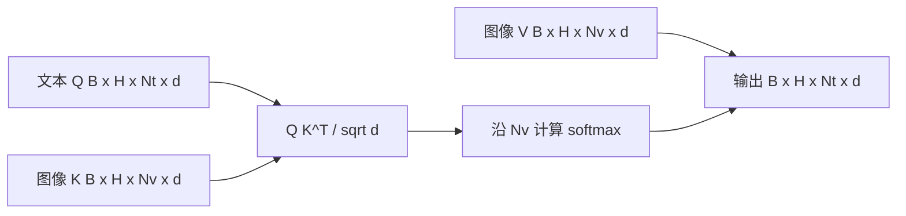

# 交叉注意力融合（Cross-Attention Fusion）

> 投影层（Projection layer）将一个图像向量与一个描述向量对齐。真正的视觉语言解码器（Vision-language decoder）需要让每个文本词元关注每个图像块词元，使模型能将每个词关联到图像区域。交叉注意力（Cross-attention）实现这种依据关联：文本提供查询，视觉键和值作出回答。本课构建交叉注意力块、因果文本自注意力，以及保证两者合法的掩码形状。

**Type:** Build
**Languages:** Python
**Prerequisites:** 阶段 19 第 30–37 课（路线 B 基础）
**Time:** ~90 分钟

## 学习目标（Learning Objectives）

- 实现多头交叉注意力（Multi-head cross-attention），查询流来自文本，键/值流来自视觉。
- 组合解码器块：因果自注意力 + 交叉注意力 + 前馈网络。
- 正确设置掩码形状：自注意力使用因果掩码，交叉注意力不使用掩码。
- 使用批量文本词元和固定的图像词元池执行前向传播。

## 问题（The Problem）

将图像词元与文本词元拼接成一个序列是一种融合方案，即 Chameleon 和 Emu3 采用的早期融合（Early fusion）。另一种是交叉注意力，即 Flamingo 引入、后续 Flamingo 类解码器沿用的晚期融合（Late fusion）。晚期融合中，文本解码器只处理文本词元，并在每层通过交叉注意力访问图像流。

晚期融合有两项优势。首先，文本流保持纯净，模型保留纯文本能力。其次，每张图像只计算一次图像流，并在每个解码步骤中复用，因此即使描述很长，生成开销也低。代价是每个块增加一个注意力子层。

## 概念（The Concept）





### 掩码形状（Mask shapes）

解码器块内的两种注意力需要不同掩码：

| 注意力 | 查询长度 | 键长度 | 掩码 | 原因 |
|-----------|--------------|------------|------|-----|
| 自注意力（Self-attention） | `Nt`（文本） | `Nt`（文本） | 因果掩码：下三角 `(Nt, Nt)` | 自回归过程中，文本词元不能向前偷看 |
| 交叉注意力（Cross-attention） | `Nt`（文本） | `Nv`（视觉） | 无掩码 | 每个文本位置均可看到整张图像 |

本课包含一个形状验证函数，使混用掩码的错误以 `ValueError` 显现，而不是悄悄破坏损失曲线。

### 交叉注意力为何不使用掩码（Why no mask on cross-attention）

在生成任何文本前，图像已经被完整观察。描述中的词元 `t` 可以关注任意图像块；图像块没有时间顺序。某些 Flamingo 变体在交错处理多张图像和文本片段时会加入逐样本掩码模式，但对于单张图像加一段描述，交叉注意力可以看到全部图像内容。

### 键/值缓存（Key/value caching）

图像的键和值在解码开始时计算一次并存入缓存。每个新文本词元直接使用缓存，无须重新计算。这让推理时的图像描述生成更快：计算量大的 ViT 只运行一次，交叉注意力在每一步复用其键和值。本课暴露该缓存并测试缓存命中路径。

### 块的组合（Block composition）

解码器块依次执行：前置层归一化（pre-LN）-> 自注意力 -> 残差 -> pre-LN -> 交叉注意力 -> 残差 -> pre-LN -> 前馈网络 -> 残差。三个子层各有独立的 LayerNorm。Flamingo 论文在交叉注意力上加入可学习门控，使模型能够选择不走图像路径，并涉及训练稳定性的权衡；这里采用的标准基线没有门控。

```python
class DecoderBlock:
  def forward(self, text_tokens, image_tokens, text_mask, cross_mask):
      text_tokens = text_tokens + self.self_attn(self.ln1(text_tokens),
                                                 mask=text_mask)
      text_tokens = text_tokens + self.cross_attn(self.ln2(text_tokens),
                                                  image_tokens,
                                                  mask=cross_mask)
      text_tokens = text_tokens + self.ffn(self.ln3(text_tokens))
      return text_tokens
```

```figure
ch-crossattn-fan
```

## 动手实现（Build It）

`code/main.py` 实现了：

- `CrossAttention(hidden, heads)`：具有独立 `q` 和 `kv` 投影的多头交叉注意力。
- `CausalSelfAttention(hidden, heads)`：标准解码器中的带掩码自注意力。
- `DecoderBlock`：通过 pre-LN 残差组合三个子层。
- `VisionLanguageDecoder`：四层解码器，输入为模拟视觉编码器的输出和小型文本嵌入表。
- `causal_mask(length)`：返回形状为 `(length, length)` 的下三角布尔张量。
- 演示：输入一批两条长度为 10 的文本序列以及长度为 197 的图像记忆，打印输出形状、自注意力掩码形状和各位置的交叉注意力输出范数。

运行：

```bash
python3 code/main.py
```

输出：解码器产生形状为 `(2, 10, text_vocab)` 的 logits 张量。掩码形状为 `(10, 10)`。键值缓存（KV cache）复用检查确认，使用缓存和不使用缓存的路径产生相同的 logits。

## 实际应用（Use It）

交叉注意力出现在两类生产模型中：

- **Flamingo 和 IDEFICS。** 冻结语言模型（LM），每隔 K 个语言模型块插入一个交叉注意力子层。视觉语言适配器由交叉注意力块及其门控组成。
- **BLIP-2。** Q-Former 使用固定的 32 个查询词元，通过交叉注意力访问图像特征，再将查询投影到语言模型的嵌入空间。

本课的块结构可直接对应这两类模型。掩码规则相同：自注意力使用因果掩码，交叉注意力不使用掩码。

## 测试（Tests）

`code/test_main.py` 覆盖：

- 因果掩码为下三角布尔张量，形状符合预期。
- 无论键长度如何，交叉注意力输出形状均为 `(B, Nt, hidden)`。
- 缓存路径与非缓存路径在浮点容差内一致。
- 文本流与图像流形状不匹配时抛出明确的 `ValueError`。
- 完整解码器前向传播产生正确的批次和序列形状。

运行测试：

```bash
python3 -m unittest code/test_main.py
```

## 练习（Exercises）

1. 在交叉注意力残差上加入可学习的 tanh 门控（Flamingo 的技巧），验证训练可从接近零的初始门控收敛。门控从 0 开始；模型先恢复纯文本行为，再混入图像流。

2. 实现交错注意力，让同一个解码器处理多张图像和多个文本片段。构建逐样本交叉注意力掩码，阻止文本片段 2 关注图像 1。

3. 在 `Nt=64, Nv=576`（较高分辨率下的 24x24 网格）时，对比分析交叉注意力与自注意力层的性能。交叉注意力的开销为 `Nt * Nv`，在高图像分辨率下占主导。

4. 在交叉注意力图的查询侧加入随机失活（Dropout），测量演示中的描述多样性（交叉注意力图的 dropout 增大时，描述样本方差随之增大）。

5. 将交叉注意力层替换为 Q-Former 风格的注意力块，让固定的 32 词元查询池在每层关注一次图像特征。

## 关键术语（Key Terms）

| 术语 | 含义 |
|------|---------------|
| 晚期融合（Late fusion） | 文本与视觉保持独立的流；交叉注意力在每个块连接两者 |
| 交叉注意力（Cross-attention） | Q 来自一个流，K 和 V 来自另一个流 |
| 因果掩码（Causal mask） | 防止自回归过程向前偷看的下三角布尔掩码 |
| 键值缓存（KV cache） | 图像键和值存储一次，并在每个解码步骤中复用 |
| 记忆词元（Memory tokens） | 解码器所访问的冻结图像词元 |

## 延伸阅读（Further Reading）

- Flamingo（2022）：采用门控交叉注意力的标准晚期融合设计。
- BLIP-2（2023）：介绍 Q-Former，它是以可学习查询池形式组织的交叉注意力块。
- IDEFICS（2023）：Flamingo 方案的开放权重复现。
