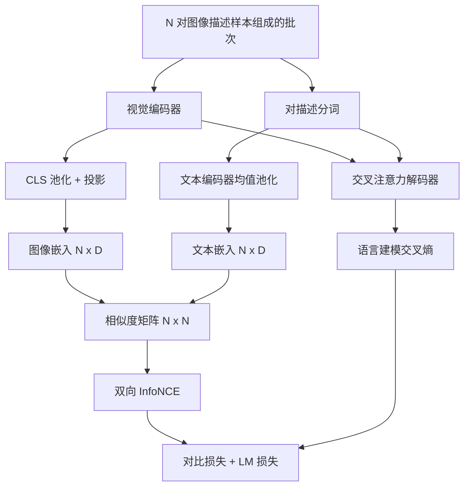

# 视觉语言预训练（Vision-Language Pretraining）

> 编码器、投影层和解码器已经连接好。现在将它们一起训练。学习由两个目标驱动：图像文本对比损失（InfoNCE）在联合嵌入空间中拉近匹配对；语言建模损失要求解码器为每张图像生成描述。二者结合，让网络既能为描述找到正确图像，也能为图像写出描述。

**Type:** Build
**Languages:** Python
**Prerequisites:** 阶段 19 第 30–37 课（路线 B 基础）
**Time:** ~90 分钟

## 学习目标（Learning Objectives）

- 在一批图像描述对上实现 InfoNCE 对比损失（Contrastive loss）。
- 将对比损失与自回归语言建模损失组合。
- 合成包含 200 对样本的模拟图像描述语料，无须下载真实数据集。
- 运行 50 步演示训练循环，观察两项损失下降。

## 问题（The Problem）

视觉语言模型需要两种能力。一是排序（Ranking）：给定描述，从多张图像中找到正确图像。二是生成（Generation）：给定图像，写出描述。只预训练其中一种能力，就只能得到半个系统。CLIP 擅长排序，却无法生成描述。GPT-4V 能生成描述，但使用独立的检索头执行排序。多目标预训练能在一轮训练中获得两种能力。

InfoNCE 负责排序。对于一批 N 对样本，模型将 N 个匹配对作为正例，将 `N^2 - N` 个不匹配对作为负例，然后在得到的 `(N, N)` 相似度矩阵上计算交叉熵损失。语言模型（LM）损失负责生成：以图像为条件，进行标准的下一词元预测。两项损失均可微，可以共享编码器、投影器和解码器权重。

## 概念（The Concept）



### 一段话理解 InfoNCE（InfoNCE in one paragraph）

将 N 个图像嵌入按行堆叠，再将 N 个文本嵌入按行堆叠。两者都做 L2 归一化。计算 `N x N` 矩阵 `S = I T^T / tau`，其中 `tau` 是可学习的温度。对角线元素是匹配对，非对角线元素是负例。计算交叉熵，并让目标 `argmax` 沿对角线排列：第 `i` 行的最大元素应位于第 `i` 列。对列对称地执行同样操作。总损失为两者的均值。这就是用八行代码实现的 CLIP 损失。

### 温度的重要性（Temperature matters）

温度（Temperature）`tau` 控制 softmax 的尖锐程度。温度过小（例如 `tau = 0.01`）时，梯度只来自最难负例，训练噪声很大。温度过大时，softmax 趋于平坦，梯度消失。CLIP 将 `tau` 作为参数学习；这里的演示也如此。

### 语言建模损失（Language modeling loss）

解码器通过交叉注意力读取图像记忆词元，并在每个位置预测下一个文本词元。损失是以后一位置为目标的标准交叉熵。填充位置不计入损失。

### 组合损失（Combining the losses）

`total = contrastive + lm_weight * lm`，其中 `lm_weight` 是标量（通常为 1.0）。两项损失的梯度都流向编码器和投影层；解码器只接收 LM 损失的梯度。这是 CoCa、BLIP 和 SigLIP 风格模型采用的多任务方案，只是权重各不相同。

| 组件 | 损失面 | 影响对象 |
|-----------|--------------|---------|
| InfoNCE | 联合空间中的样本对排序 | 编码器 + 投影层 + 文本头 |
| LM | 以图像为条件的词元预测 | 编码器 + 投影层 + 解码器 |
| 组合 | 多任务 | 整个模型栈 |

### 为何演示只需 50 步（Why 50 steps is enough for a demo）

模拟语料是由随机图像和随机描述 ID 构成的 200 对合成样本。批大小为 16，执行 50 步随机梯度下降（SGD）后，两项损失都会明显下降，即使绝对值仍高于真实数据模型能达到的水平。演示旨在确认梯度链路端到端有效，且加入 LM 损失不会破坏对比目标的稳定性。

```figure
ch-infonce-diagonal
```

## 动手实现（Build It）

`code/main.py` 实现了：

- `MultimodalModel`：组合小型 ViT 编码器、MLP 投影器、小型文本侧编码器（对嵌入后的 ID 做均值池化），以及第 61 课的交叉注意力解码器。
- `info_nce_loss(image_emb, text_emb, temperature)`：双向 CLIP 风格对比损失。
- `lm_loss(logits, target_ids, padding_id)`：带掩码的下一词元交叉熵。
- `make_mock_corpus(seed, n_pairs)`：返回 200 对确定性的（图像，描述 ID）样本。
- 训练循环运行 50 步，批大小为 16，使用 Adam 优化器和可学习的对数温度参数。每 5 步打印两项损失。

运行：

```bash
python3 code/main.py
```

输出：对比损失从约 `ln(16) = 2.77` 降至 2.4 左右；LM 损失从随机均匀基线 `ln(512) ≈ 6.24` 降至约 4.7。两者下降证明梯度连接正确。真实模型会训练数百万步，但动态规律相同。

## 实际应用（Use It）

以下模型采用相同的损失方案：

- **CLIP（2021）。** 仅使用图像文本对比损失，并带有独立的冻结编码器描述探针。
- **CoCa（2022）。** 在一个模型中组合图像文本对比损失与图像描述 LM 损失，正是本课构建的模式。
- **BLIP（2022）和 BLIP-2。** 对比损失 + LM 损失 + 图像文本匹配头，共组合三项损失。
- **SigLIP（2023）。** 用 sigmoid 样本对损失替代 InfoNCE；承担相同的对比作用，但函数形式不同。
- **LLaVA 系列。** 两阶段训练：第一阶段为对齐（冻结 LM 上的余弦目标），第二阶段解冻 LM 并加入 LM 损失。第 60 课对应第一阶段，本课对应第二阶段。

## 测试（Tests）

`code/test_main.py` 覆盖：

- InfoNCE 损失对图像/文本行具有对称性。
- 相似度矩阵为大正数构成的完美对角矩阵时，InfoNCE 损失返回 0。
- LM 损失正确屏蔽填充位置。
- 模型前向传播可无误地产生两项损失。
- 5 步训练循环降低组合损失。

运行测试：

```bash
python3 -m unittest code/test_main.py
```

## 练习（Exercises）

1. 用 SigLIP 风格的 sigmoid 样本对损失替换 InfoNCE，对比模拟语料上的收敛情况。

2. 添加难负例挖掘（Hard-negative mining）步骤：每隔一个批次，从上一批次中选择最难的非对角线样本对并追加进去。训练并检查对比损失是否下降得更快。

3. 在联合嵌入上方添加图像文本匹配二分类头（真/假：两者匹配吗？），作为第三项损失，复现 BLIP 的三头配置。

4. 将模拟语料替换为从马尔可夫链采样的描述 ID 序列，该链的转移矩阵以图像哈希为条件。由于存在真正可学习的信号，描述生成损失应进一步下降。

5. 分别用 `lm_weight = 0` 和 `lm_weight = 1` 训练相同模型。比较对比损失；LM 损失不应使排序目标退化。

## 关键术语（Key Terms）

| 术语 | 含义 |
|------|---------------|
| 噪声对比估计（InfoNCE） | 在相似度矩阵上计算交叉熵 |
| 温度（Temperature） | 控制对比 softmax 尖锐程度的标量 |
| 难负例（Hard negative） | 让模型感到混淆的非对角线样本对，可用于采样 |
| 语言模型损失（LM loss） | 描述生成侧的标准下一词元交叉熵 |
| 联合嵌入空间（Joint embedding space） | 图像和文本向量投影后所在的共享空间 |

## 延伸阅读（Further Reading）

- CLIP 论文：原始对比学习方案。
- CoCa 论文：在一个模型中结合对比学习与描述生成。
- SigLIP 论文：sigmoid 样本对损失变体及其扩展性更好的原因。
