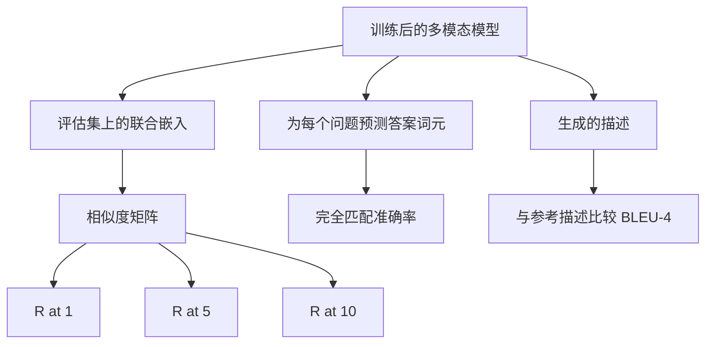

# 多模态评估（Multimodal Evaluation）

> 训练只是循环的一半，另一半是测量。本课从基本组件构建三种评估：图像描述检索，以 R@1、R@5、R@10 报告；视觉问答，以完全匹配准确率报告；图像描述生成，以 BLEU-4 报告。每项指标都是作用于模型输出的函数，配合一个几秒即可运行的合成评估套件。

**Type:** Build
**Languages:** Python
**Prerequisites:** 阶段 19 第 58–62 课（路线 E 基础：编码器、Transformer、投影、交叉注意力融合、预训练）
**Time:** ~90 分钟

## 学习目标（Learning Objectives）

- 根据图像与描述嵌入之间的相似度矩阵计算 Recall@K。
- 对将（图像，问题）映射到固定答案词表的模型，计算完全匹配的视觉问答（VQA）准确率。
- 不使用外部库，根据生成词元序列和参考词元序列计算 BLEU-4。
- 使用第 62 课训练的模型构建合成套件，运行全部三种评估。

## 问题（The Problem）

训练损失进入平台期时，人们容易宣称多模态模型已完成。训练损失衡量对训练分布的拟合程度；它不衡量模型能否在留出批次中对样本对排序、回答问题，或写出人类接受的描述。标准评估有三类：

- **检索（Retrieval，R@1、R@5、R@10）。** 构建查询描述的联合嵌入，按余弦相似度对评估池中所有图像排序，报告匹配图像是否位于前 1、前 5、前 10 名。对称的图像到文本形式采用相同流程。
- **视觉问答（Visual question answering，完全匹配）。** 给定（图像，问题），模型输出答案词元。完全匹配对每个样本只作二元判断：预测答案是否等于参考答案？再在评估集上取均值。
- **描述生成（Captioning，BLEU-4）。** 生成描述，计算相对于参考描述的 1 元至 4 元语法精确率的几何均值，并施加简短惩罚。标准形式采用多参考（每张图像对应多条参考描述）。

每项指标都是一个小函数。本课全部用代码实现，使数学具体可见，评估过程也始终由你掌控。真实基准套件（MS-COCO、VQA v2、GQA、OK-VQA）可接入相同的函数结构。

## 概念（The Concept）



### 从相似度矩阵计算 Recall@K（Recall@K from a similarity matrix）

构建图像和描述嵌入之间形状为 `(N, N)` 的余弦相似度矩阵。对每一行，按相似度降序排列各列。Recall@K 是对角线列索引出现在前 K 个位置的行所占比例。对称 Recall@K（描述到图像）在转置矩阵上计算。两个数值都要报告。对于 N=100 的评估，R@1 = 0.6 表示 100 条描述中有 60 条将正确图像检索为首位匹配。

### VQA 完全匹配（VQA exact match）

对每个（图像，问题，答案），编码图像、嵌入问题、通过解码器融合，并读出下一词元。将预测词元 ID 与参考 ID 比较，相等即正确，再在评估集上取均值。真实 VQA 数据集为每个问题提供多个人工标注答案，并使用软准确率公式（10 位标注者中至少 3 位同意时得 1.0，否则按比例降低）；本课为清晰起见，使用单答案完全匹配。

### BLEU-4（BLEU-4）

```text
BLEU-4 = BP * exp(mean(log p1, log p2, log p3, log p4))
```

其中，`p_n` 为修正后的 n 元语法精确率（出现在任一参考中的生成 n 元语法截断计数，除以生成 n 元语法总数），`BP` 为简短惩罚（Brevity penalty）：

```text
BP = 1                if generated length > reference length
   = exp(1 - r/g)     otherwise, where r is reference length and g is generated
```

小样本中某些 `p_n` 为零，需要平滑处理。实现采用 Chen 和 Cherry 的“方法 1”（对零计数的分子与分母均加 1），作为低计数情况下最稳妥的默认方案。

### 合成评估套件（Synthetic eval suite）

采用第 62 课相同的模拟语料模式，用留出的随机种子在内存中构建 50 样本评估套件。套件由三个列表组成：

- `pairs`：50 对用于检索的（图像，描述 ID）。
- `vqa`：50 个（图像，问题 ID，答案 ID）三元组。
- `caps`：50 个（图像，[参考描述 ID，...]）条目，每张图像最多 3 条参考。

套件由种子确定，与训练语料分离，因此指标基于模型从未见过的数据计算。将套件持久化为 JSON 留作练习（见下文）。

| 指标 | 范围 | 随机基线（N=50） |
|--------|-------|------------------------|
| R@1 | 0 至 1 | 0.02 (1 / N) |
| R@5 | 0 至 1 | 0.10 |
| R@10 | 0 至 1 | 0.20 |
| VQA EM | 0 至 1 | 1 / vocab |
| BLEU-4 | 0 至 1 | 很小但不为零 |

在合成数据上训练 50 步后，不期待指标很高，但期待高于随机基线，这正是演示检查的内容。

```figure
ch-recall-window
```

## 动手实现（Build It）

`code/main.py` 实现了：

- `recall_at_k(sim_matrix, k)`：为两个方向返回 `[0, 1]` 内的浮点值。
- `vqa_exact_match(predictions, references)`：返回 `int` 相等比较结果的均值。
- `bleu4(generated, references, smoothing=True)`：支持多参考。
- `build_eval_suite(seed, n_samples, vocab_size, max_len)`：返回三个确定性评估列表。
- `evaluate(model, suite)`：运行全部三项指标并返回数值组成的 `dict`。
- 演示加载第 62 课刚初始化的多模态模型，先评估，再训练 50 步并重新评估，打印前后指标。

运行：

```bash
python3 code/main.py
```

输出：前后指标表显示检索从接近随机水平提升到反映模型学到的信号，VQA 超过随机水平，BLEU-4 也有所提高（合成结构足以提升 4 元语法精确率）。

## 实际应用（Use It）

每项指标都直接对应生产基准：

- **检索。** MS-COCO 5K val、Flickr30K、ImageNet 零样本任务，都是同类相似度矩阵上的 R@K 问题。将合成评估替换为真实文件，函数签名不变。
- **VQA。** VQA v2、GQA、OK-VQA 使用相同的完全匹配结构（VQA v2 用软准确率替代单答案完全匹配）。
- **BLEU-4。** MS-COCO 描述生成、NoCaps、Flickr30K 描述生成均使用 BLEU-4，以及 CIDEr 和 METEOR。增加 CIDEr 只需再加一个函数。

对于真实基准，用真实加载器替换 `build_eval_suite`，保留函数体。数学与具体基准无关。

## 测试（Tests）

`code/test_main.py` 覆盖：

- recall@k 在完美单位相似度矩阵上返回 1.0；当 k < N 时，在翻转矩阵上返回 0.0。
- recall@k 遵守 `k <= N` 上界。
- 生成结果与任一参考完全一致时，bleu4 返回 1.0。
- 词表互不相交时，bleu4 返回 0.0。
- VQA 完全匹配值等于相等样本对所占比例。
- build_eval_suite 返回预期数量的样本对、VQA 项和描述条目。

运行测试：

```bash
python3 -m unittest code/test_main.py
```

## 练习（Exercises）

1. 在描述生成指标中加入 CIDEr。CIDEr 对 n 元语法采用 TF-IDF 加权，奖励信息量大的词元。

2. 实现软准确率 VQA：每个问题有多个人工答案，存在匹配时准确率为 `min(human_count / 3, 1)`。这复现 VQA v2。

3. 添加能防止 NaN 的 `bleu4` 变体，使其处理空生成序列时不崩溃。

4. 在 R@K 之外计算平均倒数排名（Mean reciprocal rank，MRR）。MRR 对正确条目在前 K 名之外的具体位置敏感；R@K 关注它是否进入前 K 名。

5. 在训练期间五个检查点（第 0、10、20、30、40、50 步）对模型运行评估并绘制学习曲线。确认指标轨迹跟随损失轨迹。

## 关键术语（Key Terms）

| 术语 | 含义 |
|------|---------------|
| 前 K 项召回率（R@K） | 正确匹配进入前 K 个结果的查询所占比例 |
| 完全匹配（Exact match） | 最简单的 VQA 评分：预测答案等于参考答案 |
| BLEU-4 | 1 至 4 元语法精确率的几何均值，附带简短惩罚 |
| 多参考（Multi-reference） | 描述生成指标接受每张图像的多条参考描述 |
| 留出（Held-out） | 评估集使用与训练语料分离的种子采样 |

## 延伸阅读（Further Reading）

- VQA v2 论文：软准确率公式和数据集统计。
- CIDEr 论文：TF-IDF 加权的 n 元语法描述生成指标。
- BLEU 原始论文（Papineni 等，2002）：平滑变体。
- MS-COCO 描述生成评估脚本：标准参考实现。
