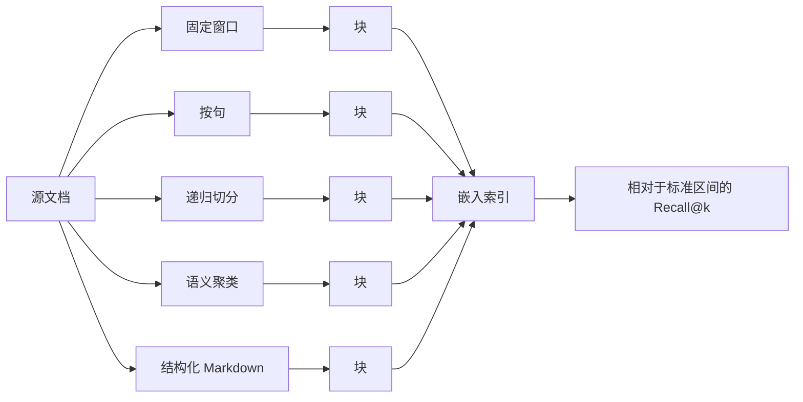

# 分块策略对比（Chunking Strategies, Compared）

> 分块决定检索器究竟能呈现什么。边界划错后，下游无论嵌入模型、重排器还是大语言模型，都无法修复损害。

**Type:** Build
**Languages:** Python
**Prerequisites:** 阶段 11 第 04 课（嵌入）、06 课（RAG）、07 课（高级 RAG）；阶段 19 路线 B 基础（第 20–29 课）
**Time:** ~90 分钟

## 学习目标（Learning Objectives）
- 从零实现五种分块策略：固定窗口、按句、递归切分、语义聚类和结构化 Markdown 标题。
- 在带有标准答案区间标注的固定测试语料上测量 recall@k，并解释为何一种策略在普通文本中胜出，而另一种在技术文档中胜出。
- 阅读块长度分布，识别各策略带来的失效模式：孤立句子、符号中间截断、仅含标题的块和语义漂移。
- 无须运行基准测试，通过检查文档类型、平均段落长度、格式是否带显式结构，为新语料选择默认策略。

## 问题（The Problem）

每条 RAG 流水线都先将源文档切成片段：小到能放入嵌入模型，大到每片段承载一个自足的意思。切分位置的选择不只是超参数，而是检索器能返回什么的上限。

“预算中止阈值是什么样的”这类查询，只有能检索到存有中止阈值的块才能成功。如果固定窗口切分器把阈值与周边上下文切开，嵌入便会移向别的簇，BM25 分数降低，重排器看到噪声，LLM 最终生成错误答案。2024 年论文《LongRAG：借助长上下文 LLM 增强检索增强生成》测得，仅分块选择就导致检索召回率出现 35 个百分点的绝对波动。2025 年针对上下文块标题的后续工作缩小了差距，但未消除它。

本课并列构建五种策略，在带标准答案区间标注的固定语料上运行，让你亲自阅读召回率数值。

## 概念（The Concept）



### 固定窗口（Fixed-window）

暴力基线：每 N 个字符切一次。可以设置重叠，使在位置 N 被切断的句子完整出现在从 N - overlap 开始的块中。速度快、确定性强，但边界效果差。用它作对照，不要作为默认策略。

### 按句分块（Sentence）

用正则表达式或简单状态机按句子边界切分，再将一个或多个句子打包到目标字符预算内。不再从词中间切断，但仍会切断段落和章节。这是许多早期 RAG 流水线的默认方式，对没有其他结构的普通文本也合理。

### 递归切分（Recursive split）

2023 年前后各类库推广的层级策略。先尝试最强分隔符（双换行、段落），不行就退到下一层（单换行），再退到句子，最后退到字符。块符合预算时递归终止。它会逐区域适配，因此擅长处理结构不一致的文档。

### 语义聚类（Semantic clustering）

为每个句子生成嵌入，将共享主题质心的相邻句子聚为一簇。当与当前质心的相似度低于阈值时切分。边界反映含义，而不是字符数。构建较慢且依赖嵌入模型，但能应对段内切换主题的文档。

### 结构化 Markdown 标题（Structural markdown headers）

对于具有显式结构的文档（Markdown、reStructuredText、RFC 风格编号章节），在标题边界切分。每块由标题及其下方内容构成，直到下一个同级或更高级标题。它按主题生成最小块，但前提是语料格式规范。

### recall@k 如何衡量边界选择（How recall@k measures the boundary choice）

带标准标注的查询包含答案区间在源文档中的精确字符偏移。分块后，检查检索器返回的前 k 个块是否有任意一个与标准区间重叠。有则该查询的 recall@k 为 1，否则为 0，再对查询集取均值。对每种策略运行相同评估，数值差异就能显示哪种边界策略适合现有语料。

```figure
ci-chunk-boundaries
```

## 动手实现（Build It）

`code/main.py` 实现了：

- `fixed_window(text, size, overlap)`：基线。
- `sentence_chunks(text, target)`：简单句子打包器。
- `recursive_split(text, separators, target)`：层级递归。
- `semantic_chunks(text, similarity_threshold)`：基于确定性模拟嵌入的质心聚类。
- `structural_markdown(text)`：识别标题的切分器。
- `mock_embed(text, dim)`：基于哈希的嵌入，使循环可离线运行。
- `DenseIndex`：与阶段 19 路线 B 的混合检索课采用相同结构。
- `eval_recall(strategy, corpus, queries, k)`：对比循环。
- `main()`：在固定语料上运行各策略并打印 recall@k 表。

运行：

```bash
python3 code/main.py
```

输出为小表，每行一种策略，每列一个 k。按句策略在结构化测试语料上落败；结构化 Markdown 在 Markdown 语料上胜出；递归策略因能自适应，在混合语料上表现稳健；在缺乏有效结构线索的普通文本语料上，语义聚类胜出。

## 表格不会掩盖的失效模式（Failure modes the table will not hide）

**孤立句子（Orphan sentences）。** 句子打包产生缺失主题句的块，嵌入随之指向错误簇。

**符号中间截断（Mid-symbol cuts）。** 代码或 YAML 中的固定窗口会将标识符切成两半，两半的嵌入都成为噪声。

**仅含标题的块（Header-only chunks）。** 结构化 Markdown 可能输出只有 `## Title` 的块。过滤掉它们，或附上下一块的首段。

**语义漂移（Semantic drift）。** 语料主题一致时，语义聚类切分不足。一个 5000 字符的块将许多具体答案装入一个模糊嵌入。应将语义策略与硬字符上限结合。

**嵌入过期（Stale embeddings）。** 语义聚类使用嵌入模型。更换模型也会改变块。将分块模型与检索模型分别固定版本，或一起重建索引。

## 不运行基准测试时如何选择默认策略（Choosing a default without running the benchmark）

三个属性决定新语料的默认分块器。

| 属性 | 取值 | 默认策略 |
|----------|-------|---------|
| 文档类型 | 无结构普通文本 | 递归切分，目标 800 |
| 文档类型 | Markdown / RFC / API 文档 | 结构化 Markdown |
| 文档类型 | 代码 | 感知抽象语法树（AST-aware，本课范围外；见阶段 19 第 02 课） |
| 段落长度 | 长、单一主题 | 按句，目标 500 |
| 段落长度 | 短、混合主题 | 语义策略，阈值 0.6 |

拿不准时，选递归切分。它是最强的单策略基线。

## 实际应用（Use It）

生产模式：

- 交付新流水线前运行评估；不要盲信库的默认策略。
- 更换嵌入模型或语料构成时重新评估；最佳策略取决于语料。
- 将策略名保存在每个块的元数据中，以便以后归因回归问题。

## 交付成果（Ship It）

第 69 课路线 F 的端到端 RAG 系统将这里选定的分块器作为第一阶段。第 68 课的评估框架读取的 recall@k 结构，与本课 `eval_recall` 的返回结构一致。选出在你的语料上胜出的策略，传入后续流程。

## 练习（Exercises）

1. 增加第六种策略：使用 `tiktoken` 而非字符计数的词元窗口。在相同固定语料上与固定窗口比较。
2. 向普通文本测试语料中加入占比 30% 的代码块，重新生成表格。解释为何除结构化 Markdown 外所有策略的召回率都下降。
3. 将确定性嵌入替换为项目真实服务商的嵌入。测量语义聚类召回率变化，并报告策略间差距扩大还是缩小。
4. 为每块增加 `summary` 字段：一句话的质心描述。将摘要附在块正文后重新评估，测量召回率提升。

## 关键术语（Key Terms）

| 术语 | 常见说法 | 实际含义 |
|------|-----------------|------------------------|
| 前 k 项召回率（Recall@k） | “找到正确块了吗？” | 前 k 块中任意一块与标准答案区间重叠的查询比例 |
| 块重叠（Chunk overlap） | “滑动窗口” | 将上一块最后 N 个字符再次包含到下一块中 |
| 结构化切分器（Structural splitter） | “识别标题的块” | 在 H1/H2/H3 边界切分；标题文本属于块 |
| 语义分块器（Semantic chunker） | “识别主题的块” | 嵌入句子，按质心相似度聚类，在漂移时切分 |
| 质心漂移（Centroid drift） | “主题转变” | 当前均值向量与下一句的余弦相似度降至阈值以下 |

## 延伸阅读（Further Reading）

- [LongRAG：借助长上下文 LLM 增强检索增强生成（LongRAG: Enhancing Retrieval-Augmented Generation with Long-context LLMs，arXiv 2406.15319）](https://arxiv.org/abs/2406.15319)
- [Anthropic：上下文检索（Contextual Retrieval）](https://www.anthropic.com/news/contextual-retrieval)
- [LlamaIndex：生产 RAG 分块策略（Chunking strategies for production RAG）](https://docs.llamaindex.ai/en/stable/optimizing/production_rag/)
- 阶段 11 第 06 课：RAG 基础
- 阶段 11 第 07 课：高级 RAG
- 阶段 19 第 65 课：对这里生成的块排序的混合检索
- 阶段 19 第 68 课：在生产环境中评分策略选择的评估框架
