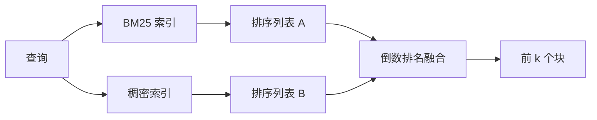

# BM25 与稠密嵌入的混合检索（Hybrid Retrieval with BM25 and Dense Embeddings）

> 词法检索与语义检索在相反的查询分布上失效。采用倒数排名融合的混合检索不是插值，而是投票，而投票在每类查询上都胜出。

**Type:** Build
**Languages:** Python
**Prerequisites:** 阶段 11 第 04 课（嵌入）、06 课（RAG）；阶段 19 路线 B 基础（第 20–29 课）；阶段 19 第 64 课（分块策略）
**Time:** ~90 分钟

## 学习目标（Learning Objectives）
- 根据 Robertson 和 Sparck Jones 的公式从零实现 BM25，包含字段加权、文档长度归一化，以及可调的 k1 和 b。
- 基于确定性模拟嵌入构建稠密检索器，让循环可离线运行。
- 按 Cormack、Clarke 和 Buettcher 在 2009 年发表的形式精确实现倒数排名融合，并解释其为何优于分数加权插值。
- 调整 RRF 的 k 常数和各模态权重，在小型固定语料上观察权衡。

## 问题（The Problem）

当查询带有语料中原样出现的标识符时，词法搜索胜出。查询 `AbortMultipartOnFail` 时，BM25 可在微秒级返回正确 Go 函数。同一查询的嵌入却落在三个相似簇的边界，稠密检索器将错误文件排在首位。

当查询的改述偏离语料的字面词元时，稠密搜索胜出。用户问“我们如何处理取消的上传”，没有输入 abort 或 multipart。BM25 返回“上传大文件”文档块，因为其中有 uploads 一词。稠密检索则找到摘要中提及取消操作的中止函数。

两者间的选择不是固定的，变量是查询分布。生产 RAG 系统通过同一端点处理两类查询，因此检索必须同时支持两者。这就是混合检索（Hybrid retrieval），而合并步骤必须正确。

## 概念（The Concept）



### 一段话理解 BM25（BM25 in one paragraph）

BM25 对查询中的每个词，将逆文档频率因子乘以包含长度归一化修正的饱和词频因子，再求和，得到查询与文档的分数。它有两个调节项。`k1` 控制词频饱和，默认 1.5 是论文推荐值，没有基准测试支持不要修改。`b` 控制文档长度的影响；默认 0.75 表示惩罚较长文档，但不是线性惩罚。

IDF 使用平滑的 Robertson 和 Sparck Jones 定义，即 `log((N - df + 0.5) / (df + 0.5) + 1)`。对数内部加一，使某词出现在一半以上语料中时，IDF 仍为正。这在停用词从计数上也算稀少的小语料中很重要。

字段加权（Field weighting）允许告诉 BM25：符号名中的匹配比正文中的匹配更重要。实现是在索引时对词计数施加乘数，而不是评分时加权。这样数学形式不变，也无需逐字段单独评分。

### 一段话理解稠密检索（Dense retrieval in one paragraph）

通过嵌入模型将每块转换成固定维度向量。查询时嵌入查询，按余弦相似度对所有块排序，返回前 k 项。模型是决定质量的变量。检索算法本身只有两行：点积和排序。

本课采用确定性的哈希嵌入，让你无须网络调用即可阅读融合数学。哈希将以词元为键的偏移累加到 96 维向量，再归一化。跨次运行的余弦排名确定，这正是测试套件所需。

### 倒数排名融合的原始公式（Reciprocal rank fusion, the published formula）

给定两个排序列表，对出现在任一列表中的每个候选，将其倒数排名贡献求和。2009 年论文采用 `1 / (k + rank)`，默认 k 为 60。按总分排序，就是整个算法。

论文中的常数 k = 60 不是随意选取的。k = 60 时，第 1 名贡献 1 / 61，第 10 名贡献 1 / 70。贡献衰减缓慢，较深位置的候选仍能投票。较小 k 让顶部结果占主导，较大 k 让贡献曲线更平。

我们的实现有两项可调内容：`k` 常数，以及一对模态权重。当已有证据表明某种方式更适合语料时，可提升 BM25 或稠密检索的权重。将排名贡献乘以权重，是最简单且有原则的实现；它保留排名衰减形状，也不依赖分数尺度。

### 融合为何优于分数加权插值（Why fusion beats score-weighted interpolation）

BM25 分数无界且依赖语料，余弦相似度范围为 -1 至 1。线性组合 `alpha * bm25 + (1 - alpha) * cosine` 需要按语料调整 alpha，每次重建索引都会失效。基于排名的融合不会如此。不同模态的排名可以比较。自 2010 年以来，公开 TREC 各赛道中，论文的 RRF 基线均优于分数插值。

Vespa 和 Weaviate 文档中关于 RankFusion 与 RRF 的讨论也是同一论点。结论相同：除非有很强证据支持分数插值，否则坚持基于排名。

```figure
rrf-fusion
```

## 动手实现（Build It）

`code/main.py` 实现了：

- `tokenize(text)`：快速正则分词器。
- `BM25Index`：字段加权，提供 `add` 和 `search`，支持调整 k1、b。
- `mock_embed`、`DenseIndex`：采用第 64 课相同的确定性嵌入，使块可比较。
- `rrf(rankings, k, weights)`：附带多模态权重的原始融合公式。
- `HybridRetriever`：组合 BM25 与稠密检索。
- 演示 `main()`：加载小型固定语料，运行三个针对各检索器优缺点的查询，打印每种模态的排名及融合列表。

运行：

```bash
python3 code/main.py
```

并排阅读演示输出。字面标识符查询在 BM25 中排第 1、稠密检索第 4、RRF 第 1。改述查询分别排第 6、第 1、第 1。歧义查询分别排第 3、第 3、第 1。融合不是平局裁决器，而是在每类查询上都胜出的系统。

## 调节参数（Tuning the knobs）

| 参数 | 默认值 | 何时调高 | 何时调低 |
|------|---------|----------------|------------------|
| BM25 k1 | 1.5 | 文档中词语重复，希望词频影响更大 | 文档短，词语重复只是噪声 |
| BM25 b | 0.75 | 长文档确实每词信息更少 | 文档长度与主题无关 |
| RRF k | 60 | 较深候选应继续投票 | 第 1 名应占主导 |
| BM25 权重 | 1.0 | 语料包含字面标识符，查询与之匹配 | 查询是用户改述 |
| 稠密权重 | 1.0 | 查询经过改述 | 查询是字面匹配 |

应在留出查询集上重新运行第 68 课评估框架来调参，而不是凭直觉。

## 演示会掩盖的失效模式（Failure modes the demo will hide）

**词表外词元（Out-of-vocabulary tokens）。** BM25 的 IDF 根据语料计算，因此只在查询中出现的词贡献为零。稠密嵌入会为同一个词生成一个臆测向量。对于语料外标识符，稠密模态返回看似合理却错误的邻居。BM25 不返回结果，相应排名贡献消失，融合因而吸收这种影响，但前提是按文档去重，而不是按块去重。

**停用词元主导（Stop-token domination）。** 对 “the” 一词运行 BM25，会在整个语料上产生均匀排名。可在索引器中滤除停用词元，或接受高 IDF 词自然占主导。

**跨模态相同内容（Identical content across modalities）。** 如果语料足够小，BM25 与稠密检索的首位相同，RRF 会给出相同首位和相同邻居。这是正确行为，不是失效，但会让融合看似没有作用。在评估中加入一对对抗查询，验证融合确实有效。

## 实际应用（Use It）

生产模式：

- 在进程内建立 BM25 索引；瓶颈是词频字典，不是向量。
- 将稠密向量索引放入独立存储（本课用平面列表，生产中会用 HNSW）。
- 并行运行两类查询；融合是对并集的常数时间合并。
- 保存每个检索命中的模态，供下游重排器查看哪种模态为其投票。

## 交付成果（Ship It）

第 66 课接收本课融合后的前 k 项，用交叉编码器重排。第 68 课用精确率、召回率、MRR 和 nDCG 评估整条流水线。本课混合检索器是第 69 课端到端系统的第一阶段。

## 练习（Exercises）

1. 用服务商的真实模型替换 `mock_embed`。重新运行演示，报告改述查询的纯稠密排名如何变化。
2. 添加第三种模态：单独索引块摘要，作为第三个排序列表融合。测量收益。
3. 扫描 RRF k 值 10、30、60、100、200，绘制第 68 课的 recall@k 曲线，报告在你的语料上曲线峰值对应的 k。
4. 正确实现 BM25F（逐字段长度归一化，而非乘数技巧），在符号匹配最重要的语料上比较。

## 关键术语（Key Terms）

| 术语 | 常见说法 | 实际含义 |
|------|-----------------|------------------------|
| BM25 | “词法搜索” | idf x 饱和 tf x 长度归一化的概率排序 |
| 倒数排名融合（RRF） | “排名融合” | 跨排序列表对 1 / (k + rank) 求和；默认 k = 60 |
| k1 | “词频饱和” | 控制重复词多久后不再增加多少分数 |
| b | “长度惩罚” | 0 表示忽略文档长度，1 表示完全归一化 |
| 字段加权（Field weighting） | “符号提升” | 索引时重复词元，提高该字段匹配的权重 |
| 排名融合与分数融合（Rank-based vs score-based fusion） | “为何 RRF 优于线性组合” | 排名跨模态可比，分数不可比 |

## 延伸阅读（Further Reading）

- Cormack、Clarke、Buettcher：《倒数排名融合优于 Condorcet 和独立排名学习方法（Reciprocal Rank Fusion outperforms Condorcet and individual rank learning methods）》，SIGIR 2009
- Robertson、Walker、Beaulieu、Gatford、Payne：《TREC-3 中的 Okapi（Okapi at TREC-3）》（原始 BM25 论文）
- [Vespa：BM25 与嵌入的混合检索（Hybrid Retrieval with BM25 and Embeddings）](https://docs.vespa.ai/en/tutorials/hybrid-search.html)
- [Weaviate：混合搜索（Hybrid Search）](https://weaviate.io/developers/weaviate/search/hybrid)
- 阶段 11 第 06 课：RAG 基础
- 阶段 19 第 64 课：本课索引输入的分块器
- 阶段 19 第 66 课：消费融合后前 k 项的交叉编码器重排器
