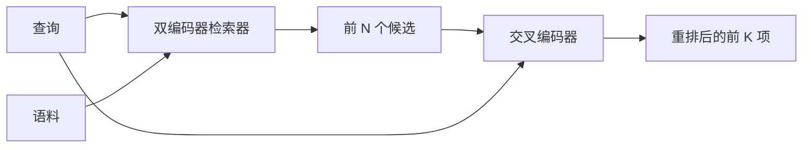

# 交叉编码器重排器（Cross-Encoder Reranker）

> 双编码器独立嵌入查询和文档。交叉编码器将两者拼接并同时阅读。交叉编码器理解最强，也最慢。将它用作双编码器前 k 项之后的第二阶段，就能收回成本。

**Type:** Build
**Languages:** Python
**Prerequisites:** 阶段 11 第 06 课（RAG）、07 课（高级 RAG）；阶段 19 路线 B 基础（第 20–29 课）；阶段 19 第 65 课（为本阶段提供输入的混合检索）
**Time:** ~90 分钟

## 学习目标（Learning Objectives）
- 从输入形状、参数量和每查询开销区分双编码器检索器与交叉编码器重排器。
- 从零实现小型交叉编码器：用 Transformer 块读取打包的（查询，文档）序列，输出单个相关性标量。
- 连接先检索后重排的两阶段流水线：低成本检索器取前 N 项，交叉编码器将 N 项重排为前 K 项，返回 K 项。
- 在小型固定语料上测量延迟与质量的权衡，为给定延迟预算选择合适的 N。

## 问题（The Problem）

双编码器（Bi-encoder）将查询和文档映射到同一向量空间，按余弦相似度排序。两次编码互不可见。模型必须在不知道查询的情况下，把文档全部有用信息压缩到一个向量。这很快：索引时每篇文档嵌入一次，查询时每个查询嵌入一次，也是语料规模排序的唯一可行方式。

代价是精确性。整体主题相同的两篇文档，嵌入可能几乎一样，即使其中一篇回答了查询，另一篇没有。双编码器无法区分它们。

交叉编码器（Cross-encoder）通过一起阅读查询和文档解决该问题。模型接收单一序列 `[query] [SEP] [document]`，对拼接后的整体执行完全注意力，输出一个相关性标量。文档每个词元都能关注查询每个词元。模型在完整上下文中决定分数。

代价是吞吐量。双编码器一次嵌入可反复查询，交叉编码器却要对每个（查询，文档）对运行一次。1000 万文档的语料，每次查询就需 1000 万次前向传播，无法在请求预算内运行。

解决方案是分阶段。先用双编码器检索前 N 项，再用交叉编码器将 N 项重排为前 K 项。N 很小（50 至 200），交叉编码器的质量收益集中在关键候选上。总延迟仍在请求预算内。总质量是交叉编码器的质量，但上限由双编码器在 N 处的召回率决定。

## 概念（The Concept）



### 交叉编码器的输入形状（The cross-encoder's input shape）

标准打包方式是 `[CLS] query_tokens [SEP] document_tokens [SEP]`。CLS 位置的输出送入一个线性头，输出相关性标量。一些实现用均值池化替代 CLS，差别不大。关键是模型为每个样本对产生一个数值。

2200 万参数的交叉编码器（已发布的 `ms-marco-MiniLM-L-6-v2` 权重类别）是典型生产选择。更小模型的质量损失快于延迟收益。更大模型（如 5.68 亿参数的 `bge-reranker-v2-m3`）留给离线重排，或 K 很小的首页重排。

### 本课为何训练微型模型（Why this lesson trains a tiny one）

真正的交叉编码器是微调后的编码器 Transformer。生产中加载检查点即可运行。本课旨在展示模型结构和延迟质量曲线，而不是训练最先进的排序器。因此我们构建小型 `nn.Module`，包含一个 Transformer 块、多头注意力（默认 4 头）和一个回归头。通过种子确定性初始化，无须磁盘权重也可复现演示。

玩具模型从固定语料学到正确的关系：相关查询文档对的预测分数高于不相关对。端到端流水线重排双编码器输出，重排后的前 k 项与标准标签相关。

### 延迟与质量（Latency vs quality）

两阶段流水线有一个可调量 N。在留出查询集上从 5 到 100 扫描 N，便得到曲线。

| N | 第二阶段 Recall@1 | 每查询交叉编码器前向传播次数 | 延迟 |
|---|--------------------|---------------------------------------|---------|
| 5 | 0.62 | 5 | 低 |
| 20 | 0.81 | 20 | 中 |
| 50 | 0.86 | 50 | 高 |
| 100 | 0.86 | 100 | 很高 |

以上数字用于说明曲线形态，不是本固定语料上的测量值。形态是真实的。20 至 50 个候选附近总有一个拐点，重排收益趋于饱和。超过拐点，就是付费却没有收益。

根据评估曲线和延迟预算选择 N。交叉编码器无法将召回率提高到双编码器在 N 处的召回率之上，因此小 N 不只限制延迟，也限制质量。

```figure
rerank-funnel
```

## 动手实现（Build It）

`code/main.py` 实现了：

- `CrossEncoder`：小型 `torch.nn.Module`，包含词元嵌入、一个带多头注意力和前馈网络的 Transformer 块，以及输出单标量的均值池化头。
- `tokenize_pair(query, document)`：把两个字符串打包成单一 ID 序列，以类型 ID 标记边界，使用标准库且结果确定。
- `train_tiny(pairs)`：在人工标注的（查询，文档，相关性）三元组列表上进行一轮监督训练，使模型在固定语料上产生合理分数。
- `rerank(query, candidates, top_k)`：生产接口。
- `pipeline(query, retriever, top_n, top_k)`：两阶段流程。
- 演示 `main()`：按第 65 课模式加载语料，检索前 N 项，重排为前 K 项，并排打印两个列表，报告各阶段延迟。

运行：

```bash
python3 code/main.py
```

输出展示双编码器前 N 项、交叉编码器前 K 项及计时摘要。交叉编码器每次调用更慢，但不会遍历整个语料。两阶段总时间仍在请求预算内，同时选出双编码器原本排在第二或第三的答案。

## 演示会掩盖的失效模式（Failure modes the demo will hide）

**交叉编码器不对称。** `rerank(q, d)` 与 `rerank(d, q)` 分数不同。始终先输入查询。误换顺序会导致召回率骤降。

**N 太小，无法暴露问题。** N = K 时，交叉编码器无法重新排序，只能重新赋权，收益看起来为零。N 至少取 K 的三倍。

**训练数据泄漏到评估。** 人工标注训练对若包含评估查询，重排会显得神奇。即使固定测试语料也必须严格分离训练与评估。

**生产权重是稠密的。** 2200 万参数交叉编码器用 float32 占 88MB。在承诺 p95 低于 100ms 前，规划好模型服务器内存。

**批处理很重要。** 真实交叉编码器将 N 个候选放在一批运行。本课在 `_batch_encode` 中实现：通过 `torch.tensor(...)` 构建批量 ID 和类型 ID 张量，再执行一次前向传播。不做批处理，延迟会乘以 N。

## 实际应用（Use It）

生产模式：

- 一起固定双编码器、交叉编码器和 N。任一变化都使原评估失效。
- 按（查询，文档 ID）的哈希缓存重排器输出。同一查询在稳定语料上的重排顺序不变，缓存命中可直接降低延迟。
- 记录排名第一的交叉编码器分数。首位分数低于语料特定阈值的查询，是领域外命中；应向 LLM 传达“我没有把握”。

## 交付成果（Ship It）

第 68 课端到端评估这条两阶段流水线。第 69 课将本重排器接在第 65 课混合检索器之后、答案生成器之前。重排器是端到端系统的第二阶段。

## 练习（Exercises）

1. 从 5 至 50 扫描 N，绘制重排输出的 recall@1，找到本固定语料的拐点。
2. 将交叉编码器训练十轮而非一轮，测量每轮正负样本对的分数间隔。
3. 用 CLS 词元头替换均值池化，在固定语料上比较收敛情况。
4. 加入第二个交叉编码器头，预测二元标签“文档中是否有这个答案”。推理时同时使用两头，一头排序，一头作阈值判断。
5. 将确定性模拟双编码器替换为第 65 课的版本，串联两阶段，测量相对仅使用双编码器时前 K 项的变化。

## 关键术语（Key Terms）

| 术语 | 常见说法 | 实际含义 |
|------|-----------------|------------------------|
| 双编码器（Bi-encoder） | “向量检索器” | 独立编码查询和文档，按余弦相似度排序 |
| 交叉编码器（Cross-encoder） | “重排器” | 联合编码（查询，文档），输出一个相关性标量 |
| 两阶段流水线（Two-stage pipeline） | “检索并重排” | 低成本检索器返回 N 项，高成本重排器保留 K 项 |
| N（候选预算，candidate budget） | “重排池” | 每个查询由交叉编码器评分的候选数 |
| 均值池化头（Mean-pooling head） | “最后隐藏层均值” | 将编码器最后一层输出平均成一个向量 |

## 延伸阅读（Further Reading）

- Nogueira、Cho：《使用 BERT 的段落重排（Passage Re-ranking with BERT）》，2019：经典交叉编码器排序论文
- Reimers、Gurevych：《Sentence-BERT：使用孪生 BERT 网络的句子嵌入（Sentence-BERT: Sentence Embeddings using Siamese BERT-Networks）》，2019：双编码器与交叉编码器对比
- [SentenceTransformers 交叉编码器（Cross-Encoders）文档](https://www.sbert.net/examples/applications/cross-encoder/README.html)
- [BGE Reranker v2 模型卡（Model card）](https://huggingface.co/BAAI/bge-reranker-v2-m3)
- 阶段 19 第 65 课：为本重排阶段提供输入的混合检索器
- 阶段 19 第 68 课：测量重排收益的评估
