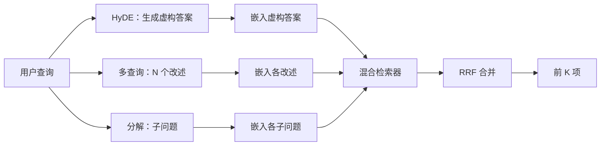

# 查询改写：HyDE、多查询与分解（Query Rewriting: HyDE, Multi-Query, and Decomposition）

> 用户输入的查询并不是检索器想要的查询。改写在检索前弥合差距，让索引看到更接近答案形态的内容。

**Type:** Build
**Languages:** Python
**Prerequisites:** 阶段 11 第 04 课（嵌入）、06 课（RAG）；阶段 19 路线 B 基础（第 20–29 课）；阶段 19 第 64、65 课
**Time:** ~90 分钟

## 学习目标（Learning Objectives）
- 实现假设文档嵌入（Hypothetical Document Embeddings，HyDE）：生成虚构答案并嵌入，用该向量替代查询向量检索。
- 实现多查询扩展：将一个查询改述为 N 个查询，分别检索，再用倒数排名融合合并其并集。
- 实现查询分解：将复杂问题拆为子问题，分别检索并合并。
- 在固定语料上直接比较三种改写器，解释各策略何时胜出。
- 接入产生确定性、适用于固定语料的输出的模拟 LLM，让改写循环可离线运行。

## 问题（The Problem）

用户输入“上传失败且预算耗尽时，我们团队怎么做？”。语料中的文档写道：“AbortMultipartOnFail 在上传失败时中止进行中的 S3 分段上传，并扣减每个存储桶的重试预算。”查询与文档不共享名词短语，BM25 因而漏检。双编码器将文档排在第三或第四，因为查询向量落入偏向“取消任务”而非“中止上传”文档的嵌入空间区域。第 66 课的两阶段重排可在答案位于前 N 项时挽救结果；若连前 N 项都未进入，重排器就根本看不到它。

解决办法是在查询接触检索器前改写。2023 年 Gao 等人的论文《无相关性标签的精确零样本稠密检索》引入 HyDE：让 LLM 写出能回答查询的文档，嵌入该假设文档，并将其嵌入用作检索向量。假设文档采用语料的表达方式，因而落在嵌入空间的正确区域，原查询向量则没有。

两种近亲技术可与 HyDE 配合。多查询扩展（Microsoft GraphRAG 使用的术语）生成查询的 N 个改述，分别检索后合并。分解（在 2024 年 Stanford DSPy 工作中以“子查询分解”推广）把“上传失败且预算耗尽时，我们团队怎么做”拆为两个问题：“上传失败时会怎样”和“重试预算耗尽时会怎样”。两次检索，一个合并结果，答案两部分都能触达。

本课实现全部三种策略，在同一固定语料上运行。

## 概念（The Concept）



### HyDE 详解（HyDE in detail）

HyDE 用 LLM 撰写的假设文档向量替代用户查询向量。提示词很短：

```
你是一位领域专家。写一段回答以下问题的文字。
使用该领域文档会采用的词汇和表达方式。
不要拒绝，不要说自己不知道。

问题：{user_query}

段落：
```

作为事实答案，LLM 的回答是错误的，因为它不了解你的语料。这没关系。检索器关心词元分布，而非事实正确性。假设段落包含 abort、multipart、bucket、budget 等词，因为该主题的文档段落就会这样表达。嵌入这段文字，向量会落在真实段落附近。

生产中将假设文档限制为两三句。更长会引入更多噪声，更短则丢失 HyDE 所需的词法信号。

### 多查询扩展详解（Multi-query expansion in detail）

生成用户查询的 N 个改述。最简单的提示词：

```
用 {N} 种不同方式改写以下问题。每个改写必须保留原始意图。
按 1 至 {N} 编号。不要添加解释。
```

为每个改述检索前 k 项，再用 RRF（第 65 课相同算法）合并 N 个排序列表。成本低、可并行、结果确定。

当用户表达只是多种同样有效问法之一，且改写能问得更好时，多查询胜出。如果原查询的问题被所有改述继承，所有改述都同样差，它就会失效。

### 分解详解（Decomposition in detail）

一次检索无法满足多方面问题。分解让 LLM 将问题拆为子问题，系统逐子问题检索。提示词：

```
以下问题可能需要来自多个不同主题的信息。
将其分解为子问题列表。每个子问题必须能够独立回答。
如果问题已经不可再分，则原样返回。

问题：{user_query}
```

逐子问题检索，再合并。对于包含连词、多分句比较或两个无关主题的问题，分解是合适工具。对原子问题则不适合；此时分解器应返回单一问题，而不是编造虚假子问题。

### 为何三种策略都存在（Why all three exist）

三者互补。HyDE 弥合查询与语料的词元差距，多查询覆盖改述差异，分解覆盖多主题查询。生产系统运行三者，并按查询选择策略（第 69 课端到端系统展示选择器）。

## 模拟 LLM（The Mock LLM）

本课离线运行。模拟 LLM 是按用户查询索引的小型查找表，并为未见查询提供回退。查找表包含：

- 每个固定测试查询：一段已写好的假设段落、三个改述和一份分解。
- 未知查询：确定性变换，提取查询实词，通过同义词映射扩展并返回结果。

重要的是模拟组件的结构，不是数据。生产中用真实模型调用替换模拟组件，检索器不变。

```figure
cd-hyde-vector
```

## 动手实现（Build It）

`code/main.py` 实现了：

- `MockLLM`：上述确定性替身。
- `HyDERewriter`：调用 LLM 撰写假设文档，以 `RewriteResult` 返回改写输出，包含假设文本和检索器应使用的查询。
- `MultiQueryRewriter`：调用 LLM 生成 N 个改述，返回查询列表。
- `DecomposeRewriter`：调用 LLM 分解，返回子问题。
- `retrieve_with_rewriter`：接收改写器和检索器，运行改写并融合结果。
- 演示在固定语料上运行三种改写器，打印哪种策略首先返回标准答案文档。

检索器复用第 65 课的结构（混合 BM25 + 稠密检索），融合仍为 RRF。唯一新增结构是小型改写器接口。

运行：

```bash
python3 code/main.py
```

输出包含各策略排名和最终摘要。HyDE 在表达不匹配查询上胜出，多查询在改述差异查询上胜出，分解在多主题查询上胜出。回退方案（无改写器）至少在三类之一上落败。

## 演示会掩盖的失效模式（Failure modes the demo will hide）

**HyDE 错误臆造语料特有标识符。** 模型编造函数名。假设文本在正确文档上的 BM25 分数骤降，因为编造名称成为不在索引中的高权重词元。限制假设文本长度，并在融合中降低 BM25 权重。

**多查询改写全部趋同。** 较弱模型产生三个几乎相同的改述，N 次检索返回相同前 k 项，RRF 合并并不优于单次检索。在改写提示词中明确要求多样性，并通过 Jaccard 检测重复。

**分解过度切分。** 分解器将原子问题变为列表，各次检索都返回同一文档，但排名降低，合并反而比原查询更差。扇出前加入“这些子问题是否足够不同”的检查来检测。

**延迟倍增。** HyDE 需要一次 LLM 调用。多查询需一次 LLM 调用生成 N 个改写，再做 N 次检索。分解需一次 LLM 调用，再做 M 次检索。检索可并行，LLM 调用决定延迟下限。

## 实际应用（Use It）

生产模式：

- 按查询长度逐查询选择策略：短原子查询用多查询，复杂多分句查询用分解，术语密集查询用 HyDE。
- 按查询哈希缓存改写器输出，许多查询会重复。
- 三种策略并行运行，再用 RRF 将三个结果集合并为一个。成本是三次 LLM 调用和一次融合；质量覆盖三种策略覆盖范围的并集。

## 交付成果（Ship It）

第 69 课将本改写阶段接在第 65 课检索器和第 66 课重排器之前。第 68 课评估改写器给检索召回率带来的提升。

## 练习（Exercises）

1. 实现 RAG-Fusion（2024 年的多查询变体），让改写器有意生成多样化改述，再由重排步骤（第 66 课）选择最终列表。
2. 增加第四种策略：后退提示（Step-back prompting），让 LLM 提出更一般的问题，据此检索，再缩小范围。在固定语料上比较。
3. 加入“问题是否原子化”判断头，训练分解器识别原子查询。测量前后的过度切分率。
4. 用真实模型调用替换模拟 LLM，测量技术栈中每种策略的延迟。
5. 为每个改写添加置信度分数，丢弃低于阈值的改写，测量对召回率的影响。

## 关键术语（Key Terms）

| 术语 | 常见说法 | 实际含义 |
|------|-----------------|------------------------|
| 假设文档嵌入（HyDE） | “虚构文档检索” | LLM 写答案，嵌入该答案并据此检索，而不是嵌入查询 |
| 多查询（Multi-query） | “改述扩展” | 查询改写 N 次，检索 N 次，再以 RRF 合并 |
| 分解（Decomposition） | “子查询切分” | 多主题查询拆为子问题，分别检索 |
| 原子查询（Atomic query） | “单主题” | 不编造虚假子问题就无法继续分解 |
| 后退提示（Step-back） | “抽象查询” | 提出更一般的问题，检索，再缩小范围 |

## 延伸阅读（Further Reading）

- Gao、Ma、Lin、Callan：《无相关性标签的精确零样本稠密检索（Precise Zero-Shot Dense Retrieval without Relevance Labels）》（HyDE），2023
- Microsoft Research：《检索的多查询扩展（Multi-Query Expansion for Retrieval）》
- Stanford DSPy：《多跳问答的子查询分解（Subquery Decomposition for Multi-Hop QA）》
- [LlamaIndex 查询变换（Query transformations）文档](https://docs.llamaindex.ai/en/stable/optimizing/advanced_retrieval/query_transformations/)
- 阶段 11 第 07 课：高级 RAG 模式
- 阶段 19 第 65 课：接收本改写器输入的检索器
- 阶段 19 第 68 课：测量改写器收益的评估
