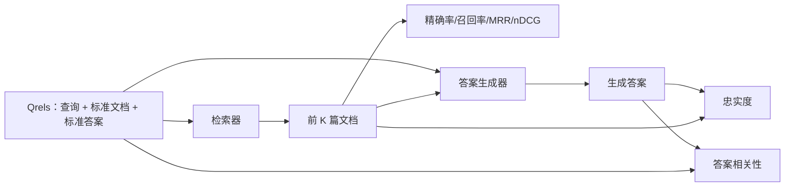

# RAG 评估：精确率、召回率、MRR、nDCG、忠实度与答案相关性（RAG Evaluation: Precision, Recall, MRR, nDCG, Faithfulness, Answer Relevance）

> 如果不能同时给检索和答案评分，就不能交付系统。两者不是同一指标，同一提示词也会在不同维度上失效。

**Type:** Build
**Languages:** Python
**Prerequisites:** 阶段 11 第 06 课（RAG）、10 课（评估）；阶段 19 路线 B 基础（第 20–29 课）；阶段 19 第 64、65、66、67 课
**Time:** ~90 分钟

## 学习目标（Learning Objectives）
- 根据标准相关性标注（Qrels）计算四项检索指标：precision@k、recall@k、MRR（平均倒数排名）和 nDCG@k。
- 计算两项答案评分指标：忠实度（每个论断均有检索上下文支持）和答案相关性（答案回应问题）。
- 构建评估端到端读取的固定 qrels 文件，包含查询、标准文档 ID 和标准答案文本。
- 阅读指标值，诊断流水线失效环节：检索、排序、生成或依据关联。

## 问题（The Problem）

RAG 系统至少有四个组成部分：分块器、检索器、重排器和生成器。任何一个都可能导致错误答案。没有分阶段指标，就只能盲目排查。

用户报告答案错误。是分块器切断了答案区间？检索器没把该块放进前 k 项？重排器把正确块推到了首位之后？还是生成器忽略块并编造内容？仅看答案无法判断。你需要：

- 检索指标，评分检索器返回的内容。
- 排序指标，评分正确块在序列中的位置。
- 忠实度，评分生成器是否局限于检索上下文。
- 答案相关性，评分答案究竟是否回应问题。

本课基于固定 qrels 文件构建全部六项指标。评估离线且确定；生产中将模拟的 LLM 评判者替换为真实模型。

## 概念（The Concept）



### 前 k 项精确率（Precision@k）

检索器返回的前 k 篇文档中，有多少比例属于标准集合？若标准集合有三篇，返回的前三篇包含其中两篇和一篇错误文档，precision@3 就是 2 / 3。无关块成本高时使用精确率，例如生成器在其上浪费词元，或该块污染答案。

### 前 k 项召回率（Recall@k）

标准文档中，有多少比例位于前 k 项？若标准集合有三篇，前五项全部包含它们，recall@5 为 1.0。遗漏答案的成本高时使用召回率，例如宁可多看到一个错误块，也不愿完全漏掉答案块。

生产 RAG 通常引用的主要指标是 recall@k。生成器容易丢弃无关块，却无法从从未见过的块中创造答案。

### 平均倒数排名（MRR，Mean Reciprocal Rank）

对每个查询，找到排序列表中第一篇相关文档的位置，倒数排名为 1 / position，再对查询集取均值。MRR 用一个数总结检索器把最佳答案放到顶部的能力。

MRR 对第一位置赋予很高权重。标准文档排第 1 的查询贡献 1.0，第 2 贡献 0.5，第 10 贡献 0.1。列表顶部主导该指标。

### 前 k 项归一化折损累计增益（nDCG@k）

归一化折损累计增益（Normalized Discounted Cumulative Gain）的完整公式为：给每篇检索文档分配增益（常用相关为 1、不相关为 0），按位置的对数折损，求和，再除以理想 DCG（完美排序时的 DCG）。范围为 0 至 1。

nDCG 支持分级相关性：标准标注可以指定“文档 A 为 3，B 为 2，C 为 1”。MRR 和 recall@k 会把所有相关性压成二元值。每个查询有多篇部分相关文档时，应使用 nDCG。

### 忠实度（Faithfulness）

对生成答案中的每个论断，检查检索上下文是否支持。标准实现使用 LLM 评判者提示词，接收（论断，上下文），返回是或否。指标是通过的论断比例。

忠实度捕捉生成器编造内容的失效模式。即使检索器返回正确块，会产生幻觉的生成器仍有问题。忠实度也称依据性（Groundedness）、支持度（Support）或归因（Attribution）。

本课用确定性模拟评判者实现忠实度，检查每个论断的词元与检索上下文的重叠是否达到阈值。生产中换成真实模型调用，指标结构不变。

### 答案相关性（Answer relevance）

答案是否真正回应问题？忠实度问“答案是否有上下文依据”，答案相关性问“答案是否围绕问题”。忠实但离题的答案，忠实度高而相关性低；简短、切题但忽略上下文的答案，相关性高而忠实度低。

标准实现同样采用 LLM 评判者，输入（问题，答案），询问答案是否回应问题。本课实现词元重叠加评判者的替身。

## 固定相关性标注（The fixture qrels）

```python
{
  "qid": "q1",
  "query": "what is the abort threshold for multipart uploads",
  "gold_doc_ids": ["d1", "d3"],
  "gold_answer_substring": "three failed parts",
  "graded_relevance": {"d1": 3, "d3": 2},
}
```

每个查询携带：
- 查询字符串；
- 标准文档 ID 集合（用于精确率、召回率、MRR）；
- 分级相关性字典（用于 nDCG）；
- 标准答案子串（作为各 qrel 的参考元数据保留；本课忠实度通过对照检索上下文评判提取的论断计算，而不是对照该子串）。

生产中需要标注这些内容。本课提供手工构建的固定数据，使评估开箱即用。

```figure
ci-rag-metric-ladder
```

## 动手实现（Build It）

`code/main.py` 实现了：

- `precision_at_k(retrieved, gold, k)`：按定义实现。
- `recall_at_k(retrieved, gold, k)`：按定义实现。
- `mean_reciprocal_rank(retrieved_list_of_lists, gold_list)`：跨查询取均值。
- `ndcg_at_k(retrieved, graded_relevance, k)`：二元或分级增益的 DCG / IDCG。
- `extract_claims(answer)`：将答案拆为句子形式的论断。
- `faithfulness(claims, context_texts, judge)`：被判定有支持的论断比例。
- `answer_relevance(question, answer, judge)`：判断答案是否回应问题。
- `MockJudge`：确定性的词元重叠评判者，使评估离线运行。
- `evaluate_pipeline(pipeline_fn, qrels, ks)`：运行各项指标的编排器。
- 演示在 qrels 上运行三种流水线变体（分块器基线、混合检索、混合检索 + 重排），打印指标表。

运行：

```bash
python3 code/main.py
```

输出在一张表中显示各变体的 precision@k、recall@k、MRR、nDCG@k、忠实度和答案相关性。混合检索行的召回率优于分块器基线，重排行的 MRR 优于混合检索。

## 通过指标诊断故障（Reading the metrics to diagnose failures）

| 症状 | 可能原因 | 修复对象 |
|---------|-------------|-------------|
| recall@k 低，precision@k 低 | 分块器切断答案，或检索器找不到它 | 分块边界（第 64 课）或检索模态（第 65 课） |
| recall@k 尚可，MRR 低 | 正确块位于前 k 项但不在首位 | 重排器（第 66 课） |
| MRR 高，忠实度低 | 上下文正确，生成器仍编造内容 | 生成提示词；强制引用或拒答 |
| 忠实度高，相关性低 | 答案有依据但离题 | 查询改写器（第 67 课）或生成提示词 |
| 四者都高，用户仍抱怨 | 评估集缺乏代表性 | 用真实用户查询扩充 qrels |

## 演示会掩盖的失效模式（Failure modes the demo will hide）

**LLM 评判者偏差。** 模型对自身输出的忠实度评价偏高。评判者应采用与生成器不同的模型系列，或对样本人工评分。

**Qrels 过期。** 语料变化时标准答案会漂移。2024 年 1 月还是 q1 标准答案的文档，到 2024 年 10 月可能因团队重命名函数而不再正确。安排每季度复核 qrels。

**忠实度微观检查遗漏宏观论断。** 逐句忠实度可能通过，但答案整体结构仍误导。除自动指标外，加入样本级定性复核。

**Recall@k 掩盖逐查询失效。** 平均召回率 90% 可能掩盖某一类查询始终漏检。按查询类别（字面、改述、多主题）切分 qrels，逐切片报告。

## 实际应用（Use It）

生产模式：

- 每次修改检索器或生成器都运行评估，将 recall@k 回归视为测试失败。
- 保存每个查询的指标轨迹。用户投诉时，查找匹配的 qrels 条目，检查是否本应捕获该问题。
- qrels 分层：20 查询的冒烟集在 CI 运行，200 查询的回归集每夜运行，2000 查询的深入集每周运行。

## 交付成果（Ship It）

第 69 课连接完整流水线（分块器、检索器、重排器、生成器），在端到端系统上运行本评估。

## 练习（Exercises）

1. 加入第五项检索指标：hit-rate@k，与 recall@k 比较，解释何时不同。
2. 实现分级忠实度：0（不支持）、1（部分支持）、2（完全支持），相应更新指标。
3. 用真实模型调用替换模拟评判者，测量两者在固定语料上的分歧。
4. 加入查询类别切片（“literal”“paraphrased”“multi-topic”），报告每个切片的指标。
5. 加入“答案长度”指标，分析其与忠实度的相关性并绘图。

## 关键术语（Key Terms）

| 术语 | 常见说法 | 实际含义 |
|------|-----------------|------------------------|
| 前 k 项精确率（Precision@k） | “相对于检索结果的命中率” | 前 k 项中属于标准集合的比例 |
| 前 k 项召回率（Recall@k） | “相对于标准集合的命中率” | 标准集合中位于前 k 项的比例 |
| 平均倒数排名（MRR） | “首次命中位置” | 第一篇相关文档的 1 / rank 的均值 |
| 前 k 项归一化折损累计增益（nDCG@k） | “分级排序质量” | 前 k 项 DCG 除以理想 DCG |
| 忠实度（Faithfulness） | “依据性” | 答案论断获检索上下文支持的比例 |
| 答案相关性（Answer relevance） | “是否回应问题？” | 答案是否符合问题意图 |
| 相关性标注（Qrels） | “标准标签” | 标注后的查询及其标准文档和答案集合 |

## 延伸阅读（Further Reading）

- Buckley、Voorhees：《评估指标稳定性的评估（Evaluating Evaluation Measure Stability）》，SIGIR 2000：排序指标经典论文
- Jarvelin、Kekalainen：《基于累计增益的信息检索技术评估（Cumulated Gain-based Evaluation of IR Techniques）》：nDCG 论文
- [Ragas：RAG 流水线自动评估（Automated Evaluation of RAG Pipelines）](https://docs.ragas.io)
- [Anthropic：上下文检索介绍（Introducing Contextual Retrieval）](https://www.anthropic.com/engineering/contextual-retrieval) - 使用 1 减去 recall@20 为检索评分。
- 阶段 11 第 10 课：评估框架基础
- 阶段 19 第 64–67 课：本课评估的组件
- 阶段 19 第 69 课：本评估评分的端到端流水线
