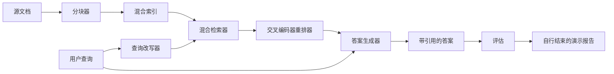

# 端到端 RAG 系统（End-to-End RAG System）

> 六课组件，一条流水线，一个评估循环，一个自行结束的演示。这就是你要交付的系统。

**Type:** Build
**Languages:** Python
**Prerequisites:** 阶段 11 第 06 课（RAG）、10 课（评估）；阶段 19 路线 B 基础（第 20–29 课）；阶段 19 第 64、65、66、67、68 课
**Time:** ~90 分钟

## 学习目标（Learning Objectives）
- 将分块器、混合检索器、查询改写器、交叉编码器重排器和答案生成器组合成单一端到端流水线。
- 实现按块锚点引用论断的答案生成器，并提供低置信度拒答回退。
- 在组装后的流水线上运行第 68 课评估，证明分阶段构建在各项指标上优于相同组件的独立运行。
- 构建自行结束的命令行（CLI）演示，摄入固定语料、运行固定查询集、输出摘要报告并以零退出。

## 问题（The Problem）

六个孤立组件不能证明系统有效。分块器可能在语料上的 recall@5 胜出，却在系统 recall@5 上落败，因为检索器无法正确排列它输出的块。重排器可能在合成候选池上提升 MRR，却在真实双编码器候选上失效，因为双编码器在重排预算内的召回率太低。查询改写器可能将某个查询的标准文档提升，却在下个查询失效，因为模拟 LLM 返回退化的假设文本。

集成测试是用一个编排文件连接一切，以相同指标在同一固定 qrels 上端到端运行整条流水线。这就是本课构建的内容。若集成流水线的指标优于各阶段独立演示的指标，你便证明了系统。

## 概念（The Concept）



### 连接选择（Wiring choices）

流水线是一个小型图，每阶段都是签名明确的函数。

| 阶段 | 输入 | 输出 |
|-------|-------|--------|
| 分块器 | 文档文本 | Chunk 记录列表 |
| 检索器 | 查询字符串 | 前 N 条 Chunk 记录 |
| 改写器（可选） | 查询字符串 | 改写列表 + 假设文本 |
| 重排器 | 查询、候选 | 带交叉编码分数的前 K 条 Chunk 记录 |
| 生成器 | 查询、前 K 条 Chunk 记录 | 带引用的答案字符串 |

各签名稳定后，组合就很直接。本课 `Pipeline` 类持有五个阶段，以 `query` 方法顺序运行。各阶段都可替换：传入不同分块器、检索器、改写器、重排器或生成器，流水线仍能运行。

### 带引用的答案生成器（Answer generator with citations）

生成器是最后阶段，也是最容易出错的阶段。本课提供确定性模拟生成器：

1. 接收重排后的前 K 个块。
2. 选择至多两个与查询实词词元重叠最高的块。
3. 从每个选定块取一句并拼成答案，每句后附 `[doc_id:chunk_index]` 锚点。
4. 若没有块的重叠超过拒答阈值，则输出“我不知道”，不附引用。

生产中将模拟组件替换为真实 LLM 调用，采用以下提示词模板：

```
你只能使用下方片段回答问题。
每个论断都必须用括号中的锚点引用。
如果片段无法回答问题，请说“我不知道”。

问题：{query}

片段：
{enumerated chunks with anchors}

答案：
```

记录交叉编码器首位分数，正是为了低置信度拒答路径。分数低于语料阈值时，生成器拒答。这是防止幻觉答案的安全机制。

### 自行结束的演示（The self-terminating demo）

演示端到端运行所有内容。它打印一个查询的分阶段明细，在四条固定 qrels 上评估，打印指标表；若第 68 课全部指标达到演示设定阈值，就以零状态退出。任一指标低于阈值，则以非零状态退出，并指出失败指标。

这就是 CI 冒烟测试的形式。流水线离线、快速、确定。固定语料上的阈值刻意设得严格，使六课中任一回归都令演示失败。

```figure
rag-pipeline-flow
```

## 动手实现（Build It）

`code/main.py` 实现了：

- `Chunk`：贯穿各阶段的记录，在第 64 课结构上增加 chunk_index 和源 doc_id。
- `Chunker`：选择第 64 课的一种策略，默认递归切分。
- `HybridIndex`：封装第 65 课的 BM25 + 稠密检索 + RRF。
- `Rewriter`（可选）：根据查询长度和是否有连词，从第 67 课的 HyDE、多查询、分解中选择。
- `Reranker`：第 66 课训练的交叉编码器，使用更小的固定训练集以在几秒内收敛。
- `Generator`：带引用和低置信度拒答的确定性模拟生成器。
- `Pipeline`：组合五阶段，以 `query(question)` 方法返回 `Result(answer, top_k, latency_ms_per_stage)`。
- `run_demo()`：摄入语料，运行三个固定查询，执行评估、打印结果，按阈值设置退出码。

运行：

```bash
python3 code/main.py
```

输出包含一条查询轨迹、完整评估表和最终通过/失败状态。在固定语料上返回退出码 0。

## 演示会掩盖的失效模式（Failure modes the demo will hide）

**分块边界漂移。** 若在评估 qrels 标注与演示之间更换分块策略，标准文档 ID 将不再对齐。在 qrels 文件中锁定分块策略。演示包含注明分块器的头部。

**重排训练集泄漏到评估。** 第 66 课的 14 个训练三元组包含类似评估查询的问题。生产中必须严格留出评估查询。演示的评估查询刻意与重排训练集分离。

**模拟生成器掩盖幻觉风险。** 模拟组件只输出检索块中的文本，无法编造。本课指出该限制，并提供换入真实模型的生产路径。

**无流式输出。** 流水线在各阶段结束后返回完整答案。生产系统会流式输出生成器内容。流式处理不在本课范围内；无论哪种方式，答案评分指标都作用于最终字符串。

**延迟为离线测量。** 模拟 LLM 调用是常数时间，真实 LLM 调用则占主导。应在请求范围内规划延迟预算；本课分阶段计时只测量 CPU 工作。

## 实际应用（Use It）

生产模式：

- 以一个编排器和显式阶段接口交付流水线文件，避免将连接逻辑散布全仓。
- 每次涉及阶段的合并前运行评估，评估下降就不合并。
- 保存每次 CI 运行的指标轨迹，以便将回归归因到阶段替换。
- 增加 20 查询的冒烟集（回归集子集），在 30 秒内运行；完整回归集每夜运行。

## 交付成果（Ship It）

本课流水线文件是阶段 19 路线 F 其余课程假设采用的结构。后续课程可在其上增加摄入自动化、增量重建索引、遥测和服务层。检索、重排、改写和评估部分在这里已经完整。

## 练习（Exercises）

1. 在改写器内加入逐查询策略选择器，按第 67 课启发式（长度、连词、术语比例）选择 HyDE、多查询或分解。
2. 用环境标志控制生成器的真实 LLM 调用，默认仍用模拟组件，测量延迟差。
3. 扩展演示，接受 `--corpus path` 标志加载真实语料，重新运行评估与阈值检查。
4. 为分块器添加 `--strategy` 标志，测量各策略对端到端召回率的贡献。
5. 添加流式生成器接口并接入评估，确认忠实度基于最终字符串，而非流式输出前缀计算。

## 关键术语（Key Terms）

| 术语 | 常见说法 | 实际含义 |
|------|-----------------|------------------------|
| 流水线（Pipeline） | “RAG 流水线” | 从摄入到带引用答案的组合阶段 |
| 引用锚点（Citation anchor） | “来源链接” | 附在每个论断上的 (doc_id, chunk_index) 引用 |
| 低置信度拒答（Refuse-on-low-confidence） | “我不知道” | 重排器首位分数低于阈值时，生成器不返回答案 |
| 冒烟集（Smoke set） | “CI 评估” | 每次 PR 检查运行的最小 qrels 子集 |
| 阶段接口（Stage interface） | “函数签名” | 流水线各阶段稳定的输入输出类型 |

## 延伸阅读（Further Reading）

- [Anthropic：构建搜索与检索（Building search and retrieval）](https://www.anthropic.com/news/contextual-retrieval)
- [Pinterest：MCP 内部搜索（MCP internal search）](https://medium.com/pinterest-engineering)：生产架构参考
- [Ragas：RAG 流水线自动评估（Automated Evaluation of RAG Pipelines）](https://docs.ragas.io)
- 阶段 11 第 06 课：RAG 基础
- 阶段 19 第 64–68 课：在此组合的组件
