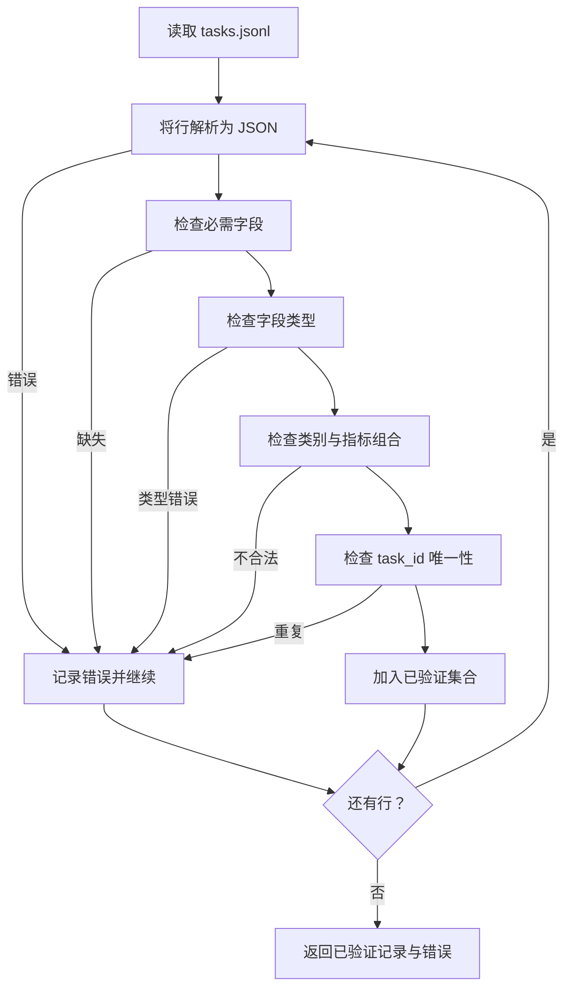

# 任务规格格式（Task Spec Format）

> 评估框架的质量取决于任务遵守的契约。编写任何评分函数前，先固定 JSONL 结构和指标词汇表。

**Type:** Build
**Languages:** Python
**Prerequisites:** 阶段 19 路线 B 基础
**Time:** ~90 分钟

## 学习目标（Learning objectives）

- 定义统一的 JSONL 任务记录模式，覆盖算术、选择题、代码执行、分类和自由文本摘要。
- 固定封闭的指标名词汇表，让后续课程（71–73）可按单一字段分派。
- 将少样本示例和后处理规则定义为任务的一部分，而非运行器的一部分，使相同提示词在不同模型中对应相同目标。
- 实现严格验证器，在格式错误记录进入运行器前将其拒绝。
- 交付覆盖规格各分支的 10 任务固定集，使验证器有真实内容可验证。

```figure
ci-task-spec-gate
```

## 为何固定规格（Why a frozen spec）

研究代码库积累评估脚本的速度往往快于测试。半年后，每个笔记本有自己的 JSON 结构，每项指标被重复实现两次，不同运行之间无法比较。解决办法很朴素：选定模式，编写验证器，拒绝其他形式。本课就做这件事。

结构借鉴 BIG-bench、HELM 和 lm-eval 风格框架的理念，但字段名由本课程定义。每个字段只有一个负责人。运行器读取任务，指标读取目标，后处理步骤归一化生成结果。流水线中途不能修改任何字段。

## 记录结构（The record shape）

任务是单行 JSON 对象。框架读取 `tasks.jsonl`，独立验证每一行。坏行只中止该记录，不中止整次运行。

```json
{
  "task_id": "arith_001",
  "category": "arithmetic",
  "prompt": "Compute the result. Question: 17 + 24\nAnswer:",
  "targets": ["41"],
  "metric_name": "exact_match",
  "few_shot_examples": [
    {"prompt": "Question: 2 + 2\nAnswer:", "completion": "4"}
  ],
  "post_process": "strip_whitespace",
  "metadata": {"difficulty": "easy"}
}
```

必需字段为 `task_id`、`category`、`prompt`、`targets`、`metric_name`、`post_process`。`few_shot_examples` 和 `metadata` 可选。未知顶层字段导致验证失败。

## 字段规则（Field rules）

`task_id` 是不含空白的字符串。验证器确保它在文件内唯一。

`category` 只能为 `arithmetic`、`mcq`、`code_exec`、`classification`、`summary` 之一。类别约束合法的指标与后处理组合。`code_exec` 任务必须用 `metric_name = code_exec`，`mcq` 任务必须用 `metric_name = exact_match` 与单字母目标比较。

`prompt` 是非空字符串。验证器禁止尾随空白，并拒绝提示词正文已含少样本块的记录。少样本渲染由运行器负责，而非作者。

`targets` 是非空字符串列表。对于 `exact_match`，匹配任一元素即算正确。对于 `f1` 和 `rouge_l`，采用得分最高的目标。对于 `mcq`，列表恰含一个元素。

`metric_name` 只能为 `exact_match`、`f1`、`bleu_4`、`rouge_l`、`accuracy`、`code_exec` 之一。词汇表封闭，增加指标需要新增课程和此处的新条目。

`few_shot_examples` 是 `{prompt, completion}` 对的列表。验证器将其限制为最多八项，使提示词长度有界。

`post_process` 只能为 `none`、`strip_whitespace`、`lower`、`extract_letter`、`extract_code_block`、`extract_first_line` 之一。每条规则只有一种确定性行为。验证器禁止组合规则。

## 验证器行为（Validator behaviour）



验证器返回两个列表：已验证记录，以及包含问题行、违反规则和出错字段的错误记录。错误列表非空时运行器拒绝启动，除非显式设置 `--allow-bad-tasks` 标志。

## 少样本渲染（Few-shot rendering）

运行器将少样本示例拼接到提示词前，以空行分隔。各模型执行相同代码路径，因此差异只来自模型本身。作者只写一份示例，而非为每个服务商各写一份。

```python
def render(task):
    parts = []
    for ex in task.get("few_shot_examples", []):
        parts.append(ex["prompt"] + " " + ex["completion"])
    parts.append(task["prompt"])
    return "\n\n".join(parts)
```

## 后处理规则（Post-process rules）

后处理在生成之后、指标之前运行，确定且无状态。

- `none` 原样返回字符串。
- `strip_whitespace` 去除首尾空白。
- `lower` 将字符串转为小写。
- `extract_letter` 返回首个匹配 `[A-E]` 的字符，用于选择题。
- `extract_code_block` 返回第一个三反引号围栏块的正文，用于代码执行。
- `extract_first_line` 返回首个非空行，用于摘要分类。

需要列表外规则的任务，应放到新课程中。

## 本课不做什么（What this lesson does not do）

不评分，不调用模型，不运行代码。这些分别在第 71、72、75 课实现。本课固定它们共同遵守的契约。

10 任务固定集包含算术、选择题、代码执行、分类、摘要各两项。验证器对全部 10 项通过。另一固定文件（`tasks_bad.jsonl`）触发各项规则，验证器返回相应数量的错误。

## 如何阅读代码（How to read the code）

`main.py` 定义 `TaskSpec`、`validate_task`、`validate_file` 和 CLI 入口。固定数据加载器为 `load_fixtures`。渲染及后处理辅助函数与验证逻辑放在一起，使第 75 课运行器只需导入一个模块。

从上到下阅读 `main.py`，再读 `code/tests/test_spec.py`。测试固定各项验证规则和后处理行为。`main.py` 底部演示验证附带固定数据并打印摘要。

## 进一步探索（Going further）

真实评估套件增加类别，就像数据库模式增加列。稳妥做法是：没有相应指标、后处理规则和至少一个固定任务，就拒绝增加类别。将规格视作数据库迁移，每次变化都须评审、版本化并附测试。本课验证器就是门禁。
