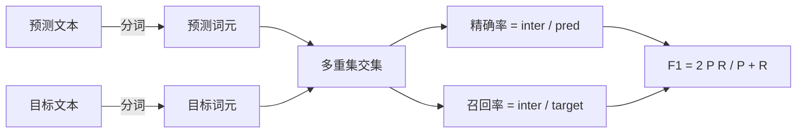
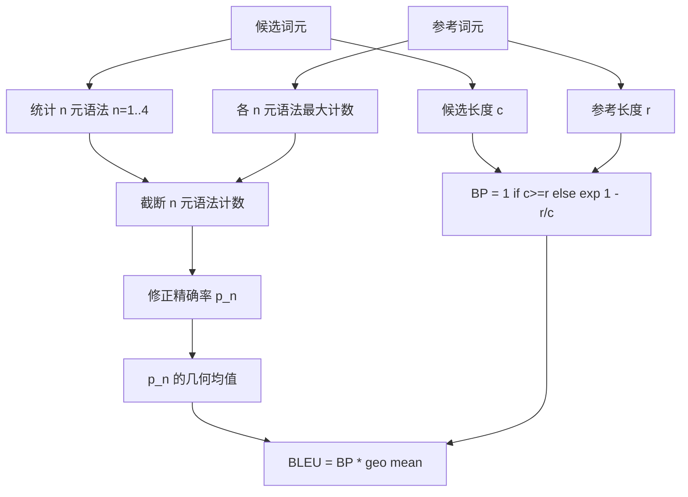

# 经典指标（Classical Metrics）

> BLEU、ROUGE-L、F1、完全匹配、准确率。这五项指标仍占已发表 LLM 评估数值的大部分。从基本原理实现每项指标，才能理解数值的含义。

**Type:** Build
**Languages:** Python
**Prerequisites:** 阶段 19 路线 B 基础，第 70 课
**Time:** ~90 分钟

## 学习目标（Learning objectives）

- 按明确的分词规则实现词元级完全匹配、F1 和准确率。
- 从头实现 BLEU-4：修正 n 元语法精确率、n 为 1 至 4 的几何均值、简短惩罚。
- 通过最长公共子序列实现 ROUGE-L，以 F-beta 组合精确率和召回率。
- 按第 70 课的 metric_name 字段分派，让运行器不依赖具体指标。
- 用推导示例而非第三方库生成的参考向量固定行为。

```figure
cd-bleu-overlap
```

## 为何重新实现（Why reimplement）

你会读到一篇论文报告 BLEU 28.3，另一篇报告 BLEU 0.283。你会发现两个库的 ROUGE-L 分数相差十分，只因一个先转小写而另一个没有。停止困惑最快的办法是自己编写指标，然后明确指出哪行决定分词器，哪行应用平滑。此后，跨论文比较数值就是阅读指标设置，而非争论库。

标准库加 numpy 足够。BLEU 是计数和截断，ROUGE-L 是动态规划，F1 是词元集合交集。最难的是选择分词器并坚持使用。

## 分词（Tokenisation）

分词器为 `re.findall(r"\w+", text.lower())`：转小写、提取连续字母数字、去掉标点。本课每项指标都使用这个分词器，运行器无权选择。更换分词器，就是在运行不同的基准测试。

```python
TOKEN_RE = re.compile(r"\w+", re.UNICODE)
def tokenize(text):
    return TOKEN_RE.findall(text.lower())
```

这是有意简化。生产设置需要关注中日韩文字（CJK）、缩约词和代码标识符。本课强调：分词器是契约，不是调节项。

## 完全匹配（Exact match）

```python
def exact_match(pred, targets):
    return float(any(pred.strip() == t.strip() for t in targets))
```

每任务返回 1.0 或 0.0，数据集聚合值为均值。这是算术、选择题和短分类任务的主力指标。

## 词元级 F1（Token-level F1）

为预测与目标建立词元多重集。精确率为多重集交集大小除以预测多重集大小，召回率为同一交集大小除以目标多重集大小，F1 为调和均值。实现处理空预测和空目标边界情况。



多目标任务取目标列表上的最佳 F1，与文献广泛报告的 SQuAD 风格行为一致。

## BLEU-4（BLEU-4）

BLEU 是经典机器翻译指标，也仍用于摘要研究。我们采用语料级 BLEU-4，使用标准简短惩罚，对修正 n 元语法计数加一平滑，避免单个缺失 4 元语法把分数压到零。

对每个候选参考对，计算 n 为 1、2、3、4 时的修正 n 元语法精确率。修正精确率用任一参考中该 n 元语法的最大计数截断候选计数，防止候选通过重复短语抬分。四项精确率的几何均值再乘简短惩罚。



平滑规则是 Lin 和 Och 所称的方法 1：取对数前，对每项 n 元语法精确率的分子分母都加一。参考没有匹配的 4 元语法时，这可避免 `log 0`，且长候选的结果仍接近未平滑值。

## ROUGE-L（ROUGE-L）

ROUGE-L 比较候选与参考词元序列的最长公共子序列（Longest common subsequence，LCS）。LCS 捕捉词序但不要求连续，因此成为默认摘要指标。我们用标准动态规划表计算 LCS 长度，再计算召回率 `lcs / reference length`、精确率 `lcs / candidate length`，以 F-beta 组合；beta 为一时是对称 F1 形式。

```python
def lcs_length(a, b):
    n, m = len(a), len(b)
    dp = numpy.zeros((n + 1, m + 1), dtype=int)
    for i in range(n):
        for j in range(m):
            if a[i] == b[j]:
                dp[i+1, j+1] = dp[i, j] + 1
            else:
                dp[i+1, j+1] = max(dp[i+1, j], dp[i, j+1])
    return int(dp[n, m])
```

numpy 表让实现易读，纯 Python 列表也可行。选择 ROUGE-L 的任务需支付每任务 O(n m) 开销。典型摘要长度下仍小于一毫秒。

## 准确率（Accuracy）

多目标分类任务中，准确率归约为与单个归一化目标的完全匹配。我们将其暴露为独立函数，让分派器按 `metric_name` 分派，而无需在运行器内比较字符串。

## 分派契约（Dispatch contract）

唯一入口为 `score(metric_name, prediction, targets)`，返回 `[0, 1]` 内浮点数。运行器不按指标名分支，只转交调用并写入结果。第 75 课会将这个接口连接到第 70 课任务规格。

```python
def score(metric_name, pred, targets):
    if metric_name == "exact_match":
        return exact_match(pred, targets)
    if metric_name == "f1":
        return max(f1_score(pred, t) for t in targets)
    if metric_name == "bleu_4":
        return max(bleu4(pred, t) for t in targets)
    if metric_name == "rouge_l":
        return max(rouge_l(pred, t) for t in targets)
    if metric_name == "accuracy":
        return accuracy(pred, targets)
    raise ValueError(f"unknown metric_name: {metric_name}")
```

`code_exec` 在第 72 课处理，并在那里接入分派器。

## 本课不做什么（What this lesson does not do）

不调用模型，不进行超出第 70 课后处理规则的生成结果归一化，不计算置信区间，也不实现 BLEURT 或 BERTScore（它们需要模型，属于另一课）。重点是基础层：五项指标、一个分词器、一张分派表。

## 如何阅读代码（How to read the code）

`main.py` 将每项指标定义为独立函数，并提供分派器。参考向量位于文件底部的 `_reference_examples` 块。演示对八个示例运行分派器并打印各指标分数。`code/tests/test_metrics.py` 固定参考向量，检验各边界情况：空预测、空参考、无共享词元、完全匹配、重复短语截断。

从上到下阅读 `main.py`，函数按复杂度排列。exact_match 和 accuracy 各一行，F1 六行。BLEU 和 ROUGE-L 是较复杂部分，包含平滑规则与 LCS 递推的详细注释。

## 进一步探索（Going further）

经典指标必要但不充分。它们奖励表面重叠，却遗漏含义。解决办法是信任经典基础层后，再叠加基于模型的指标（BLEURT、BERTScore、GEval），那属于后续课程。现在先让这五项运行，用测试固定行为，你就拥有可审计、快速且可复现的指标栈。
