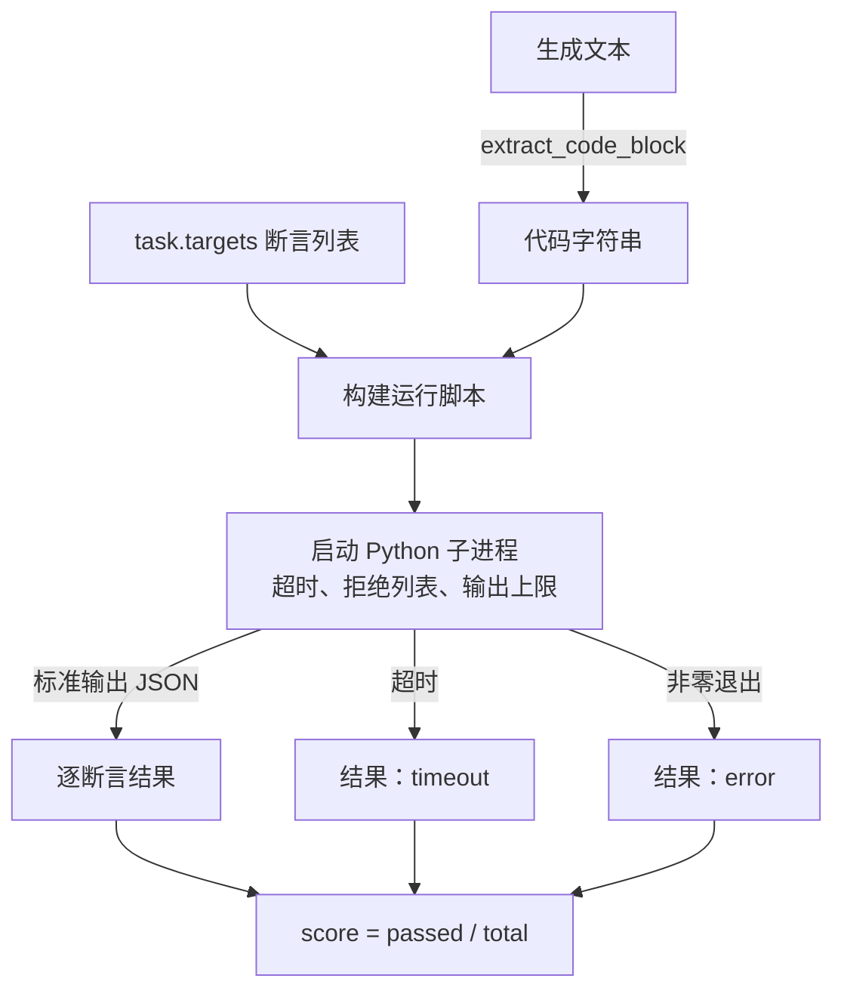
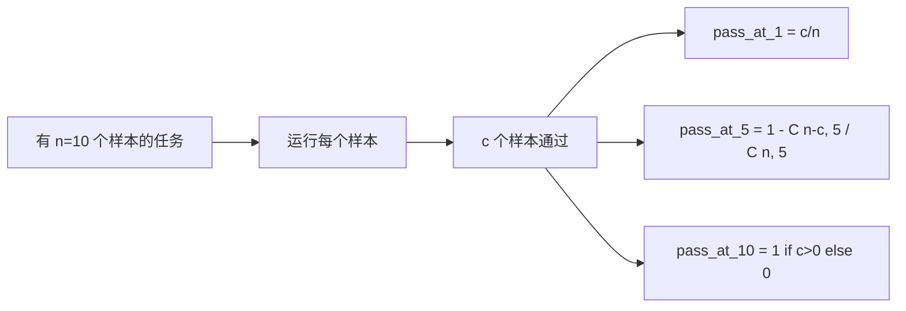

# 代码执行指标（Code Exec Metric）

> 生成代码通过测试才算正确。评估框架必须提取代码、在不使宿主崩溃的情况下运行代码，并诚实统计通过率。本课构建这一接口。

**Type:** Build
**Languages:** Python
**Prerequisites:** 阶段 19 路线 B 基础，第 70、71 课
**Time:** ~90 分钟

## 学习目标（Learning objectives）

- 从自由形式生成结果中提取代码块，行为与第 70 课后处理规则一致。
- 在独立子进程中执行候选代码，设置实际时间超时、输出上限和导入拒绝列表。
- 以提供的断言字符串在候选代码上通过的比例评分。
- 对同一模型采样多个生成结果的任务计算 pass-at-k。
- 将沙箱崩溃、语法错误和超时作为一等失效模式，用不同退出码供运行器记录。

```figure
sandbox-runner
```

## 为何使用独立子进程（Why an isolated subprocess）

内联 `exec` 是安全和稳定性风险。生成的 `while True: pass` 会永远阻塞评估。生成的 `import shutil; shutil.rmtree('/')` 则会造成字面所示的灾难。解决方案是每个候选启动新 Python 解释器，通过标准输入传入代码，将断言结果写入标准输出，超限就杀掉进程。宿主评估进程继续运行。

HumanEval、MBPP、BigCodeBench 和 LiveCodeBench 等真实评估都采用子进程沙箱，有些再叠加 Docker。我们止步于子进程，是因为它可移植、只需标准库，并能捕捉教学评估中的重要失效模式。生产部署还须加入 seccomp、网络隔离和只读文件系统。下一节加固课程不属于本路线。

## 代码执行任务结构（The shape of a code-exec task）

`code_exec` 任务在 `targets` 中携带断言字符串。运行器从生成结果提取围栏代码块，在外层构建测试框架并运行。



分数为 `[0, 1]` 内的比例。三条断言通过两条，得分 0.667。无论何种失败，运行器返回相同结构：子进程崩溃映射到归一化错误码，而非让 Python 回溯冒泡到框架。

## 拒绝列表（The denylist）

拒绝列表基于导入。执行候选代码前，运行脚本将危险模块导入替换为抛出 `ImportError("denied")` 的桩。列表刻意保守：`os.system`、`subprocess`、`socket`、`requests`、`urllib`、`urllib.request`、`urllib.error`、`urllib.parse`、`ctypes`、`shutil`、`http.client`、`asyncio.subprocess`。

我们不声称它万无一失。有意对抗的代码能逃逸 Python 中任何进程内沙箱。拒绝列表只是后备措施，实际时间超时和输出上限才是核心控制。

```python
DENIED = {
    "os.system": True,
    "subprocess": True,
    "socket": True,
    "shutil": True,
    "requests": True,
    "urllib": True,
    "ctypes": True,
}
```

我们在候选前加入 `import sys` 和防护代码，用猴子补丁让 `os.system` 抛错，以此包装候选。完整模板在 `main.py`。

## 实际时间超时（Wall-clock timeout）

每个子进程默认实际时间预算为三秒。运行器使用 `subprocess.run(..., timeout=t)`。超时触发后捕获 `TimeoutExpired`，杀掉进程，为任务记录 `timeout` 退出原因。该任务得零分，运行器继续。

可通过 `task.metadata.timeout_s` 逐任务配置超时。长时间单元测试可申请更多；第 70 课验证器将值限制在三十秒，以保持套件有界。

## 输出上限（Output cap）

子进程可能淹没标准输出，耗尽宿主内存。运行器将标准输出流式写入缓冲区，累计超过 256 KB 立即杀掉子进程。结果记录为 `exit_code = error`，详情字符串为 `"output overflow"`。生成结果意外写出持续打印的无限循环时，实践中就会发生此问题。

## 至少一次通过率（Pass-at-k）

Pass-at-k 是 HumanEval 等采用的无偏估计量。每任务有 `n` 个独立样本，其中 `c` 个通过，从这 `n` 个中取大小为 `k` 的样本，至少含一个通过解的概率为：

```
pass_at_k(n, c, k) = 1 - C(n - c, k) / C(n, k)
```

当 `n - c < k` 时，分子未定义，值为 `1`。实现直接处理该边界。我们暴露 `pass_at_k(n, c, k)`，供第 74 课排行榜层使用。



## 退出码（Exit codes）

运行器对每任务返回五种结果之一：

- `pass`：全部断言通过。
- `assertion_fail`：代码运行，但至少一条断言失败。
- `syntax_error`：代码未能导入或存在 SyntaxError。
- `timeout`：实际时间耗尽。
- `error`：其他崩溃，包括命中拒绝列表和输出溢出（溢出详情为 `"output overflow"`）。

分数仍是比例，退出码是元数据。后续课程可决定将超时算作零分还是缺失数据。

## 本课不做什么（What this lesson does not do）

不提供真正沙箱，不运行开放网络上的不可信代码，不处理文件 I/O 或网络调用等有状态任务。这些需要容器或微型虚拟机（MicroVM）。本课重点是契约：独立子进程、拒绝列表、超时、输出上限、明确退出码词汇表，以及 pass-at-k 数学。

## 如何阅读代码（How to read the code）

`main.py` 定义 `extract_code`、`run_candidate`、`score_code_exec` 和 `pass_at_k`。子进程运行脚本构建为字符串，以 `-c` 传给新 Python 解释器。`code/tests/test_exec.py` 用 HumanEval 风格推导示例检验四种退出码及 pass-at-k。

从上到下阅读 `main.py`。运行器模板是核心，仔细看断言循环，直到能预测它写回父进程的 JSON 信封。

## 进一步探索（Going further）

子进程结构可用后，下一个关注点是可移植性。不同 Python 版本在 Windows 上处理 SIGKILL 的方式不同。最清晰的解决办法是将运行器放入 Docker 镜像。再下一步是用真实单元测试文件替代断言字符串，让评估符合生产 CI。到那时别再把断言字符串称为测试；它们是玩具测试，也具有玩具测试的失效模式。
