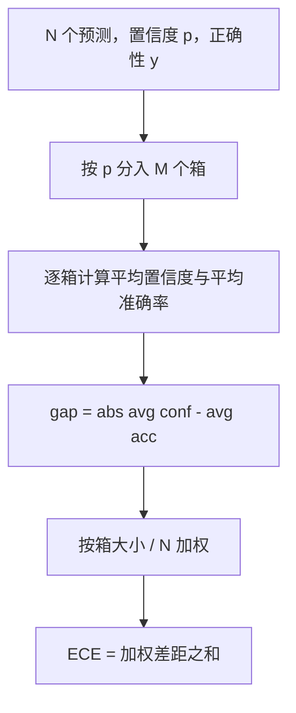
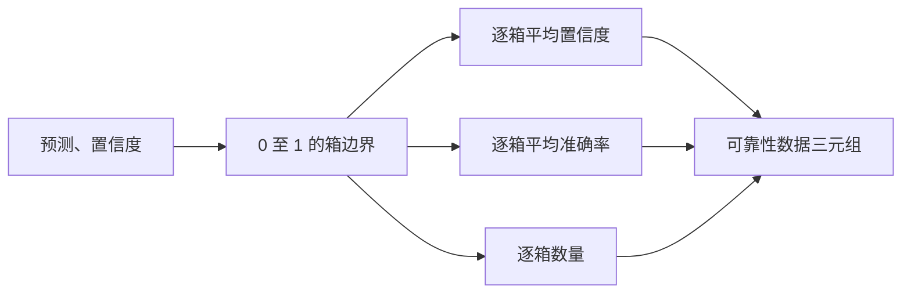

# 困惑度与校准（Perplexity and Calibration）

> 模型若对一千个答案都声称有 90% 把握，却只答对六百个，就没有良好校准。校准是可信评估的一半，另一半是困惑度，用来说明模型是否认为留出文本本身合理。

**Type:** Build
**Languages:** Python
**Prerequisites:** 阶段 19 路线 B 基础，第 70、71 课
**Time:** ~90 分钟

## 学习目标（Learning objectives）

- 根据模型适配器提供的词元负对数概率，计算留出语料的词元级困惑度。
- 根据分箱预测概率，计算分类器或选择题评估的期望校准误差（ECE）。
- 计算 Brier 分数（相对正确性指示值的均方误差），解释它何时能弥补 ECE 的不足。
- 构建绘制置信度与准确率曲线所需的可靠性图数据。
- 将三者接入评估框架，使运行器可为模型报告附加 `perplexity`、`ece` 和 `brier` 数值。

```figure
cd-reliability-diagram
```

## 困惑度说明什么（What perplexity tells you）

困惑度（Perplexity）是每词元平均负对数似然的指数，越低越好。困惑度为一，表示模型为每个实际词元分配概率一。困惑度等于词表大小，表示模型均匀预测，什么也没学会。真实值介于两者之间：较强的 2026 年基础模型在 WikiText-103 上约为八至十二，较差模型在同一文本上为五十以上。

框架不自行计算对数概率，这由模型适配器提供。框架只聚合：接收逐词元对数概率列表和逐序列词元数列表，返回语料困惑度。

```python
def perplexity(neg_log_probs, token_counts):
    total_nll = sum(neg_log_probs)
    total_tokens = sum(token_counts)
    return math.exp(total_nll / total_tokens)
```

实现处理零词元边界，并断言负对数概率非负。常见错误是忘记负号：适配器返回 `log p` 而非 `-log p`，会产生小于一的困惑度，这是不可能的。函数将其捕获为契约违反。

## ECE 衡量什么（What ECE measures）

期望校准误差（Expected calibration error，ECE）按置信度将预测放入固定数量的箱，再测量各箱置信度与准确率的平均差距，按箱大小加权。



标准形式在 `[0, 1]` 上使用十个等宽箱。实现支持任意正整数箱数，暴露 `bins` 参数，让运行器可在发表惯例（10）与比较惯例（15）之间选择。

ECE 受箱数和样本量影响。十个箱、一百条预测时，无法区分 0.02 ECE 与随机噪声。实现同时返回非空箱数量，使样本太少时运行器能拒绝报告单一数值。

## Brier 分数比 ECE 多做什么（What Brier score does that ECE does not）

ECE 只关心平均差距。模型在一半箱中过度自信、另一半中信心不足，可能 ECE 很低，局部校准却差。Brier 分数逐预测测量相对真实结果的平方误差，因此直接惩罚离散程度。

二元结果的 Brier 为 `mean((p_i - y_i)^2)`，可分解为可靠性、分辨率和不确定性。我们计算分数及分解。运行器报告标量，为仪表板记录分解。

```python
def brier(p, y):
    return float(np.mean((p - y) ** 2))
```

## 可靠性图数据（Reliability diagram data）

可靠性图（Reliability diagram）绘制各箱预测置信度与经验准确率，对角线表示完美校准。函数返回三个数组：逐箱平均置信度、逐箱平均准确率和逐箱数量。绘图代码位于下游，本课止于数据结构。



返回元组包含调用层绘图或计算自定义 ECE 变体（自适应 ECE、扫描 ECE 等）所需内容。返回 numpy 数组，免去下游转换。

## 置信度来源（Confidence sources）

框架不假设置信度来自 softmax，接受每个预测的任意 `[0, 1]` 数值。选择题的自然置信度是 `softmax over option log-likelihoods`。自由文本的自然置信度是模型自报概率，或平均对数似然的指数。评估只消费数值，来源由适配器负责。

## 边界情况（Edge cases）

- 全部预测错误：ECE 为平均置信度，Brier 高；困惑度仍取决于模型如何看待文本。
- 全部预测正确且高置信度：ECE 接近零，Brier 接近零。
- 完全不确定的预测器 p=0.5：ECE 为 0.5 减准确率，Brier 为 0.25 减一个修正项。
- 空输入：ECE、Brier 和可靠性返回 `0.0`（或全零数组），零词元困惑度返回 `NaN`。这些路径都不发警告，运行器检查值并决定报告还是跳过。

测试固定了这些情况。真实模型在真实基准上不会遇到它们，但有问题的适配器或极小样本会，运行器不应崩溃。

## 分派（Dispatch）

校准不是 F1 那样的逐任务指标，而是逐模型报告。运行器在整次评估中累积 `(confidence, correct)` 对，一次计算 ECE、Brier 和可靠性数据。困惑度在留出文本语料上计算，与逐任务评分分离。

接口为：

```python
report = CalibrationReport.from_predictions(confidences, correct)
report.ece          # float
report.brier        # float
report.reliability  # tuple of three numpy arrays
report.populated_bins  # int
```

`PerplexityResult.from_token_nll(neg_log_probs, token_counts)` 返回困惑度和每词元平均负对数似然。

## 本课不做什么（What this lesson does not do）

不调用模型，不实现 softmax，不从输出词元估算置信度（适配器负责），也不做温度缩放或 Platt 缩放；这些事后修正属于另一课。本课重点是让三个数值（困惑度、ECE、Brier）可信且可复现。

## 如何阅读代码（How to read the code）

`main.py` 定义 `perplexity`、`expected_calibration_error`、`brier_score`、`reliability_diagram`，以及 `CalibrationReport` / `PerplexityResult` 数据类。演示使用真值已知的合成预测：校准良好、过度自信和信心不足的模型。`code/tests/test_calibration.py` 固定各边界及合成预测器参考值。

从上到下阅读 `main.py`。函数顺序从标量到向量再到报告，每个函数都有说明数学和契约的简短文档字符串。

## 进一步探索（Going further）

校准是已发表评估最被忽略的维度。多数排行榜只报告一个准确率就结束。相比准确率低几个点、却能可靠报告不确定性的模型，准确率胜出但 Brier 落败的模型是更差的生产部署选择。校准链路就绪后，在留出验证切片上加入温度缩放，重新计算 ECE，观察差距缩小。这属于另一课，但基础在这里。
