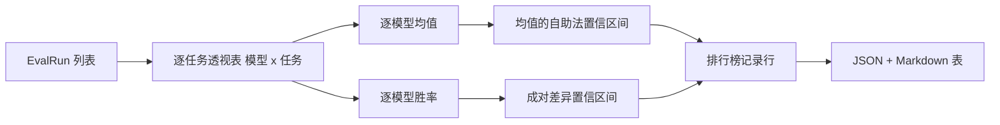
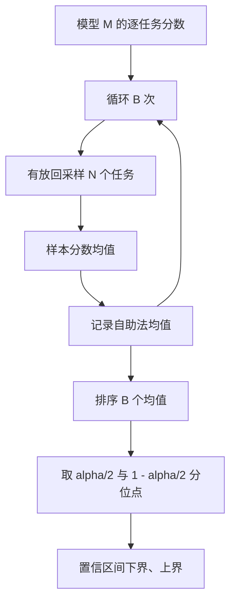

# 排行榜聚合（Leaderboard Aggregation）

> 逐任务分数容易，跨异构任务的逐模型排名更难。一千条预测的排行榜中，统计显著性是大家常跳过的部分。本课不会跳过。

**Type:** Build
**Languages:** Python
**Prerequisites:** 阶段 19 路线 B 基础，第 70、71、73 课
**Time:** ~90 分钟

## 学习目标（Learning objectives）

- 将多模型、多任务的逐任务分数聚合成整洁的逐模型记录行。
- 归一化异构分数，避免通过率和 BLEU 数值过度影响聚合。
- 按均值和胜率排列模型，解释各自何时适合作为摘要。
- 对逐模型平均分和成对差异计算自助法置信区间。
- 将排行榜输出为 JSON 报告和 Markdown 表，供第 75 课运行器贴入 CI 评论。

```figure
ci-leaderboard-ci
```

## 输入结构（The shape of input）

聚合器消费 `EvalRun` 记录列表：

```python
@dataclass
class EvalRun:
    model_id: str
    task_id: str
    metric_name: str
    score: float          # in [0, 1]
    category: str
```

第 75 课运行器为每个 `(model, task)` 对输出一条记录。聚合器不关心分数如何产生，假设归一化已完成：各分数均在 `[0, 1]` 内。

## 输出（The output）

输出三张表：



排行榜行包含 `model_id`、`mean_score`、`mean_ci_lo`、`mean_ci_hi`、`win_rate`、`tasks_completed`，以及用于逐类别均值的可选 `categories` 映射。

## 归一化（Normalisation）

一个任务按 `[0, 1]` 评分、另一个按 `[0, 100]` 评分时，后者会悄悄主导均值。聚合器验证每个输入分数位于 `[0, 1]`，否则拒绝运行。修复应在上游：指标本来就应返回比例。第 71 至 73 课强制这一契约。

## 均值与胜率（Mean and win-rate）

两种排名方案服务不同目标。

平均分是一个模型逐任务分数的均值，是排行榜报告的主要数值，对离群值和任务不均衡敏感。

胜率（Win-rate）统计模型在相同任务上击败所有其他模型的频率。每任务最高分模型获胜，平局平分。胜率等于获胜次数除以该模型有分数的任务数。它较少受离群值和尺度差异影响，但会丢失信息。

```python
def win_rate(model_id, runs_by_task, all_models):
    wins, total = 0, 0
    for task_id, runs in runs_by_task.items():
        scores = {r.model_id: r.score for r in runs if r.model_id in all_models}
        if model_id not in scores:
            continue
        total += 1
        best = max(scores.values())
        if scores[model_id] >= best:
            wins += 1
    return wins / total if total else 0.0
```

框架同时报告两者。第 75 课运行器默认按均值排名，Markdown 中也直接提供胜率列，供偏好该指标的用户使用。

## 自助法置信区间（Bootstrap confidence intervals）

逐模型均值附有通过任务重采样估计的置信区间。对任务 ID 有放回采样，计算重采样集合均值，重复 `B` 次，再取水平为 `alpha` 的百分位区间。



成对比较时，对逐任务差异 `score_A - score_B` 做自助法，取百分位区间并报告。用户查看区间是否排除零；若排除，则差异在 alpha 水平显著，否则排行榜将两模型视为并列。

底层辅助函数（`bootstrap_mean_ci`、`bootstrap_pairwise_diff`）默认 `B=1000`；公开聚合器（`aggregate`、`pairwise_diffs`）默认 `b=500`，使演示和测试保持快速。默认 alpha 为 0.05。本课只用 numpy 实现自助法，不用 scipy。

## 类别（Categories）

若设置 `EvalRun.category`，聚合器还报告逐类别均值，即排行榜上的 `math`、`reasoning`、`code`、`safety` 列。它使运行器发现模型虽整体好却代码弱等情况，而总均值会掩盖这些信息。

## Markdown 渲染（Markdown rendering）

排行榜渲染为 Markdown 表：

```text
| 排名 | 模型 | 均值 | 95% 置信区间 | 胜率 | 任务 |
|------|-------|------|--------|----------|-------|
| 1    | gpt   | 0.78 | 0.74-0.82 | 0.62 | 50 |
| 2    | claude| 0.75 | 0.71-0.79 | 0.34 | 50 |
| 3    | random| 0.10 | 0.07-0.13 | 0.04 | 50 |
```

表按平均分排序，置信区间显示两位小数，长模型 ID 截断为二十个字符。

## 本课不做什么（What this lesson does not do）

不运行模型，不调用指标层，不实现自适应 ECE 或其他校准变体（属于第 73 课），也不实现任务加权。这里每任务同等计数。生产排行榜会加权任务；我们通过 `weight` 字段保留扩展点，但聚合器忽略它。需要时在后续课程加入加权。

## 如何阅读代码（How to read the code）

`main.py` 定义 `EvalRun`、`LeaderboardRow`、`aggregate`、`bootstrap_mean_ci`、`bootstrap_pairwise_diff` 和 `render_markdown`。演示构建三模型、十二任务的合成套件，聚合后打印排行榜和成对差异表。`code/tests/test_leaderboard.py` 固定自助法、Markdown 渲染、胜率边界和空输入行为。

从上到下阅读 `main.py`。先是数据结构（EvalRun、LeaderboardRow），再是聚合器、自助法，最后是渲染。每个函数都有聚焦的契约。

## 进一步探索（Going further）

自然的下一步是用配对任务显著性替代非配对自助法。模型 A、B 都运行相同一百任务时，合适检验是对逐任务差异做配对自助法，本课已实现。再往后需要尊重任务家族的层级自助法：数学题并非彼此独立，一种算术错误模式可能影响十道题。这留待后续。本课重点是打好基础，让评估报告能站得住脚的数值。
