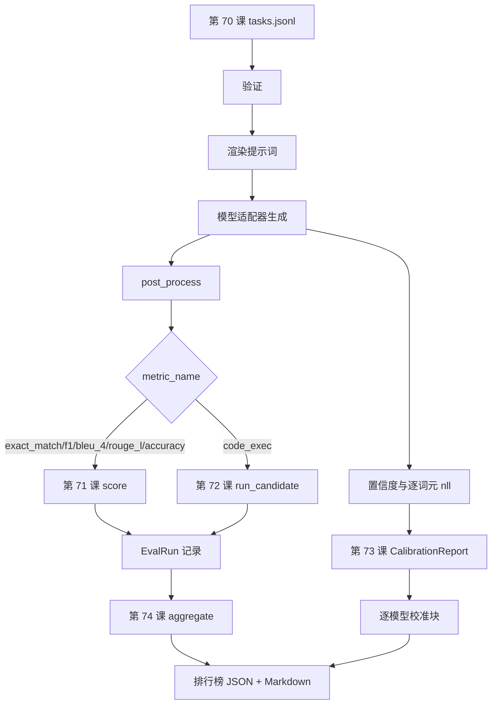

# 端到端评估运行器（End-to-End Eval Runner）

> 五课铺设组件，一课将它们连接。运行器读取第 70 课任务规格，通过适配器调用模型，用第 71、72 课评分，附上第 73 课校准报告，输出第 74 课排行榜。演示自行结束。

**Type:** Build
**Languages:** Python
**Prerequisites:** 阶段 19 路线 B 基础，第 70 至 74 课
**Time:** ~90 分钟

## 学习目标（Learning objectives）

- 定义 `ModelAdapter` 接口，使任意模型（模拟、本地、API）都能通过少量方法满足要求。
- 在固定 JSONL 文件上评估，通过工作池并行执行任务。
- 一轮处理组合指标层（exact_match、F1、BLEU-4、ROUGE-L、code_exec）与校准层。
- 输出逐模型 `EvalRun` 记录，直接交给排行榜聚合器。
- 同时输出 JSON 报告和 Markdown 表；正常运行自行以零退出，验证或运行失败时非零退出。

```figure
eval-grid
```

## 流水线（The pipeline）



运行器是集成点。第 70 至 74 课各负责一个模块，由运行器组合。运行器不重复模块逻辑，而是导入它们。

## 适配器接口（The adapter interface）

适配器连接运行器与任意模型，接口刻意保持小。

```python
class ModelAdapter:
    model_id: str

    def generate(self, prompt: str, task: TaskSpec) -> Generation: ...
```

`Generation` 是数据类，包含：

- `text`：模型的自由形式输出。
- `confidence`：`[0, 1]` 内浮点值，表示模型自报的答案概率。
- `token_nll`：可选的生成词元负对数似然之和。
- `token_count`：可选的生成词元数。

运行器提供三种模拟适配器：`RuleBasedAdapter`（确定性、近乎完美）、`NoisyAdapter`（过度自信、经常错误）、`BiasedAdapter`（擅长一类、另一类极差）。演示在第 70 课固定集上运行三者。

## 并行执行（Parallel execution）

运行器使用 `concurrent.futures.ThreadPoolExecutor` 为每个模型并行运行任务。工作线程数默认取八与任务数中较小者。真实模型调用的瓶颈是网络 I/O，线程足够。代码执行路径在任务内启动自己的子进程，执行器只调度等待。

为保证测试确定性，运行器暴露 `run_eval(adapters, tasks, parallel=False)`，让测试固定执行顺序。

## 单轮评分循环（The single-pass scoring loop）

对每个任务：

1. 渲染提示词（少样本前缀加正文）。
2. 调用适配器并计时。
3. 按任务规则后处理生成结果。
4. 分派到指标层。
5. 构建包含分数和指标元数据的 `EvalRun` 记录。
6. 将 `(confidence, correct)` 对加入校准缓冲区。

对于完全匹配类指标（`exact_match`、`accuracy`、`code_exec`），`correct` 信号为 `score >= 1.0`；分级指标为 `score >= 0.5`。阈值位于 `_correct_from_score`，运行器不暴露公开覆盖选项。

## 聚合（Aggregation）

每个任务都有结果后，运行器调用第 74 课的 `aggregate`、`pairwise_diffs`，以及第 73 课的 `CalibrationReport.from_predictions`。输出是单一 JSON 信封：

```json
{
  "leaderboard": [...],
  "pairwise": [...],
  "calibration": {
    "model_id_a": {"ece": 0.04, "brier": 0.10, "populated_bins": 8, ...},
    ...
  },
  "summary": {
    "tasks": 10,
    "models": 3,
    "wall_seconds": 1.2
  }
}
```

运行器还将 Markdown 表写到标准输出，方便用户贴入 PR 评审。

## 自行结束的演示（Self-terminating demo）

演示在第 70 课十个固定任务上运行三个模拟适配器。实际用时应少于十秒。正常运行的退出码为零。

正常运行条件是：

- 每个任务通过第 70 课验证。
- 每个任务由第 71、72 课评分。
- 校准报告通过第 73 课无误聚合。
- 排行榜中基于规则的适配器严格高于随机适配器。

任一条件失败，运行器以非零退出，并在 JSON 信封中返回结构化错误。

## 本课不做什么（What this lesson does not do）

不调用真实模型，不实现 API 密钥流程或限流处理，不实现流式或部分生成（适配器每次返回一个完整生成结果），也不做重试或缓存。这些属于适配器层；运行器不依赖具体指标和服务商。

## 如何阅读代码（How to read the code）

`main.py` 负责集成，通过按相对路径定位的小型 `_load_sibling` 辅助函数导入另外五课模块。数据类 `Generation`、`EvalReport`、`ModelAdapter` 在本地定义，模拟适配器位于文件底部。

从上到下阅读 `main.py`。略看导入，再看 `run_eval`、`_score_one` 和适配器。末尾演示是入口。

`code/tests/test_runner.py` 固定适配器接口、单轮循环、并行与串行等价性、校准缓冲区和 JSON 信封结构。

## 进一步探索（Going further）

本运行器是基础。生产评估系统还会加入：以 `(task_id, model_id, model_version)` 为键的结果缓存，跟踪每次运行美元与词元消耗的成本账本，限流时退避的重试层，pass-at-k 任务采样策略，以及长套件的流式输出格式。每项都是包装运行器的单一职责，无须改变指标或聚合层。这种分离正是契约的意义。

模拟组件可用后，再为真实服务商添加适配器。选择有免费额度的服务商，写三十行连接代码，观察排行榜开始工作。然后接入第二家，让框架完成其余工作。
