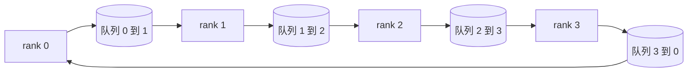

# 从零实现集合通信操作（Collective Ops From Scratch）

> 支撑分布式训练的四种集合通信操作是 allreduce、broadcast、allgather 和 reduce_scatter。训练框架提供的其他原语都是它们的包装。在 `multiprocessing.Queue` 网格上实现一次，对照参考实现验证，路线其余部分就变成连接工作。

**Type:** Build
**Languages:** Python
**Prerequisites:** 阶段 19 路线 C 第 42–49 课
**Time:** ~90 分钟

## 学习目标（Learning Objectives）

- 分两轮实现环形全归约（Ring allreduce）：先 reduce-scatter，再 allgather，并证明每 rank 每元素通信量为 2(N-1)/N 字节。
- 基于 `multiprocessing.Queue` 上的点对点发送构建 broadcast、allgather、reduce_scatter。
- 用同一输入对照 `torch.distributed` 的 gloo 参考实现验证每个原语。
- 根据集群形态、延迟下限和带宽上限，论证选择环形还是树形。

## 问题（The Problem）

N 个 rank 上的朴素 allreduce 将张量向根发送 N 次，再广播回来 N 次。每 rank 带宽按 O(N) 增长，根成为瓶颈，实际时间下限是最慢链路用时乘 N。环形 allreduce 将其摊为 2(N-1) 个大小 T/N 的块，使每 rank 字节数降至 2T(N-1)/N，不随集群规模增长。N 小且链路延迟高时，树形 allreduce 胜出，因为深度为 log2(N) 跳，而非 2(N-1)。集群形态与拓扑选错，最慢 GPU 就决定步时。

本路线涉及的每个分布式训练框架都依赖这四个原语。PyTorch DDP 每参数桶执行一次 allreduce 同步梯度。ZeRO 用 reduce_scatter 分片优化器状态，用 allgather 广播更新参数。FSDP 将整个前向过程变为 allgather 加 reduce_scatter。流水线并行需要 broadcast 在阶段组间传递激活。不能实现这四种集合通信，就无法推理训练为何停滞、为何 rank 3 出现梯度不匹配，或更换拓扑后流水线气泡为何翻倍。

## 概念（The Concept）



### 两轮环形全归约（Ring allreduce in two passes）

将张量分成索引为 0..N-1 的 N 个等块，每 rank 拥有与其 rank 相等的块索引。第一轮 reduce-scatter 运行 N-1 步。在步骤 s，rank r 向 rank (r + 1) mod N 发送块 (r - s) mod N，从 rank (r - 1) mod N 接收块 (r - s - 1) mod N，并累加到本地副本。N-1 步后，rank r 拥有块 r 的完整和。第二轮 allgather 再运行 N-1 步，使完成的块沿环轮转，直到每 rank 都持有所有块的完整和。

| 原语 | 每 rank 字节数 | 步数 | 使用场景 |
|-----------|---------------|-------|-------------|
| 环形全归约（Ring allreduce） | 2T(N-1)/N | 2(N-1) | 大 T、高带宽同构集群 |
| 树形全归约（Tree allreduce） | T log2(N) | 2 log2(N) | 小 T 或高延迟链路 |
| 广播（Broadcast） | T | log2(N) 树 | 参数初始化、标量配置 |
| 全收集（Allgather） | T(N-1)/N | N-1 | 分片前向、ZeRO 取消分片 |
| 归约散发（Reduce_scatter） | T(N-1)/N | N-1 | ZeRO 梯度分片 |

### 队列网格作为 NCCL 替身（Queue mesh as a stand-in for NCCL）

NCCL 在 PCIe 和 NVLink 上运行，采用硬件卸载归约。CPU 没有这些条件。每条环边一个 `multiprocessing.Queue`，可提供单生产者、单消费者的有序点对点交付。归约在用户空间执行，因此有 Python 开销，但通信模式与 NCCL 环形 allreduce 相同。先在队列版推理正确性，便能理解集群行为。

### 对照 gloo 验证（Verify against gloo）

每个原语都附单元测试：在相同 world size 上，用同一张量对照以 gloo 后端初始化的 `torch.distributed` 输出。环形 allreduce 与 gloo 差异超过 float32 epsilon，测试即失败。对照参考实现验证不可省略；否则原语会一直看似正确，直到真实训练第 10000 步才暴露问题。

```figure
ci-ring-allreduce
```

## 动手实现（Build It）

`code/main.py` 实现了：

- `Mesh` 类：将 N 个 `multiprocessing.Queue` 接成环，为每 rank 暴露 `send(dst, tensor)` 和 `recv(src)`。
- `ring_allreduce(mesh, rank, world_size, tensor)`：运行两轮算法。
- `broadcast(mesh, rank, world_size, tensor, src)`：在对数深度树上广播。
- `allgather(mesh, rank, world_size, tensor)`：执行 N-1 次轮转。
- `reduce_scatter(mesh, rank, world_size, tensor)`：allreduce 的前半段。
- `_gloo_reference(op, world_size, tensor)`：用 gloo 上的 `torch.distributed` 处理同一输入，作逐字节相同比较。

运行：

```bash
python3 code/main.py
```

输出：逐原语验证表，对比队列网格与 gloo 输出，随后是证明 2T(N-1)/N 缩放规律的逐 rank 字节计数。

## 真实生产模式（Production patterns in the wild）

三种模式使原语足够稳健，可供交付。

**allreduce 前对梯度分桶。** 10 亿参数模型有数万梯度张量。每张量一次 allreduce 会支付 N 次延迟下限。DDP 将梯度分成约 25 MB 的桶，每桶一次 allreduce，小张量随大张量一起传输。不分桶，延迟开销就会主导步时。

**通信与计算重叠。** 反向传播按逆序逐层计算梯度。最后一层梯度一就绪便启动其 allreduce，同时继续计算下一层。PyTorch DDP 用桶就绪钩子实现。网络有余量时，重叠可将可见通信时间减半。

**按消息大小选环或树，不凭信仰。** NCCL 带拓扑检测器，约 1 MB 以上消息选环，以下选树。交叉点由带宽与延迟决定：1 MB 以上，带宽项 2T(N-1)/N 主导，环胜；以下，log2(N) 跳数胜。硬编码一种拓扑会在不匹配的消息大小上损失吞吐。

## 实际应用（Use It）

生产模式：

- **PyTorch DDP。** 反向传播后对分桶梯度调用 `dist.all_reduce`。桶大小可调；100Gbit 以太网下默认 25 MB 合理。
- **DeepSpeed ZeRO。** 用 reduce_scatter 分片梯度，在前向前用 allgather 重建完整参数。本课原语正是 ZeRO 调用的操作。
- **FSDP。** 前向先用 allgather 还原层，计算后用 reduce_scatter 归约，再丢弃还原副本。原语相同，调度不同。

## 交付成果（Ship It）

在第 77–81 课使用队列网格原语。第 77 课将 allreduce 接入 DDP，第 78 课将 reduce_scatter 接入 ZeRO，第 79 课将 broadcast 接入流水线激活，第 81 课在端到端演示中组合四者。

## 练习（Exercises）

1. 添加树形 allreduce 变体，按消息大小切换环与树，测量交叉点。
2. 添加 `recv_timeout_ms`，使停滞 rank 报出截止时间错误，而非永久挂起。
3. 将四个原语的 `multiprocessing.Queue` 替换为 TCP 套接字，保留相同测试，使用真实网络。
4. 添加带宽观测钩子，将逐 rank 字节计数记录到 JSONL。
5. 在 4 个 rank 上对 1KB、1MB、16MB 张量比较环与树实际时间，以实验论证交叉点。

## 关键术语（Key Terms）

| 术语 | 常见说法 | 实际含义 |
|------|----------------|------------------------|
| 全归约（Allreduce） | “跨 rank 求和” | 调用后每 rank 持有相同归约张量 |
| 环（Ring） | “快速拓扑” | N-1 个 T/N 大小的块沿环流动两遍 |
| 树（Tree） | “对数拓扑” | 沿二叉树归约，深度 log2(N) 跳 |
| 全收集（Allgather） | “拼接分片” | 每 rank 最终拥有其他所有 rank 的分片 |
| 归约散发（Reduce_scatter） | “拆分求和结果” | 每 rank 最终只拥有一个块的和 |
| 桶（Bucket） | “融合小张量” | 将 N 个小 allreduce 合成一个大操作 |

## 延伸阅读（Further Reading）

- [PyTorch Distributed：NCCL 集合通信（NCCL collectives）](https://pytorch.org/docs/stable/distributed.html#collective-functions)
- [Horovod 环形全归约（Ring allreduce）论文](https://arxiv.org/abs/1802.05799)
- [NCCL 拓扑与算法选择（Topology and algorithm selection）](https://docs.nvidia.com/deeplearning/nccl/user-guide/docs/index.html)
- [Patarasuk 和 Yuan：带宽最优全归约算法（Bandwidth optimal allreduce algorithms）](https://www.cs.fsu.edu/~xyuan/paper/09jpdc.pdf)
- 阶段 10 第 05 课：分布式训练概览
- 阶段 19 第 77 课：基于这些原语连接 DDP
