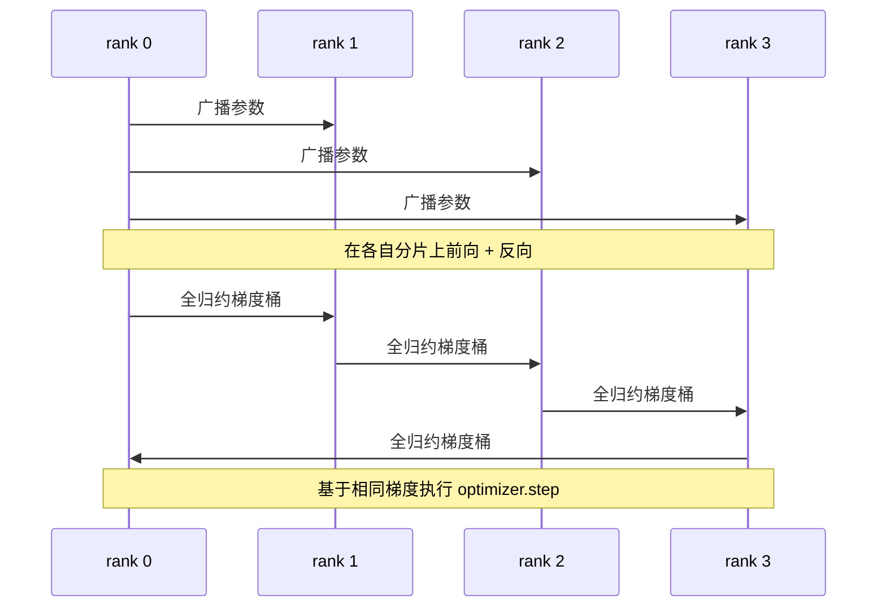

# 从零实现数据并行 DDP（Data Parallel DDP From Scratch）

> DistributedDataParallel 是 allreduce 之上的钩子。包装模型，从 rank 0 广播初始参数，使各 rank 起点一致，为每个参数安装反向钩子以对梯度执行 allreduce，剩下就是梯度下降。整个模式只有 200 行。

**Type:** Build
**Languages:** Python
**Prerequisites:** 阶段 19 路线 C 第 42–49 课
**Time:** ~90 分钟

## 学习目标（Learning Objectives）

- 连接具有 `DistributedDataParallel` 形式的包装器，广播初始参数并在反向传播后全归约梯度。
- 用 `torch.multiprocessing.spawn` 启动 N 个 CPU rank，采用 gloo 后端和基于文件的会合。
- 对相同模型和数据顺序训练，展示逐步参数等价，证明梯度同步正确。
- 论证分桶（梯度融合）和重叠（反向时通信）如何将可运行 DDP 变为生产 DDP。

## 问题（The Problem）

拥有 10 亿参数和 12 GB 激活的模型无法放入一块消费级 GPU。即使放得下，训练也需数周。数据并行（Data parallel）将批次分到 N 个 rank，各 rank 在自己的分片上前向和反向，每步对各 rank 梯度求和，使 N 个副本保持一致。优化器基于求和梯度更新。

没有梯度同步，N 个副本到第 2 步就分离。它不再是“一个模型用更多数据训练”，而是恰好共享初始权重的 N 个独立模型。同步做得差（每参数一次 allreduce，无重叠、无分桶），网络成为瓶颈，GPU 空等传输。DDP 的技术在于让梯度同步相对计算近乎免费。标准 PyTorch DDP 通过梯度分桶、allreduce 与下一层反向重叠、NVLink 上的 NCCL 实现。我们可在 CPU 上用 gloo 实践三者，获得相同认识。

## 概念（The Concept）



### DDP 所需三种操作（The three operations DDP needs）

| 阶段 | 集合通信 | 原因 |
|-------|-----------|-----|
| 初始化 | 从 rank 0 广播 | 各 rank 从相同参数开始 |
| 反向后 | 全归约各梯度 | 优化器基于平均梯度更新 |
| 某些时候 | 广播缓冲区 | 批归一化运行统计保持同步 |

### 为何用均值而非和（Why mean and not sum）

Allreduce-SUM 除以 world_size 得到平均梯度。均值不随 world_size 变化：单 rank 调好的学习率可用于四 rank，因为每步梯度量级不变。Allreduce-SUM 不除，就迫使每次改变集群大小都重新调学习率。DDP 包装 SUM 并做除法，本课也如此。

### 为何梯度分桶（Why bucket gradients）

Transformer 有数千参数张量。每张量一次 allreduce 会支付数千次 gloo 延迟下限。DDP 将梯度合为约 25 MB 桶，每桶一次 allreduce。传输总字节数不变，但延迟在桶内摊销。本课微型模型将全部梯度放入一个桶；可迁移的是这个结构。

### 为何固定种子（Why pin the seed）

各 rank 必须用 `torch.manual_seed(seed + rank)` 打乱数据，用 `torch.manual_seed(seed)` 初始化参数。只用共享种子会让各 rank 看到相同批次顺序，违背数据并行；参数使用 rank 特定种子，则初始参数存在浮点 epsilon 差异，同步梯度也不能使副本一致。种子模式不对，参数等价测试第 1 步就失败。

```figure
ci-ddp-grad-sync
```

## 动手实现（Build It）

`code/main.py` 实现了：

- `MiniMLP`：三层 MLP，小到几秒收敛，大到足以展示连接逻辑。
- `DistributedDataParallel(model, world_size)`：构造时广播参数，返回包装器，其 `sync_grads` 将累积的 allreduce 求和梯度除以 world_size。
- `worker(rank, world_size, ...)`：完整训练循环，包含 gloo 上的 `torch.distributed` 初始化、前向、反向、同步、更新。
- `_reference_single_process_loop(...)`：在单 rank 上以相同数据顺序训练相同模型，用于逐步逐字节参数等价测试。

运行：

```bash
python3 code/main.py
```

输出：逐步训练表，对比单进程与 4 rank DDP 的损失和参数校验和。两路径的损失曲线在浮点 epsilon 内一致，证明梯度同步正确。

## 真实生产模式（Production patterns in the wild）

三种模式使 DDP 足够稳健，可供交付。

**找出未使用参数。** 有些前向路径有条件跳过参数（提前退出、专家混合路由）。被跳过参数无梯度，但 DDP 桶就绪钩子仍等待它们，allreduce 因而死锁。`find_unused_parameters=True` 让 DDP 归约前查看哪些参数获得梯度。代价是每步遍历计算图，因此前向不分支时应关闭。

**静态图优化。** 各步前向稳定时，`static_graph=True` 允许 DDP 预计算桶调度。规模大时很重要：每步省几毫秒，累积 10000 步便可观。

**梯度累积需谨慎。** 累积 K 个微批次而不逐个同步，可带来 10 倍吞吐收益。DDP 提供上下文管理器 `no_sync()`，暂停反向后的 allreduce。忘记它就白做 K 次 allreduce，吞吐跌到底部。

## 实际应用（Use It）

生产模式：

- **PyTorch DDP。** 标准实现。`torch.nn.parallel.DistributedDataParallel(model)` 连接分桶、重叠和 no_sync 上下文。
- **HuggingFace Accelerate。** 增加处理 `torchrun` 环境变量和模型包装的启动器，底层仍是相同 DDP。
- **Megatron-LM 数据并行。** 对大模型组合 DDP 与张量并行；数据并行部分仍是反向后 allreduce。

## 交付成果（Ship It）

第 78 课 ZeRO 分片用 reduce_scatter 替换逐参数 allreduce，使每 rank 只存优化器状态的自身分片。第 81 课将 DDP 与 ZeRO 组合成端到端演示。

## 练习（Exercises）

1. 增加可配置大小的梯度桶，在更深模型上测量相对逐参数 allreduce 的加速。
2. 将 `no_sync()` 实现为上下文管理器，验证 K 个微批次累积与单进程基线一致。
3. 增加 `find_unused_parameters` 模式，让前向有时跳过一个 MLP 层；不设标志时运行应死锁。
4. 将 gloo 替换为只用 `torch.distributed.barrier()` 的同步，体会基于 allreduce 与基于屏障同步的差异。
5. 在批大小 1、16、256 下测量梯度同步占步时的比例，并解释缩放规律。

## 关键术语（Key Terms）

| 术语 | 常见说法 | 实际含义 |
|------|----------------|------------------------|
| 分布式数据并行（DDP） | “数据并行” | 每步广播参数、全归约梯度的包装器 |
| 桶（Bucket） | “融合梯度” | 将 N 个小 allreduce 合为一个大操作 |
| 重叠（Overlap） | “隐藏通信” | 后续层仍在反向计算时发起 allreduce |
| no_sync | “累积” | 为梯度累积跳过反向后的 allreduce |
| find_unused | “有分支的前向” | 归约前检测无梯度参数 |

## 延伸阅读（Further Reading）

- [PyTorch DistributedDataParallel 文档](https://pytorch.org/docs/stable/generated/torch.nn.parallel.DistributedDataParallel.html)
- [PyTorch DDP 内部机制（Internals）教程](https://pytorch.org/tutorials/intermediate/ddp_tutorial.html)
- [Li 等：PyTorch Distributed：加速数据并行训练的经验（Experiences on Accelerating Data Parallel Training）](https://arxiv.org/abs/2006.15704)
- 阶段 19 第 76 课：DDP 所依赖的集合通信
- 阶段 19 第 78 课：ZeRO 分片用 reduce_scatter 替换逐参数 allreduce
