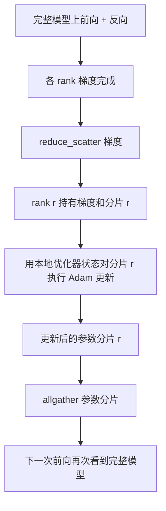

# ZeRO 优化器状态分片（ZeRO Optimizer State Sharding）

> Adam 为每个参数存两份矩估计，均为 float32。70 亿参数模型携带 56 GB 优化器状态。ZeRO 阶段 1 将其分到 N 个 rank，每 rank 拥有优化器的 1/N。本地更新后，更新参数分片广播回来，各 rank 重建完整模型，再开始下一步。收益是训练栈最大单项分配的内存线性下降。

**Type:** Build
**Languages:** Python
**Prerequisites:** 阶段 19 路线 C 第 42–49 课
**Time:** ~90 分钟

## 学习目标（Learning Objectives）

- 将优化器状态（一阶矩、二阶矩、fp32 主副本）分到 N 个 rank，各拥有 1/N。
- 用 reduce_scatter 仅交付各 rank 自身分片的梯度和，再用 allgather 广播更新参数分片。
- 计算阶段 1、2、3 相对普通 DDP 的内存节省表。
- 根据模型大小和带宽预算论证阶段 1、2、3 的选择。

## 问题（The Problem）

普通 DDP 复制一切：每 rank 都有完整参数、梯度和优化器状态。70 亿参数 fp16 模型意味着每 rank 14 GB 参数、14 GB 梯度、28 GB 优化器状态。优化器状态最大，也最容易分片，因为只在更新时访问，前向反向不访问。

ZeRO 阶段 1 分片优化器状态，各 rank 持有 1/N 的 Adam 矩。反向后，不再全归约完整梯度并本地更新，而是 reduce_scatter，让各 rank 只收到自身分片的梯度和。该 rank 更新主参数的自身分片，再 allgather 更新参数分片，使各 rank 在下一次前向前拥有完整模型。优化器内存减少 N 倍。每步通信流量与 DDP 相同：一次 reduce_scatter 加一次 allgather，带宽等于一次 allreduce。内存获益，吞吐不变。

## 概念（The Concept）



### ZeRO 阶段（Stages of ZeRO）

| 阶段 | 分片对象 | 每 rank 内存 | 每步通信 |
|-------|----------------|------------------|---------------|
| DDP | 无 | params + grads + optim | 1x allreduce |
| ZeRO-1 | 优化器状态 | params + grads + optim/N | 1x reduce_scatter + 1x allgather |
| ZeRO-2 | 优化器 + 梯度 | params + grads/N + optim/N | 1x reduce_scatter + 1x allgather |
| ZeRO-3 | 优化器 + 梯度 + 参数 | params/N + grads/N + optim/N | 每层 1x allgather + 每层 1x reduce_scatter |

优化器状态主导预算，因此阶段 1 收益最便宜。阶段 2 需要梯度分片累积逻辑，但带宽相同。阶段 3（FSDP）每次前向反向都支付逐层通信，换取参数分片的内存下降。本课完整实现阶段 1。

### 内存数学与实际数值（The memory math, real numbers）

P 参数模型使用 Adam 混合精度训练时：

| 项 | 普通方案 | ZeRO-1 | 原因 |
|------|---------|--------|-----|
| fp16 参数 | 2P bytes | 2P bytes | 前向需要 |
| fp16 梯度 | 2P bytes | 2P bytes | 反向需要 |
| fp32 主副本 | 4P bytes | 4P/N bytes | 仅优化器使用 |
| fp32 一阶矩 | 4P bytes | 4P/N bytes | 仅优化器使用 |
| fp32 二阶矩 | 4P bytes | 4P/N bytes | 仅优化器使用 |
| 总计 | 16P bytes | 4P + 12P/N bytes |   |

N=8 时，普通 16P，ZeRO-1 5.5P，下降 65%。N=64 时，普通 16P，ZeRO-1 4.19P，下降 74%。

### reduce_scatter 为何优于先 allreduce 再分片（Why reduce_scatter beats allreduce-then-shard）

Allreduce 给每 rank 完整梯度和。如果只需分片 r，归约梯度的 (N-1)/N 在 rank r 上就浪费了。Reduce_scatter 恰好交付各 rank 拥有的分片；每 rank 字节数与 allreduce 相同（因为 allreduce 是 reduce_scatter + allgather），只是后半段替换为稍后的参数分片 allgather。净通信与 DDP 相同，内存则被分摊。

```figure
cd-zero-shard
```

## 动手实现（Build It）

`code/main.py` 实现了：

- `flatten_params(module)` 和 `unflatten_into(module, flat)`：将模型参数打包成连续张量，再还原。平坦布局使按 rank 分片成为简单切片。
- `ZeroOptimizer(model, world_size, rank, lr)`：拥有该 rank 的主副本及 Adam 矩分片。
- `step()`：对平坦梯度运行 reduce_scatter，对该 rank 分片应用 Adam，再 allgather 更新参数。
- 演示训练三层 MLP 20 步，并与普通 DDP 基线并排打印逐步内存预算。

运行：

```bash
python3 code/main.py
```

输出：逐步损失与内存表，显示 ZeRO-1 每 rank 只持有优化器状态的 1/N，而 DDP 持有完整副本。

## 真实生产模式（Production patterns in the wild）

三种模式使 ZeRO 足够稳健，可供交付。

**分片检查点很重要。** ZeRO-1 优化器状态分散在各 rank，检查点必须记录所有权。第 80 课构建分片检查点清单，让 ZeRO 在相同 world size 上恢复。缺少它，重启时保存状态无法读取。

**混合精度是重点。** ZeRO 是混合精度技术，被分片的是 fp32 主副本。不用混合精度运行 ZeRO，会支付 fp32 主副本内存税，却没有对应 fp16 前向收益。生产总将 ZeRO 与 autocast 或 bf16 权重结合。

**阶段 1 近乎免费获益。** 带宽通信与 DDP 相同，内存节省随 N 线性增长，唯一成本是优化器分片簿记。生产栈默认阶段 1，除非参数分片内存也成问题，再用阶段 2 或 3 以通信换内存。

## 实际应用（Use It）

生产模式：

- **DeepSpeed ZeRO。** 参考实现。`deepspeed_config.json` 选择阶段 1/2/3 与分区大小。
- **PyTorch FSDP。** PyTorch 原生对应方案。`ShardingStrategy.SHARD_GRAD_OP` 对应 ZeRO-2，`FULL_SHARD` 对应 ZeRO-3。
- **HuggingFace Accelerate。** 在统一配置下包装 DeepSpeed 和 FSDP。

## 交付成果（Ship It）

第 79 课流水线并行是正交分片轴：不是在相同模型间分片优化器状态，而是跨 rank 分配层。第 81 课在端到端演示中组合 DDP + ZeRO。

## 练习（Exercises）

1. 扩展到 ZeRO-2：反向后将非自身分片部分清零，使各 rank 只存自身梯度分片。
2. 增加内存分析器，打印 rank 0 实际 fp32 字节用量与公式预测的对比。
3. 测量普通 DDP 与 ZeRO-1 每步实际时间，拆分前向、反向和通信。
4. 实现 ZeRO-1 梯度裁剪：对本地范数平方 allreduce，跨所有分片计算 L2 范数。
5. 用 allreduce 而非 reduce_scatter 实现“朴素 ZeRO”，测量通信时间差，用数值论证 reduce_scatter 选择。

## 关键术语（Key Terms）

| 术语 | 常见说法 | 实际含义 |
|------|----------------|------------------------|
| ZeRO-1 | “优化器分片” | 每 rank 持有 fp32 主副本 + Adam 矩的 1/N |
| ZeRO-2 | “梯度也分片” | reduce_scatter 后各 rank 还丢弃非自身分片梯度 |
| ZeRO-3 | “参数分片” | 每 rank 持有 fp16 参数的 1/N，前向每层 allgather |
| 主副本（Master copy） | “fp32 权重” | 优化器更新的高精度参数副本 |
| 归约散发（Reduce_scatter） | “拆分求和结果” | 仅交付各 rank 自身分片的梯度和 |

## 延伸阅读（Further Reading）

- [Rajbhandari 等：ZeRO：面向万亿参数模型训练的内存优化（Memory Optimizations Toward Training Trillion Parameter Models）](https://arxiv.org/abs/1910.02054)
- [DeepSpeed ZeRO 文档](https://www.deepspeed.ai/tutorials/zero/)
- [PyTorch FSDP 文档](https://pytorch.org/docs/stable/fsdp.html)
- 阶段 19 第 76 课：本课依赖的 reduce_scatter 和 allgather
- 阶段 19 第 80 课：ZeRO 状态必需的分片检查点
