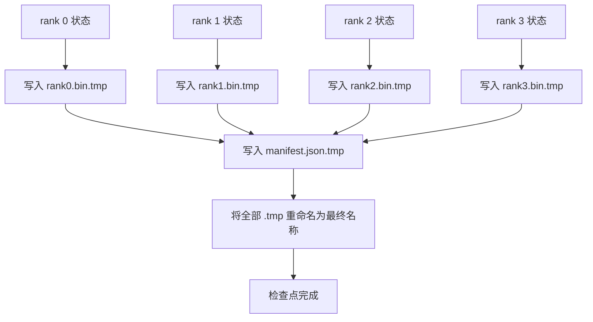

# 分片检查点与原子恢复（Sharded Checkpoint and Atomic Resume）

> 700 亿参数训练任务每隔几小时就会因节点故障暂停。检查点格式决定损失 30 分钟还是 30 小时。分片检查点并行写各 rank 分片，以清单记录所有权。恢复时各 rank 从自身文件加载分片，在相同 world size 上重建状态，优化器如同未中断般继续更新。原子写入防止半成品检查点破坏下次恢复。

**Type:** Build
**Languages:** Python
**Prerequisites:** 阶段 19 路线 C 第 42–49 课
**Time:** ~90 分钟

## 学习目标（Learning Objectives）

- 将多 rank 检查点保存为逐 rank 分片文件，加记录所有权的清单。
- 使用原子写入模式（先临时路径、再重命名），使写入中途崩溃不会产生半成品检查点。
- 从清单恢复，验证各 rank 的 fp16 参数与 ZeRO 优化器状态逐字节相同。
- 论证清单模式如何防御 world size 改变、分片数不匹配和部分写入三种失效。

## 问题（The Problem）

普通检查点将全部参数和优化器状态读入 rank 0，汇集后写单文件。700 亿模型意味着 1.1 TB 状态通过一个 rank 的网络端口。写入阻塞其余 rank，它们空等汇集。I/O 带宽取决于最慢单 GPU 网络链路，而非聚合带宽。真实集群上，先汇集再写可能比此前一小时训练更久，使任务每训练日连一个检查点都交付不了。

分片检查点反转模式：各 rank 并行将自身分片写入自身文件。清单记录分片原属 rank，使恢复可各归原位。聚合写带宽随集群扩展。1 TB 检查点经单 rank 需 4 小时，经 64 rank 只需 4 分钟。清单还为不兼容恢复提供契约：可检测 world size 变化和部分写入，加载路径能明确失败，而非静默使用陈旧数据。

## 概念（The Concept）



### 清单模式（Manifest schema）

```json
{
  "world_size": 4,
  "step": 1234,
  "wall_clock_seconds": 4521,
  "shards": [
    {"rank": 0, "path": "rank0.bin", "sha256": "...", "param_shard_offset": 0, "param_shard_numel": 65536},
    {"rank": 1, "path": "rank1.bin", "sha256": "...", "param_shard_offset": 65536, "param_shard_numel": 65536}
  ],
  "schema_version": 1
}
```

三组字段是核心。`world_size` 让不同规模恢复明确失败，而非静默损坏。逐分片 `sha256` 捕捉部分或损坏写入。逐分片 `param_shard_offset` 与 `param_shard_numel` 让加载器在正确位置重建平坦参数张量。

### 原子写入（Atomic write）

标准模式：各分片写入 `<name>.tmp`，清单写入 `manifest.json.tmp`，逐一 fsync，再重命名。同文件系统内 POSIX rename 原子执行，要么新文件完整存在，要么旧文件存在。最终重命名前崩溃，仍以上一个检查点为生效版本。没有原子写入，崩溃可能留下部分分片，现存清单又指向它，恢复加载便损坏优化器状态。

### 模式必须防御的三种失效（Three failure modes the schema must defend against）

| 失效 | 症状 | 防御 |
|---------|---------|---------|
| World size 改变 | 用 N=4 清单在 N=8 恢复 | 检测清单 world_size 不匹配，明确失败 |
| 分片数不匹配 | rank*.bin 文件少于清单分片数 | 枚举并验证每个分片存在 |
| 部分写入 | 分片在刷新中途截断 | 加载时验证 sha256 |

各防御都尽早拒绝错误加载；否则静默损坏可能到 100 步后损失变 NaN 才显现。

### 为何逐 rank 文件而非一个大文件（Why per-rank files, not one big file）

POSIX 上通过 `O_APPEND` 对一个文件并发进行字节对齐写入可行，但实际一个分片内的偏移跨越 MB 级区域，锁开销主导。逐 rank 文件无争用，底层并行文件系统（Lustre、GPFS）还可受益于条带化。生产栈（DeepSpeed、FSDP、NeMo）因此均采用逐 rank 文件。

```figure
ci-sharded-checkpoint
```

## 动手实现（Build It）

`code/main.py` 实现了：

- `ShardManifest` 数据类，包含上述模式及 `to_json`/`from_json`。
- `save_sharded(state_dict_per_rank, dir, step)`：按先临时文件再重命名的原子模式，将各 rank 二进制状态写入自身文件，再写清单。
- `load_sharded(dir, expected_world_size)`：读取清单，验证各分片 sha256，返回逐 rank 状态字典。
- 往返测试：构建逐 rank 状态、保存、加载、断言逐字节相同。

运行：

```bash
python3 code/main.py
```

输出：写入 4 个分片文件和清单，再重新加载，验证逐字节相同。

## 真实生产模式（Production patterns in the wild）

三种模式使检查点足够稳健，可供交付。

**异步写入。** 生产栈在独立线程或进程写检查点，让训练继续。屏障在下次检查点：上次未完成就不开始下次。DeepSpeed 的 `async_io` 标志正是如此。本课保持同步写，使步骤可见。

**先本地快盘，再异步上传。** 先写本地 NVMe，再异步上传 S3 或 GCS。双层模式让集群内检查点快速恢复，同时向集群外归档持久副本。清单携带本地路径，上传清单携带远程路径。

**轮换很重要。** 生产保留最近 K 个检查点（通常 3–5），淘汰最旧。无轮换，磁盘中途写满，下个检查点失败。有轮换，下次保存先删除最旧，释放预算。

## 实际应用（Use It）

生产模式：

- **DeepSpeed 检查点。** `deepspeed.save_checkpoint(tag=step)` 写逐 rank 文件及指向当前标签的 `latest` 文件。
- **PyTorch FSDP 检查点。** `torch.distributed.checkpoint` 保存分片状态，由 `Planner` 决定逐 rank 布局。
- **NeMo。** 以统一 `save_to_checkpoint` API 包装 DeepSpeed 与 FSDP，并增加元数据。

## 交付成果（Ship It）

第 81 课保存端到端 DDP+ZeRO 运行的分片检查点，在相同 world size 重新加载，证明恢复契约成立。

## 练习（Exercises）

1. 加入异步写入：线程启动保存，训练继续；上次完成前阻塞下次保存。
2. 加入 `last_5_steps` 轮换：保留最近 5 个检查点，保存新版本前删除最旧。
3. 加入仅用 CRC 的快速验证路径，用于内循环重新加载（轮换将一个检查点变为新生效版本，不做完整 sha256）。
4. 加入跨 world size 加载：读取清单、拼接、重新分片，将 N=4 重新均衡到 N=8。
5. 上传到模拟 S3（第二目录）并写上传清单，论证双层存储策略。

## 关键术语（Key Terms）

| 术语 | 常见说法 | 实际含义 |
|------|----------------|------------------------|
| 分片检查点（Sharded checkpoint） | “逐 rank 保存” | 各 rank 并行写自身分片文件 |
| 清单（Manifest） | “索引” | 记录分片路径、偏移、sha256 的 JSON 文件 |
| 原子写入（Atomic write） | “先 tmp 后重命名” | 先写 .tmp，再 POSIX rename，使崩溃后旧文件仍生效 |
| 部分写入（Partial write） | “截断分片” | 写入中崩溃产生损坏分片，由 sha256 捕捉 |
| 轮换（Rotation） | “保留最近 K 个” | 写新检查点前删除最旧，使磁盘用量有界 |

## 延伸阅读（Further Reading）

- [DeepSpeed 检查点（Checkpointing）](https://deepspeed.readthedocs.io/en/latest/model-checkpointing.html)
- [PyTorch torch.distributed.checkpoint](https://pytorch.org/docs/stable/distributed.checkpoint.html)
- [POSIX rename 原子性（Atomicity）](https://pubs.opengroup.org/onlinepubs/9699919799/functions/rename.html)
- 阶段 19 第 78 课：本检查点设计保存的 ZeRO 状态
- 阶段 19 第 81 课：端到端演示往返验证保存状态
