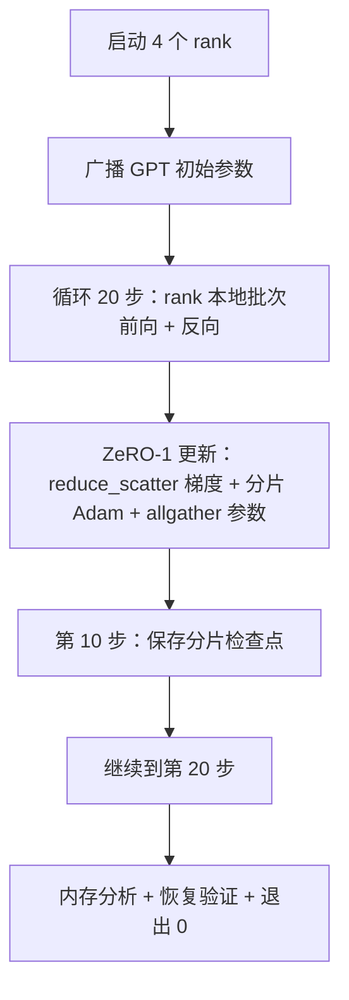

# 端到端分布式训练（End-to-End Distributed Training）

> 第 76 至 80 课各构建一个部分，这里将它们组装：在 4 个模拟 rank 上训练微型 GPT，用 DDP 同步梯度、ZeRO-1 分片优化器状态，并在中途保存分片检查点。演示运行 20 步后自行结束，打印损失曲线和内存分析，写出可恢复检查点。

**Type:** Build
**Languages:** Python
**Prerequisites:** 阶段 19 路线 C 第 42–49 课
**Time:** ~90 分钟

## 学习目标（Learning Objectives）

- 将 DDP（第 77 课）、ZeRO-1（第 78 课）和分片检查点（第 80 课）组合成一个训练循环。
- 在小型合成语料上，跨 4 个模拟 rank 训练两层 Transformer 语言模型 20 步。
- 打印逐步损失表、逐 rank 内存分析，以及在相同 world size 恢复后逐字节相同的检查点清单。
- 论证组合：前课各部分可独立测试，本课证明它们能够组合。

## 问题（The Problem）

综合实践（Capstone）证明各部分能配合。第 76 课实现集合通信，第 77 课包装为 DDP，第 78 课用 reduce_scatter 分片优化器状态，第 79 课分析流水线，第 80 课保存分片检查点。每课独立并有自己的测试。真实训练同时使用所有原语；组合错误会导致损失发散、检查点无法恢复，或逐 rank 内存本应下降却增长。

本课运行端到端演示，验证四个不变量：(a) 20 步损失在浮点噪声内单调下降；(b) 每步各 rank 参数范数相同；(c) 每 rank 优化器内存等于 ZeRO-1 公式 12P/N 字节；(d) 第 10 步检查点重启加载后逐字节相同。演示自行结束：20 步、单命令、退出码 0。

## 概念（The Concept）



### 微型 GPT（The mini GPT）

模型刻意小：2 个 Transformer 块、嵌入维度 32、4 个注意力头、词表 64、序列长 16、批大小 4，只有几千参数。又足够大，可检验所有连接决策：多头注意力走标准掩码路径，LayerNorm 有需同步的权重，语言模型头是投影回词表的独立线性层。同时小到 4 个 CPU rank 跑 20 步只需几秒。

### 组合规则（The composition rules）

| 课程部分 | 负责内容 | 留给循环的工作 |
|--------------|--------------|----------------------------|
| DDP 广播 | 初始参数同步 | 构造时调用一次 |
| ZeRO-1 更新 | 梯度同步、主副本更新、参数广播 | 每步调用一次，替代 optimiser.step |
| 分片检查点 | 持久化逐 rank 状态，带 sha256 清单 | 通过 allgather 收集状态后，在 rank 0 调用 |
| 训练循环 | 前向、反向、损失日志 | 按顺序调用上述三者 |

循环不需知道 reduce_scatter 或会合文件。ZeRO 与检查点模块暴露窄接口，由循环组合。

### 为何微型 GPT 而非 MLP（Why a tiny GPT and not just an MLP）

第 77 课 MLP 足以验证梯度同步。微型 GPT 增加三点：覆盖词表的独立语言模型头（本课为清晰不共享权重；完整 GPT 通常与词元嵌入共享）；softmax+交叉熵损失（比 MSE 有更多数值边界）；不对称前向（嵌入后，每层注意力再 MLP）。综合实践若坚持 MLP，会掩盖组合是否正确处理 LayerNorm 或嵌入层梯度形状。

### 自行结束意味着退出 0（Self-terminating means exit 0）

循环固定运行 20 步后退出。无 `while True`，无人干预，不从外部状态恢复。可无人值守运行、完成后找到完整日志的综合实践，才能证明系统连接正确。任一部分死锁，演示不返回，测试装置会捕获。

```figure
ci-distributed-assembly
```

## 动手实现（Build It）

`code/main.py` 实现了：

- `MiniGPT`：两层 Transformer，带掩码自注意力和独立语言模型头。
- `make_corpus(seed, total_tokens)`：确定性下一词元预测数据。
- `_train_worker`：每 rank 启动；广播初始参数、运行循环、调用 ZeRO 更新，在第 10 步写分片检查点。
- `verify_resume`：主运行后在进程内重新加载第 10 步检查点，断言保存的主分片与内存快照逐字节相同。
- `main`：编排整个演示，打印损失表、内存分析和验证结果。

运行：

```bash
python3 code/main.py
```

输出：20 行损失表、4 行逐 rank 内存分析、检查点清单，成功时输出 “RESUME VERIFIED”。

## 真实生产模式（Production patterns in the wild）

三种模式使组合适用于真实运行。

**每 K 分钟而非每 K 步保存。** 步时随序列长度和微批次数变化。10 分钟保存周期不论模型大小都覆盖相同计算时间。本课为简单按步，生产按实际时间。

**尽早检测发散。** 生产在反向后加入 NaN 防护和损失突增检测；一步损失跳升超过 2 倍，就回滚上个检查点，不让优化器继续进入退化状态。本课损失曲线平滑，防护未用到，但保留钩子。

**跨 rank 聚合内存分析。** 真实运行各 rank 内存不同，例如最大流水线阶段所在 rank 有更多激活。生产记录最大值和均值，本课逐 rank 打印以展示符合公式。

## 实际应用（Use It）

生产模式：

- **DeepSpeed。** 一个配置下组合 DDP、ZeRO、流水线和激活检查点。本课是其结构缩影。
- **PyTorch FSDP。** 原生对应方案。使用 `ShardingStrategy.SHARD_GRAD_OP` 的 `FullyShardedDataParallel` 对应 ZeRO-2。
- **NeMo 和 Megatron-LM。** 为最大模型增加张量并行，其余组合结构相同。

## 交付成果（Ship It）

本路线到此结束。六课合起来，是真实团队采用 DeepSpeed 前会构建的分布式训练子系统；抽象已对照 gloo 验证，失效模式也已检验。阶段 17（基础设施与生产）负责将其带到真实集群。

## 练习（Exercises）

1. 为注意力头加入张量并行切分，验证损失与单 rank 基线一致。两个 rank 各持一半头，对注意力输出 allreduce。
2. 跨 4 个微批次累积梯度，证明等于一个大批次的梯度。
3. 加入真正从第 10 步恢复训练到第 20 步的路径，最终损失须与原运行相同。
4. 将指标（损失、梯度范数、步时）导出 JSONL，供事后可视化。
5. 加入损失突增时回滚上个检查点的 NaN 防护，通过单步学习率乘数强制突增，检验回滚。

## 关键术语（Key Terms）

| 术语 | 常见说法 | 实际含义 |
|------|----------------|------------------------|
| 端到端（End-to-end） | “全部连起来” | 一次运行组合各部分，而非逐部分单元测试 |
| 内存分析（Memory profile） | “每 rank GB” | 各 rank 参数、梯度、优化器状态所占字节 |
| 恢复契约（Resume contract） | “保存和加载” | 检查点往返后逐 rank 状态逐字节相同 |
| 自行结束（Self-terminating） | “有界运行” | 固定步数，完成退出 0，无人在回路 |

## 延伸阅读（Further Reading）

- [DeepSpeed 端到端训练（End-to-end training）教程](https://www.deepspeed.ai/getting-started/)
- [PyTorch FSDP 高级（Advanced）教程](https://pytorch.org/tutorials/intermediate/FSDP_advanced_tutorial.html)
- [Megatron-LM 训练脚本（Training script）参考](https://github.com/NVIDIA/Megatron-LM)
- 阶段 19 第 76–80 课：本课组合的各部分
- 阶段 17：将组合迁移到真实集群
