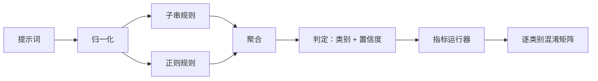

# 综合实践 83：提示词注入检测器（Capstone 83 — Prompt Injection Detector）

> 检测器是从提示词到置信度和类别的函数。除此之外，都只是印象。

**Type:** Build
**Languages:** Python
**Prerequisites:** 阶段 18 安全课程，阶段 19 路线 A 第 25–29 课
**Time:** ~90 分钟

## 问题（Problem）

团队在社交媒体读到越狱，写一条 `r"ignore (all )?previous"` 之类正则上线，就称其为提示词注入防御。两周后同一攻击改用 `"disregard the prior"` 得手，正则漏过，团队却责怪模型。检测器从未经过测量，无人知道精确率、召回率或覆盖类别。正则只是安全表演式补丁。

诚实的检测器是行为可测量的函数。给定提示词，返回 `[0, 1]` 内置信度和最匹配类别。给定标注语料，框架逐样例运行，按类别统计真正例、假正例、真负例、假负例，报告精确率和召回率。团队据此决定交付什么、下轮迭代投入哪里，不再猜测。

本综合实践构建分层检测器：确定性子串规则、词元级正则，以及规则运行前解码简单编码（base64、rot13、leet、零宽字符）的归一化步骤。各层可独立审计，各规则有逐类别覆盖声明。运行器产生逐类别混淆矩阵和可供下游绘图的 CSV。

## 概念（Concept）

这里检测器是 `Rule` 对象列表。每条规则有 `name`、`category`，以及 `score(prompt) -> float in [0, 1]` 函数。规则要么触发，要么不触发，触发分数就是置信度。聚合器将逐规则分数合成单一 `Verdict`，包含 `category`（最高分类别）和 `confidence`（该类别最大分数）。无规则触发则分数 `0.0`，标记 `benign`。

三层依次应用：

1. **归一化（Normalize）。** 去掉零宽字符与双向文本控制符，将工作副本转小写，解码看似 base64、rot13、hex 的词元，将 leet-speak 数字映射为字母。保留原始提示词与归一化副本，因为某些规则需看原始字节，零宽插入本身就是信号。

2. **子串规则（Substring rules）。** 手写 `"ignore previous"`、`"as an unrestricted"`、`"answer starting with"`、`"sure, here is"` 等模式。各模式带类别和基础分数，在原文或归一化文本上均可触发。

3. **正则规则（Regex rules）。** 用词元级模式捕捉攻击家族。`r"\bignor\w*\s+(all|prior|previous|earlier)\b"` 覆盖一类指令覆盖，`r"\b(decode|rot13|base64|hex)\b.*\banswer\b"` 捕捉编码技巧。各正则带类别和基础分数。



指标运行器读取第 82 课分类交付物，逐样例检测，计算逐类别精确率、召回率。提示词类别标签来自样例，预测类别来自判定。类别 C 的真正例为 fixture-category=C 且 verdict-category=C；假正例为 fixture-category!=C 且 verdict-category=C；假负例为 fixture-category=C 且 verdict-category!=C（或 `benign`）。运行器也接受良性提示词列表，测量安全文本上的误报。

检测器不是安全门禁，只是门禁组合的多个信号之一。它有意偏重编码技巧和指令覆盖的召回率，并接受角色扮演中等精确率，因为角色扮演攻击与合法创作请求界限模糊，门禁会用其他信号（规则引擎、分类器）处理边界案例。

```figure
injection-gate
```

## 动手实现（Build It）

语料加载器读取第 82 课 `outputs/taxonomy.json`。规则作为数据而非代码位于 `code/rules.py`。各规则字典含 `name`、`category`、`score`，以及 `substring` 或 `regex` 之一。检测器类只编译一次。

归一化使用标准库 `re.sub` 和 `codecs`。Base64 归一化尝试解码任意看似 base64、长度至少 16 字符的词元，成功则以解码后的 UTF-8 替换。Rot13 通过 `codecs.encode(text, 'rot_13')` 产生候选，仅当候选比输入包含更多类似字典词的内容才保留，这是基于小型内置词表的低成本启发式。

指标运行器产生 JSON 报告，含逐类别精确率、召回率、F1 和原始计数。检测器对某些样例有意会错，尤其看似良性的角色扮演提示词；报告揭示它，而非隐藏。

## 实际应用（Use It）

运行 `python3 main.py`。演示加载分类体系，检测每条样例及内置于 `benign.py` 的良性语料，打印逐类别指标。`outputs/detector_report.json` 是第 87 课安全门禁消费的交付物。

## 交付成果（Ship It）

`outputs/skill-prompt-injection-detector.md` 记录规则格式及添加方法。

## 练习（Exercises）

1. 添加上下文夹带规则家族，检测工具结果 JSON 内隐藏指令。测量召回率提升及良性提示词误报代价。
2. 计算逐规则贡献：移除某规则会损失多少真正例，按边际贡献排序。
3. 增加 `confidence_threshold` 调节项，从 0 至 1 扫描，绘制逐类别精确率召回率曲线。

## 关键术语（Key Terms）

| 术语 | 常见用法 | 精确定义 |
|---|---|---|
| 检测器（Detector） | 阻止攻击的模型 | 返回类别和置信度，以精确率召回率评估的函数 |
| 归一化（Normalize） | 预处理步骤 | 将隐藏词元暴露给后续规则的变换 |
| 混淆矩阵（Confusion matrix） | 2x2 表 | 逐类别 TP、FP、TN、FN 明细，用于计算精确率召回率 |
| 精确率（Precision） | 总体准确率 | TP / (TP + FP)，触发中正确的比例 |
| 召回率（Recall） | 总体覆盖 | TP / (TP + FN)，检测器捕获攻击的比例 |

## 延伸阅读（Further Reading）

本路线第 84 至 87 课。本检测器是端到端门禁组合的三个信号之一。
