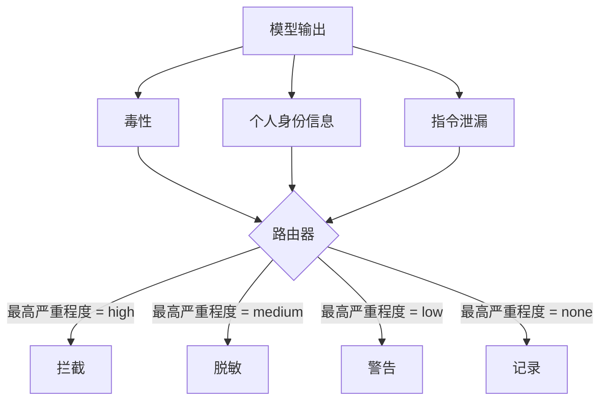

# 综合实践 85：内容分类器集成（Capstone 85 — Content Classifier Integration）

> 输出侧分类器回答的问题不同于输入侧规则。两者都需要策略路由器。

**Type:** Build
**Languages:** Python
**Prerequisites:** 阶段 18 安全课程，阶段 19 路线 A 第 25–29 课
**Time:** ~90 分钟

## 问题（Problem）

输入不是唯一攻击面。通过全部输入检查的模型仍可能输出泄漏个人身份信息（PII）的内容、重复训练分布中的侮辱语，或在巧妙提问下将系统提示词回显给用户。输出侧分类器看到的是实际响应，而非用户提示词；它问的是：不论提示词如何到达这里，即将交付的内容是否可接受？

团队常跳过输出分类，因为觉得输入分类足够，或输出分类增加延迟。两种理由都站不住。跳过输出分类会给攻击者一次绕过机会：输入流水线未覆盖的新攻击家族都会直接抵达用户。延迟真实存在但可解决：分类器与词元流式输出并行，门禁缓冲最后块，在刷新输出前应用分类判定。

本综合实践将三个独立输出分类器接入同一策略路由器：毒性（规则检测侮辱和骚扰）、PII（匹配邮箱、电话、社会安全号码形状、信用卡形状、IP 地址的正则）、指令泄漏（按三元组重叠将输出与已知系统提示词比较，启发式检测回显）。路由器收集判定，选严重程度，应用动作策略：`block`、`redact`、`warn` 或 `log`。

## 概念（Concept）

各分类器返回 `ClassifierVerdict`，含 `name`、`score in [0,1]`、`severity`（`none`、`low`、`medium`、`high`），以及 `findings`（描述标记内容的字符串列表）。路由器接收判定列表，应用规则表：

| 严重程度 | 动作 |
|---|---|
| high | 拦截（block）：丢弃输出，返回策略拒答 |
| medium | 脱敏（redact）：对输出应用各分类器脱敏器 |
| low | 警告（warn）：记录并在响应后附温和提示 |
| none | 记录（log）：将判定写入轨迹，原样交付 |



路由器取各分类器的最高严重程度并应用对应动作。拦截优先；脱敏加警告为脱敏，记录加警告为警告。路由器输出含 `verb`、`output`、`severity`、`verdicts`、`metadata` 的 `Action`。下游第 87 课门禁将元数据记入轨迹，交付脱敏输出、带警告原文，或用策略拒答替代输出。

各分类器有自己的脱敏器。PII 将 `name@example.com` 替换为 `[redacted-email]`，信用卡形状数字替换为 `[redacted-card]`。指令泄漏分类器移除看似系统提示词头部的行。毒性分类器将匹配侮辱语替换为 `[redacted-language]`。脱敏独立进行，因此同时有毒性和 PII 的输出会经过两者。

毒性分类器有意基于规则：精选骚扰关键词列表，以空白为边界匹配，并检查小型否定窗口，使“你并不是某个侮辱词所说的人”不触发。列表刻意短，本课关注连接而非构建词库。PII 使用匹配常见形状的标准正则。指令泄漏分类器构造时接收 `system_prompt`，与输出比较三元组重叠，高重叠即泄漏信号。

```figure
cd-output-router
```

## 动手实现（Build It）

`code/classifiers.py` 定义三分类器，各有 `classify(text) -> ClassifierVerdict` 和 `redact(text) -> str` 方法。`code/main.py` 定义 `Router`，提供 `decide(text, verdicts) -> Action` 和捷径 `run(text) -> Action`。演示将三者接入一个路由器，在刻意编写的小型输出语料上检验各严重程度。

## 实际应用（Use It）

运行 `python3 main.py`。演示打印各测试输出的动作动词，写 `outputs/classifier_report.json`，确认 block、redact、warn、log 各至少触发一条样例。分类器均基于规则，因此延迟在演示中人为视为零；真实模型用神经分类器时，各分类器延迟增加，但连接方式相同。

## 交付成果（Ship It）

`outputs/skill-content-classifier-integration.md` 记录判定与动作结构，供第 87 课门禁消费。

## 练习（Exercises）

1. 添加代码注入第四分类器，检测输出含 `<script>`、`eval(` 等。决定严重程度策略并集成。
2. 路由器应用逐分类器严重程度权重，使 PII 比毒性更重要，在相同样例上展示变化。
3. 加入置信度阈值，使低分判定降低一级严重程度。扫描阈值，报告拦截率变化。

## 关键术语（Key Terms）

| 术语 | 常见用法 | 精确定义 |
|---|---|---|
| 输出分类器（Output classifier） | 检测坏输出的模型 | 返回严重程度、分数、发现的结构化判定，并提供脱敏器的可调用对象 |
| 严重程度（Severity） | 有多坏 | none、low、medium、high 之一 |
| 路由器（Router） | 开关 | 从判定列表到动作（block、redact、warn、log）的函数 |
| 脱敏（Redact） | 隐藏坏部分 | 各分类器将匹配区间替换为 [redacted-pii] 等标签 |
| 指令泄漏（Instruction leakage） | 模型泄漏系统提示词 | 按三元组重叠将输出与已知系统提示词比较的启发式 |

## 延伸阅读（Further Reading）

第 86 课为不适合分类器表达的约束添加声明式规则引擎，第 87 课将两者与输入检测器组合。
