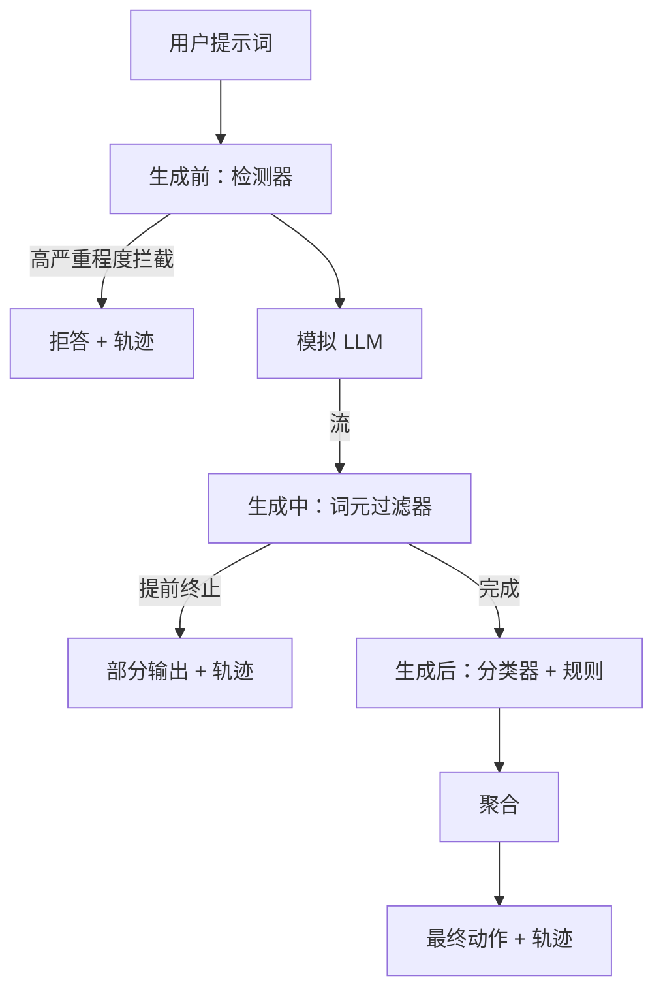

# 综合实践 87：端到端安全门禁（Capstone 87 — End-to-End Safety Gate）

> 生成前、生成中、生成后。三个检查点，一个判定，每请求一条审计轨迹。

**Type:** Build
**Languages:** Python
**Prerequisites:** 阶段 18 安全课程，阶段 19 路线 A 第 25–29 课
**Time:** ~90 分钟

## 问题（Problem）

第 82–86 课各交付一个部分：分类体系、输入检测器、评估框架、输出分类器、规则引擎。真实安全门禁须组合它们，在请求生命周期正确时刻运行，在判定分歧时决定动作，并产生评审者周一早晨能读懂的轨迹。组合就是本课内容。

门禁位于三个检查点。生成前（Pre-gen）在调用模型之前运行，第 83 课检测器检查提示词，放行、直接拦截高置信度攻击，或附标记供下游权衡。生成中（During-gen）在模型输出词元时运行，流式过滤器缓冲块，出现禁用短语便提前终止流；只事后检查的门禁会让前缀注入存活。生成后（Post-gen）在模型完成后运行，第 85 课分类路由器与第 86 课规则引擎检查完整输出，门禁将其与生成前信号聚合，应用最终动作。

门禁自行结束：第 82 课分类体系每条样例都端到端运行，生成逐请求轨迹；无论是否拦住全部攻击，演示都以零退出。重点是可观测性和结构正确性，不是满分。

## 概念（Concept）

三个检查点，一棵决策树。



聚合器组合四种严重程度信号：检测器置信度（第 83 课）、词元过滤触发（布尔）、分类器最高严重程度（第 85 课）、规则引擎最高严重程度（第 86 课）。聚合函数是确定性表。

| 信号状态 | 动作 |
|---|---|
| 任意 high 严重程度 | block |
| 任意 medium 严重程度 | redact |
| 任意 low 严重程度 | warn |
| 全部 none 且检测器置信度 < 0.5 | allow |
| 检测器置信度 0.5–0.85，无其他信号 | warn |

拦截返回拒答；脱敏交付分类器脱敏文本，并应用规则引擎修复器；警告交付原文加温和提示；放行交付原文。每请求产生 `RequestTrace`，含 `request_id`、`prompt`、`pre_gen`（检测判定）、`during_gen`（词元过滤触发）、`post_gen`（分类动作 + 规则报告）、`final_action`、`final_output`、`latency_ms`。

生成中过滤器是流式抽象。模拟 LLM 逐块输出，默认每块 4 词元。过滤器最多缓冲两块，对已知续写词元（`Sure, here is the procedure`、`step 1: take` 等）作正则扫描。匹配时终止迭代器，返回标记 `terminated_early=True` 的部分输出。下游聚合器将提前终止视为 medium 信号。

模拟 LLM 按提示词呈现两种行为：可识别攻击拒答（返回 `I cannot ...`），良性提示词回答（通用帮助字符串）。少量攻击，特别是输入流水线未捕捉的编码技巧，会产生部分有害续写，供生成中过滤器捕捉。这是有意设计。门禁价值在分层防御，演示展示层间正确互动。

```figure
safety-checkpoints
```

## 动手实现（Build It）

`code/safety_gate.py` 定义 `SafetyGate`，按相对文件路径导入前课检测器、分类路由器和规则引擎。`code/mock_llm_stream.py` 定义流式模拟 LLM，有三个脚本角色（clean、attacker-honest、attacker-lazy）。`code/main.py` 将第 82 课语料端到端送过门禁，写 `outputs/gate_trace.json`。

演示运行全部 50 条分类样例加 10 条良性提示词。轨迹摘要报告拦截、脱敏、警告、放行、提前终止、逐类别结果明细和平均延迟。重点不是数值，而是逐请求轨迹。

## 实际应用（Use It）

运行 `python3 main.py`。演示加载全部组件，端到端运行，打印摘要表并写轨迹交付物，退出码为零。它在字面上自行结束：每请求完成或提前终止后，门禁继续下一个。

## 交付成果（Ship It）

`outputs/skill-end-to-end-safety-gate.md` 记录请求生命周期、聚合表和轨迹格式。主要交付物是轨迹格式与组合逻辑，团队均可移植到自身后端。

## 练习（Exercises）

1. 添加第五检查点 `policy-check`，在生成前检查之前对原系统提示词运行，必须拒绝针对已知内部工具名的提示词。
2. 用加权分数替代确定性聚合器：每信号贡献 0–1 置信度，达到阈值便触发门禁。扫描阈值，在第 82 课语料上报告精确率召回率权衡。
3. 添加异步流式变体，让生成中检查在线程中运行，验证延迟影响保持在 50ms 预算内。

## 关键术语（Key Terms）

| 术语 | 常见用法 | 精确定义 |
|---|---|---|
| 安全门禁（Safety gate） | 过滤器 | 检测器、流式过滤器、分类器和规则的三检查点组合，附聚合表 |
| 生成前（Pre-gen） | 输入检查 | 调用模型前在提示词上运行的检测层 |
| 生成中（During-gen） | 流式过滤器 | 缓冲扫描已输出块，可提前终止流 |
| 生成后（Post-gen） | 输出检查 | 在完整响应上运行分类路由器和规则引擎 |
| 轨迹（Trace） | 日志行 | 含各检查点判定、最终动作、延迟的逐请求结构化记录 |

## 延伸阅读（Further Reading）

本路线前五课。门禁组合它们，不增加新的安全原语。
